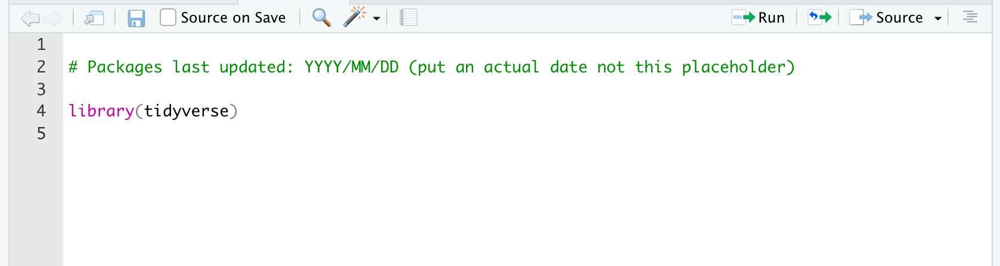

\mainmatter

# Introduction

We will use the statistical analysis software R in this course with the interface provided by R Studio. We can access R Studio using the website [R Studio Cloud](http://www.rstudio.cloud) at <http://www.rstudio.cloud>.

## A focus on workflow

A key focus on this course is training you in a workflow that will avoid a large number of problms than can occur when using R.

## R works with plug-in / add-ons

R is a statistical language with many plug-ins called **packages** that you will use to do analyses. You can think of R as being like your smartphone. To do things with your phone you need **an App** (R equivalent is a *package*). Before you can use the App you need to **download**  it (R equivalent is to *install.packages*) from the **App Store** (R equivalent is the *CRAN*). To use the app you need **Open** it  (R equivalent is the *library command*). These similarities are illustrated in the table below.

```{r, fig.cap = "Packages as smart phone apps", echo = FALSE, out.width = "50%"}

```

## Create an account at R Studio Cloud

R Studio Cloud accounts are free and required for this course. Please go to the website and set up a new account using your university email address.


## Join the class workspace

You need to join the class workspace to access class materials. 

To do so:

1. Log into R Studio Cloud (if you haven't already done so).
2. Go to your email and find the message were you will emailed the link to the class R Studio workspace.
3. Click on that link or paste it into your web browser. You should see a screen like the one below. Click join.

INSERT IMAGE HERE OF JOIN SCREEN


## Exploring the R Studio Interface


### File/Plot Window

Picture with arrow


### Console Window

Notice the we can use R a bit like a calculator. 


```{r, echo = FALSE, out.width="100%"}
knitr::include_graphics("first_time/images/console.png")
```

Picture with arrow


### Script Window

Create a script in your R Studio project by using the menu File > New File > R Script.
Save the file with an appropriate name. A common, and good, convention is to start all script names with the word "script" and separate words with an underscore "_". You might save this file with the name "script_my_first_one.R". The advantage of this approach is that when you look at your list of files alphabetically, all the script files will cluster together. Likewise, it's a good idea to save all data files such that they begin with "data_". This way all the data files will cluster together in your directory view as well.. You can see there is already a data file with this convention called "data_okcupid.csv". You can see as discussed prevously, we are trying to instill and effect workflow as you learn R.


## Writing your first script

### Add a comment with today's date

It's a good idea to add a comment with the date of your script. Like smartphone apps, packages are updated regularly. Sometimes when a package is updated it will no longer work with an older script. Fortunately, the **checkpoint** package let's users role back the clock and user older versions of packages. Adding a comment with the date of your script will help future users (including you) to use your script with the same version of the package (if needed). This won't be relevant to what we do in this course - but it is good practice. This is another important workflow tip.

```{r}
## Packages last updated: YYYY/MM/DD (put use an actual date not this placeholder)
```


### Add library(tidyverse) to your script 

Now put the line below at the top of your script file:

```{r, echo = TRUE, eval = FALSE}
library(tidyverse)
```

```{r, echo = FALSE, out.width="50%", out.height="50%"}

```


### Activate tidyverse auto-complete for your script

Select the library(tidyverse) text with your mouse/track-pad and highlight it. Then click the Run button in the upper right of the script window.


After you click the Run button you should see text like the following the Console window:

```{r, echo = FALSE, eval = TRUE}
library(tidyverse)
```

Running the library(tidyverse) prior to entering the rest of your script allows R Studio to present auto-complete options when typing your text.

## Loading your data

### Use read_csv (not read.csv) to open the file. 

If you followed the steps above, you should have auto-complete for the tidyverse. This means you should see an auto-complete option for read_csv. Be sure to use read_csv not read.csv. The use of the _ indicates we are using the command from the tidyverse package.

We already have the **data_okcupid_heights.csv** data file in our project directory. We will load this data with the command below. Notice how we format our command below. After each command option for read_csv there is a comma followed by a **shift-return**. The shift return moves to the next line and keeps the text aligned. 

This command puts the data_okcupid_heights.csv data into the R data.frame/tibble called my_data. Note that we avoid the use of capital letters in my_data. Also note that we avoid using a period. It's good to have a style guide when you are typing variable/object names to avoid mistakes. I suggest the following style guide (which is common in R):

* Use the underscore (_) to represent a space in your variable object name
* Avoid using periods in your variable/object names
* Use only lower case - avoid upper case


Add the line below to your script file:

```{r, eval = FALSE}
my_data <- read_csv(file = "data_okcupid_heights.csv", 
                    na = c("", "NA", "-999"))
```

In the command above, *file* indicate the name of the file in the project directory. Likewise, *na* indicate the values that are used in that .csv file to represent missing values. In R, *NA* is often used to indicate missing values (i.e., NA indicates Not Available). Here we are telling read_csv that when we read the data file is there is nothing present between two commas (i.e., ""), or if there is the text "NA", or if there is the text "-999", treat all of text strings as missing values.

Select the read_csv lines and click the Run button in the top right of the script window. You should see text like that below. 

```{r, eval = TRUE, echo = FALSE}
my_data <- read_csv(file = "data_okcupid_heights.csv", 
                    na = c("", "NA", "-999"))
```

This text indicates that you have loaded a data file with two columns named sex and height. The sex column is of type col_character which indicates it contains text/letters. The height column is of type col_double which merely indicates that it is a column of numbers represented with high precision (double indicates it is high precision - technical description of exactly what is meant by double is left for a computer science course).

### Missing values and read_csv

Tell people how to identify missing values when they load their data.


## Getting your data ready for analysis

### Make sure you are using well-formatted variable names

Janitor package here..

### Tell R which variables are categorical (i.e., a factor)

A key part of using R is telling it which variables are categorical variables. If you don't do this some analysis won't run. Worse - other analyses will run but provide the wrong numbers.

Below are a series of command where we load our data and identify which variables are categorical. In R categorical variables are called factors. 


```{r}
my_data <- read_csv(file = "data_okcupid_heights.csv", 
                    na = c("", "NA", "-999"))

glimpse(my_data)
```

We know that sex is a categorical variable (i.e., a factor). Yet when we look at the output above from glimpse it is of type chr - which means character. We need to make the data into a factor.


```{r}
my_data <- mutate(my_data, sex = as.factor(sex))

```


In later exercise we will deal with situation where numbers like 1 and 2 are used to designate sex instead of a label like male or female. When numbers are used in factors we have to provide labels for them (i.e., value labels in SPSS terms) using the level command; but that's a future exercise.

Notice now that we have made sex a factor, there is fct beside it in the glimpse output.

```{r}
glimpse(my_data)
```


## Checking out the structure of your data

### glimpse(): A way to check out your data structure

Check out the structure of the data with the glimpse command. Add the command below to your script file, highlight it, and click Run.

```{r}
glimpse(my_data)
```

You may also encounter the str function (or structure function) as a way to glimpse the data. This is an older command that provides a bit more information. However, the output of the str function isn't as user friendly as that from the glimpse function.

```{r}
str(my_data)
```

You can also see the names of the columns using just:
```{r}
names(my_data)
```


### head(): Check out the first few rows 

You can see the first few rows of the data with the head command. Add the command below to your script file, highlight it, and click Run.

```{r}
head(my_data)
```

### tail(): Check out the last few rows 

You can see the last few rows of the data with the head command. Add the command below to your script file, highlight it, and click Run.

```{r}
tail(my_data)
```

### view(): See a spreadsheet view of your data

You can view the data in a spreadsheet style window using the command below.

Do NOT add this command to your script file. Just type it in the Console. Adding it to the script can cause problems.

```{r, eval = FALSE}
view(my_data)
```

### summary(): Quick summaries

You can a short summary of your data with the summary() command. Note that we will use the summary command in many places in the course. The output of the summary command changes depending on what you give it (data, regression results, etc). Add the command below to your script file, highlight it, and click Run.

Later you will use the summary command in other ways. It is a very interesting command because it can give the summary of many different things (data, regression results, etc). 

```{r}
summary(my_data)
```


## Run *vs.* Source with Echo *vs.* Source 

You have the script below in your Script window. We will discuss how, Run, Source with Echo, and Source (without Echo) work.

```{r, echo = FALSE, out.width="50%", out.height="50%"}
knitr::include_graphics("first_time/images/script_all.png")
```


### Run

The Run button will run the text you highlight and present the relevant output. You have used this command a fair amount above.

I strongly suggest you ONLY use the Run button when testing a command to make sure it works or to debug a script.

In general, you should always try to execute your R Scripts using the Source with Echo command (preceded by a Restart, see below). This ensures your script will work beginning to end for you in the future and for others that attempt to use it. Using the Run button in an ad lib basis can create output that is not reproducible.

### Source (without Echo)

Source (without Echo) is not designed for the typical analysis workflow. It is mostly helpful when you run simulations. You can see below that when you run Source (without Echo) much of the output you would wish to read is suppressed.

In general, avoid this option.

```{r, eval = FALSE}
Parsed with column specification:
cols(
  sex = col_character(),
  height = col_double()
)
Observations: 59,826
Variables: 2
$ sex    <chr> "male", "male", "male", "male", "male", "male", "male", "male", "male", m…
$ height <dbl> 75, 70, 68, 71, 66, 67, 65, 70, 72, 72, 70, 71, 72, 69, 71, 73, 70, 72, 67…
> 
```


### Source with Echo

The Source with Echo command runs all of the contents of a script and presents the output in the R console.

Prior to running Source with Echo (or just Source), it's always a good idea to restart R. This makes sure you clear the computer memory of any errors from any previous runs. 

So you should do the following:
* Menu item: **Session > Restart R**
* Click the down arrow beside Source, and click on Source With Echo

This will run the script and provide you with the desired output. This should be your default workflow.

Inspect the output of the script we created below using this workflow. Notice how you can see the results of every command presented.

```{r, eval = FALSE}
> library(tidyverse)

> my_data <- read_csv(file = "data_okcupid_heights.csv", 
+                     na = c("", "NA", "-999"))
Parsed with column specification:
cols(
  sex = col_character(),
  height = col_double()
)

> glimpse(my_data)
Observations: 59,826
Variables: 2
$ sex    <chr> "male", "male", "male", "male", "male", "male", "male", "male", "male", m…
$ height <dbl> 75, 70, 68, 71, 66, 67, 65, 70, 72, 72, 70, 71, 72, 69, 71, 73, 70, 72, 67…

> head(my_data)
## A tibble: 6 x 2
  sex   height
  <chr>  <dbl>
1 male      75
2 male      70
3 male      68
4 male      71
5 male      66
6 male      67

> tail(my_data)
## A tibble: 6 x 2
  sex    height
  <chr>   <dbl>
1 female     64
2 female     63
3 female     67
4 female     61
5 female     62
6 female     62

> summary(my_data)
     sex                height     
 Length:59826       Min.   :55.00  
 Class :character   1st Qu.:66.00  
 Mode  :character   Median :68.00  
                    Mean   :68.29  
                    3rd Qu.:71.00  
                    Max.   :80.00  
```

### Source: Use Session > Restart R EVERY time before you click Source

Avoid a large number of problems, prior to using the Source button, go to **Session > Restart R**.

This ensure each script runs in a fresh environment.

Do **Session > Restart R** before click source -- **ALWAYS**.


## A few analyses with scripts and Source with Echo

### select(): Obain a subset of columns

### filter(): Obtain a subset of rows

### summarise(): Obtain summary statistics for a column


## Avoid problems in your scripts

I suggest you do the following things to avoid problems in your scripts

### Source: Use Session > Restart R EVERY time before you click Source

As noted above, prior to using the Source button, go to Session > Restart R.

This ensure each script runs in a fresh environment.

### Avoid View() in your scripts

Depending on your version of R Studio, putting View() in your scripts can cause problems. Try to restrict use of View to the Console window.


### Package Installation Advice

In the first part of the course, the package will be installed for you. To use those package you will merely need to activate them with the library command. Later in the course you will install your packages. When you do so there a few things you need to keep in mind to avoid problems:


#### Do NOT put install.package() commands in your scripts

Try to avoid putting install.package commands in your scripts. Doing so can corrupt your R installation. You may need to re-install R if you do so. Worse, you may create problems on your computer so that even re-installing R won't get it working again. As discussed above, install.packages commands in scripts are problematic because they often follow library commands. When this happen your R installation becomes corrupted.

#### install.packages: Use Session > Restart R EVERY time before you install.packages

Prior to using install.packages, go to Session > Restart R.

This ensure each installation occurs in a fresh environment.


## Using R the old way or the new way (the tidyverse way) 

Talk about difference. A key differences

#### Tibbles vs Data Frames: Why use read_csv instead of read.csv

When you load data into R it is typically represented in one of two formats. The original format for representing a data set in R is the data frame. When you load data using read.csv your data is loaded into a data frame. 

#### read.csv puts data into a data frame
```{r}
my_dataframe <- read_csv(file = "data_okcupid_heights.csv", 
                    na = c("", "NA", "-999"))

```

Notice that when you print a data frame it does NOT show you the number of rows or columns above the data.  Here I actually pasted just the first 10 rows of the output - because all the rows are printed in your console.
```{r, eval = FALSE}
print(my_dataframe)
```

```{r, eval = TRUE, echo = FALSE}
print(my_dataframe[1:10, ])
```


#### read_csv puts data into a tibble

Notice that when you print a tibble it DOES show you the number of rows and columns.  As well, the tibble only provides the first few rows of output so it doesn't fill your screen.


```{r}
my_tibble <- read_csv(file = "data_okcupid_heights.csv", 
                    na = c("", "NA", "-999"))

```
```{r}
print(my_tibble)
```

#### Deeper differences between data frames and tibbles

In short you should always use tibbles (i.e., use read_csv) - they are simply enhanced data frames (i.e., the new version of the data frame). The differences between data frames and tibbles run deeper than the superficial output provided here. On some rare occasions an old package or command may not work with a tibble so you need to make it a data frame. You can do so with the commands below:

#### Converting a tibble into a data frame

```{r}
new_dataframe <- as.data.frame(my_tibble)
```


## A Few Key Points About R

Sometimes you will need to send a command in R additional information. Occasionally this will involve using vectors of numbers, vectors of characters, or lists.

#### Vector of numbers

We can create a vector of only numbers using the "c" function - which you can think of as being short for "combine" (or concatenate). In the commands below we create a vector of a few even numbers called "even_numbers".

```{r}
even_numbers <- c(2, 4, 6, 8, 10)
```

```{r}
print(even_numbers)
```

```{r}
print(even_numbers *2)
```

We can obtain the second number in the vector using the following notation:

```{r}
print(even_numbers[2])
```


#### Vector of characters

We can also create vectors using only characters:

```{r}
favourite_things <- c("copper kettles", "woolen mittens", "brown paper packages")
```

```{r}
print(favourite_things)
```

We can obtain the second item in the vector using the following notation:

```{r}
print(favourite_things[2])
```

### Using character vectors with a command

Previously, we used a vector to indicate what codes represent missing values:

```{r}
missing_value_codes <- c("", "NA", "-999")

print(missing_value_codes)
```

You could load data like this:


```{r, eval = FALSE}

missing_value_codes <- c("", "NA", "-999")

my_data <- read_csv(file = "data_okcupid_heights.csv", 
                    na = missing_value_codes)
```

Or the way we used did previously:

```{r, eval = FALSE}
my_data <- read_csv(file = "data_okcupid_heights.csv", 
                    na = c("", "NA", "-999"))
```


### Lists

Lists are similar to vectors in that you can create them and access items by their numeric position. Vectors must be all characters or all numbers. Lists can be a mix of characters or numbers. Most importantly items in lists can be accessed by their label.

```{r}
my_list <- list(last_name = "Stanley",
                first_name = "David",
                office_number = 4002)

print(my_list)
```


You can access an item by its label/name using the dollar sign:

```{r}
print(my_list$last_name)
print(my_list$office_number)
```

One way of indicating to R that you are using the value 1 and 2 to code Male and Female in your data is by using a list that you pass to another command (i.e., with levels commands from a future exercise). Here is how you would represent how you coded sex:

```{r}
sex_coding <- list("male" = 1,
                   "female" = 2)

print(sex_coding)

print(sex_coding$male)

```
