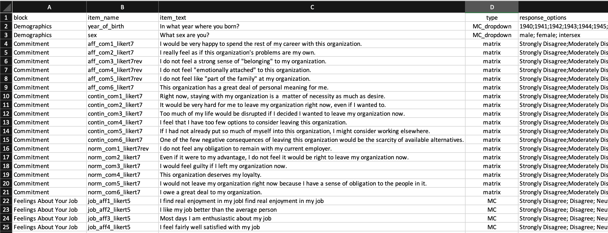
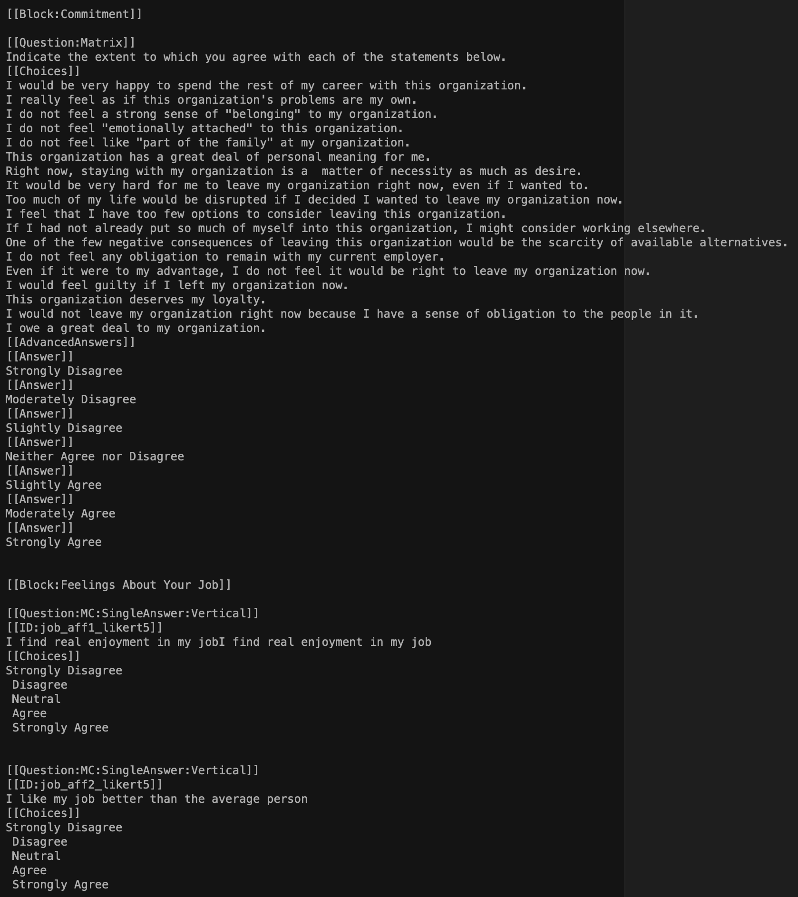
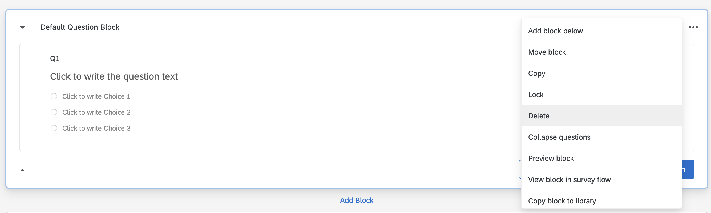
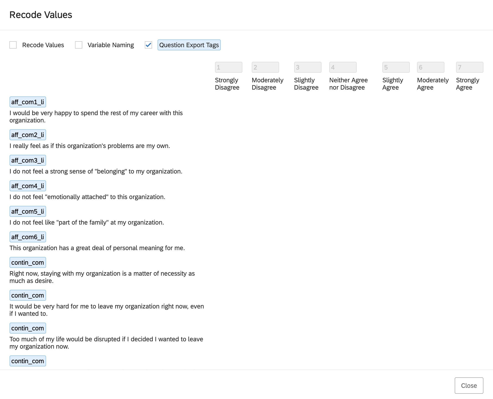

# Qualtrics

```{r, include=FALSE}
library(tidyverse)
```
## Overview

There are two tasks covered in this chapter: **1)** importing surveys into Qualtrics and **2)** moving data from Qualtrics to R. An overview of each process is below.

**1. Importing items into Qualtrics**

* Create a survey codebook in Excel (or similar program) that has each item and the response options for it
* Convert the survey codebook to Qualtrics [Advanced Text Format](https://www.qualtrics.com/support/survey-platform/survey-module/survey-tools/import-and-export-surveys/)
* Import the items
* Tweak the survey after import

**2. Qualtrics Data to R**

* Export the raw data from Qualtrics with maximal information in the data file
* Load the raw data into R
* Convert the raw data to analytic data. This conversion includes: assigning values to response options (e.g., "Strongly Disagree" to a numeric value), flipping response for reverse-worded (i.e., reverse-keyed) items, and creating scale scores.

The overall steps are quite simple and I walk you through each step in detail below.

## Required

The files below are used in this chapter. Right click to save each file. 

| Relevant files |
|-------------------|
|[survey_codebook.csv](survey_codebook.csv)   |
|[items_qualtrics_format.txt](items_qualtrics_format.txt)|
|[data_qualtrics.csv](data_qualtrics.csv)   |
|[script_qualtrics.R](script_qualtrics.R) |

The following CRAN packages must be installed:

| Required CRAN Packages |
|-------------------|
|tidyverse          |
|janitor            |
|remotes            |


The following GitHub packages must be installed:

| Required GitHub Packages |
|--------------------------|
|[dstanley4/qualtricsMaker](https://github.com/dstanley4/qualtricsMaker)|


A GitHub package can be installed using the code below:

```{r, eval = FALSE}
remotes::install_github("dstanley4/qualtricsMaker")
```


## Items to Qualtrics

There are two approaches to entering survey items into Qualtrics.

* Enter the items one at a time using the Qualtrics web interface.

* Create a text file in the Qualtrics [Advanced Text Format](https://www.qualtrics.com/support/survey-platform/survey-module/survey-tools/import-and-export-surveys/) and import the items. Be warned though a bit of tweaking is often still needed using the web interface.

Here we focus only on the second approach to entering items into Qualtrics.

### Create survey codebook

The easy way to create items in the [Advanced Text Format](https://www.qualtrics.com/support/survey-platform/survey-module/survey-tools/import-and-export-surveys/) is to use the qualtricsMaker package. With this package you create a spreadsheet with the items and then convert that spreadsheet to the Advanced Text Format. 

Consider a scenario where we want to create a survey that contains 2 demographics items, 18 commitment items, and 4 job satisfaction items. The *three-component model of commitment* items are from [@meyer1993commitment] and the *job satisfaction* items are from [@thompson2012brief].

We being by creating a survey codebook spreadsheet in Excel (or similar program). The spreadsheet should have the columns with the names: block, item_name, item_text, type, response_options. The completed file (  [survey_codebook.csv](survey_codebook.csv)) is illustrated below.  I provide a detailed description of what should be placed in each column after the figure. Remember to work from the guiding principle that one row is used for one item/question.

```{r, echo=FALSE, out.width="100%"}

```

#### block column

Enter any text you wish to use as a label for a block of items.

#### item_name column

To make your life easier down the road, it is critical you set up your spreadsheet or online survey such that it uses a naming convention prior to data collection. Recall the [naming convention from the previous chapter](https://dstanley4.github.io/psyc6060bookdown/an-emphasis-on-workflow.html#naming-conventions).


#### item_text column

The item_text column contains the text for each item. Note that if you use commas in your item text do not save this file as a .csv file - it will not work. Rather save it as .tsv file (tab separated values). Then use read_tsv command instead of the read_csv command in the code that follows later.


#### type column

| Code for type column | Qualtrics Item Type | Additional Information  |
|----------------------|---------------------|-------------------------|
| matrix               | matrix     | If the first item in a block has type *matrix* all items in the block will be used to construct the matrix question. **Unfortunately, importing item_names for matrix questions is not supported by Qualtrics. You will need to manually restore your item_names following the directions below for matrix items.** |
| MC                   | multiple choice vertical format  |  |
| MC_horizontal         | multiple choice horizontal format  |  |
| MC_multi_horizontal   | multiple choice horizontal format multiple answers |  |
| MC_select            | select box |  |
| MC_multi_select      | select multiple boxes     |  |
| MC_dropdown          | dropdown   |  |


#### response_options column

The Likert items for the different blocks use different response options. The commitment items use a 7-point response option whereas the job satisfaction items use a 5-point response option.

##### Year of birth

We used a number of response options to indicate Year of Birth. We entered them as per below. Each response option is separated by a semi-colon. Each of the years below will be in the dropdown button.

**Entered in the response_option column as below. Each option separated by a semicolon.**

1940;1941;1942;1943;1944;1945;1946;1947;1948;1949;1950;1951;1952;1953;1954;1955;1956;1957;1958;1959;1960;1961;1962;1963;1964;1965;1966;1967;1968;1969;1970;1971;1972;1973;1974;1975;1976;1977;1978;1979;1980;1981;1982;1983;1984;1985;1986;1987;1988;1989;1990;1991;1992;1993;1994;1995;1996;1997;1998;1999;2000;2001;2002;2003;2004;2005;2006;2007;2008;2009;2010

##### Sex 3 points

Please note that in psychology we distinguish between sex and gender. We use the term "sex" to refer to underlying biology. In contrast, we use the term "gender" to refer a psychological construct (i.e., gender identity). A person's sex and gender may be quite different. Depending on the theory used in a study, you might be interested in sex or gender or both. In this example, we are using sex but not gender. If you were asking about gender - you would have a much longer (and quite different) list of options. 

**Entered in the response_option column as below. Each option separated by a semicolon.**

male; female; intersex


##### Commitment 7 points

**Entered in the response_option column as below. Each option separated by a semicolon.**

Strongly Disagree;Moderately Disagree;Slightly Disagree;Neither Agree nor Disagree;Slightly Agree;Moderately Agree;Strongly Agree

##### Job Satisfaction 5 points

**Entered in the response_option column as below. Each option separated by a semicolon.**

Strongly Disagree; Disagree; Neutral; Agree; Strongly Agree

### Convert to Qualtrics format

#### Create TXT file

Once you have the survey codebook above, you need to convert it to an [Advanced Text Format](https://www.qualtrics.com/support/survey-platform/survey-module/survey-tools/import-and-export-surveys/) .txt file. We can do so by following the steps below. The instructions differ slightly for RStudio Cloud and RStudio - both are presented.

##### RStudio on your computer
1. Create a folder on your computer called "new_survey" **with the survey_codebook.csv file in it.** 

2. Open RStudio. Then go to File > New Project... and select Existing Directory.

```{r, echo = FALSE, out.width="50%"}
knitr::include_graphics("ch_qualtrics/images/screenshot_existing_dir.png")
```

2. Then find and select the "new_survey" folder on your hard drive and click the Create Project button.

```{r, echo = FALSE, out.width="50%"}

```

3. You should previously have installed the remote and tidyverse package from the CRAN and the qualtricsMaker package from GitHub. If you haven't done this already type the commands below into the **Console**.

**Installing Packages from the CRAN**

```{r, eval=FALSE}
install.packages("tidyverse", dep = TRUE)
install.packages("remotes", dep = TRUE)
```

**Installing Package from GitHub**

Then install the qualtricsMaker package from GitHub:

```{r, eval = FALSE}
remotes::install_github("dstanley4/qualtricsMaker")
```


3. Create a new script by going to File > New File > R Script. A new script will appear in RStudio. Immediately press Control-S to save the script. Call it "script_convert.R".

```{r, echo = FALSE, out.width="50%"}

```

4. Place the code below into the script and press Control-S to save your work.

```{r, eval = FALSE}
library(tidyverse)
library(qualtricsMaker)

survey_codebook <- read_csv("survey_codebook.csv",
                            show_col_types = FALSE)

make_survey(survey_codebook,
            filename = "items_qualtrics_format.txt")
```

5. Run the script by pressing the Source button in the top right of the the Script window. Doing so will create the items_qualtrics_format.txt file that you will import into Qualtrics. You can see the file after it has been created in the Files tab below.

```{r, echo = FALSE, out.width="50%"}

```

**Congratulation - your items are ready to be imported into Qualtrics. Move on to the "Import the items" section.**


##### RStudio Cloud

1. Open a new project in RStudio Cloud

3. You should previously have installed the remote and tidyverse package from the CRAN and the qualtricsMaker package from GitHub. If you haven't done this already type the commands below into the **Console**.However, if you are working from a class project I created **these packages will have been installed already for you.**

```{r, eval=FALSE}
install.packages("tidyverse", dep = TRUE)
install.packages("remotes", dep = TRUE)
```

Then install the qualtricsMaker package from GitHub:

```{r, eval = FALSE}
remotes::install_github("dstanley4/qualtricsMaker")
```

4. Import the [survey_codebook.csv](survey_codebook.csv) file by using the Upload button in the Files tab in the lower right panel.

```{r, echo = FALSE, out.width = "50%"}
knitr::include_graphics("ch_qualtrics/images/screenshot_import_button.png")
```


5. Click the Choose File button and select the survey_codebook.csv file on your hard drive. Then click OK. The survey_codebook.csv file will then appear on the Files tab within RStudio Cloud.

```{r, echo = FALSE, out.width = "50%"}
knitr::include_graphics("ch_qualtrics/images/screenshot_choose_file.png")
```

6. Create a new script by going to File > New File > R Script. A new script will appear in RStudio. Immediately press Control-S to save the script. Call it "script_convert.R".

```{r, echo = FALSE, out.width="50%"}
knitr::include_graphics("ch_qualtrics/images/screenshot_new_script_RSC.png")
```

7. Place the code below into the script and press Control-S to save your work.

```{r, eval = FALSE}
library(tidyverse)
library(qualtricsMaker)

survey_codebook <- read_csv("survey_codebook.csv",
                            show_col_types = FALSE)

make_survey(survey_codebook,
            filename = "items_qualtrics_format.txt")
```

8. Run the script by pressing the Source button in the top right of the the Script window. Doing so will create the items_qualtrics_format.txt file that you will import into Qualtrics. You can see the file after it has been created in the Files tab below.

```{r, echo = FALSE, out.width="50%"}
knitr::include_graphics("ch_qualtrics/images/screenshot_post_creation_RSC.png")
```


9. Select the checkbox beside the file you just created: items_qualtrics_format.txt

```{r, echo = FALSE, out.width="35%"}
knitr::include_graphics("ch_qualtrics/images/screenshot_select_export_file.png")
```

10. Select Export from the More menu.

```{r, echo = FALSE, out.width="60%"}

```

11. Leave the filename as it appears and click the Download button. The file will appear in the Downloads directory on your computer.

```{r, echo = FALSE, out.width="40%"}
knitr::include_graphics("ch_qualtrics/images/screenshot_export_filename.png")
```

12. Move the file (items_qualtrics_format.txt) from the Download folder to an easy to access place (e.g. the Desktop).

**Congratulation - your items are ready to be imported into Qualtrics. Move on to the "Import the items" section.**


### Import the items

In the previous step you created items_qualtrics_format.txt. This file is illustrated below - well the middle of the file is illustrated below. You can think of the file created by the survey_maker command above as a starting point. You could open up this file in a text editor and make further modifications or additions based on learning the [Advanced Text Format](https://www.qualtrics.com/support/survey-platform/survey-module/survey-tools/import-and-export-surveys/). For example, you might not want the matrix items to be in their own block. If so, you would simply remove the block text [[Block:Commitment]] from the text file prior to following the directions below. If you're a Mac user you might find the text editor [BBEdit](https://www.barebones.com/products/bbedit/download.html) helpful for this purpose -- the free version is sufficient. After you download BBEdit you have access to all of its features. Once the free trial ends - the core features are still free. You only need to purchase it if you want the advanced features (and you won't need the advanced features).

```{r, echo=FALSE, out.width="100%"}

```


##### Begin the import by logging into Qualtrics

Begin by logging into Qualtrics via the University of Guelph site for [Data Collection & Surveys](https://www.lib.uoguelph.ca/working-data/data-collection-surveys). After you log in, continue below.

##### Click the Create New Project button in the top right of the page.

```{r, echo=FALSE, out.width="20%"}

```

#### Under Projects from Scratch select "Survey" by clicking on it.

```{r, echo=FALSE, out.width="30%"}
knitr::include_graphics("ch_qualtrics/images/screenshot_b2.png")
```

#### Click the Get Started button in the lower right of the page.

```{r, echo=FALSE, out.width="40%"}
knitr::include_graphics("ch_qualtrics/images/screenshot_b3.png")
```

#### Enter project name, click Create Project

```{r, echo=FALSE, out.width="40%"}

```

#### Use the Tools menu to import the items

Select the Import option and then specify the filename (items_qualtrics_format.txt) for the Advanced Text import file with the items in it.

```{r, echo=FALSE, out.width="50%"}
knitr::include_graphics("ch_qualtrics/images/screenshot_b5.png")
```

**Congratulation - your items have been imported into Qualtrics.**


#### Remove the default Empty Question block at the top of the survey

Scroll to the top of the survey and you will see a Default Question Block above your first block. Click on the three dots "..." in the top right of this block and select Delete to remove it.

```{r, echo=FALSE, out.width="90%"}

```


### Tweak survey in Qualtrics

Now you need to tweak the survey using the Qualtrics interface. Recall that when you import items into Qualtrics, matrix-style questions will loose their item names. **You need to manually restore the item names for matrix questions now.**

1. Begin by scrolling down to a block of matrix-style questions. Select the block so it gets a blue rectangle around it.

```{r, echo=FALSE, out.width="100%"}
knitr::include_graphics("ch_qualtrics/images/screenshot_exporttag_select.png")
```

2. On the left side menu go the "Question Behaviour" menu and select "Recode values"

```{r, echo=FALSE, out.width="30%"}

```

3. Click the Export Question Tags check box. You will see the default names for the items (instead of the ones you indicated in the codebook). Click the Close button in the lower right when you're done.

```{r, echo=FALSE, out.width="100%"}
knitr::include_graphics("ch_qualtrics/images/screenshot_exporttag_defaults.png")
```

4. Manually restore the item names from the survey codebook by clicking the blue name for each item and fixing it. Don't forget to use proper item naming formats and include the reverse-key status of each item.

```{r, echo=FALSE, out.width="100%"}

```

5. Collect your data!

## Qualtrics data to R

Following data collection, you can obtain your data from Qualtrics. As of 2021, Tri-Agency (NSERC, SSHRC, CIHR) [policy](https://www.science.gc.ca/eic/site/063.nsf/eng/h_97610.html) is that data collected with Tri-Agency funded research must be available for reuse by others. The data should follow the FAIR (Findable, Accessible, Interoperable, and Reusable) principle. Consequently, when you export the data from Qualtrics (and eventually post it) we want to ensure it has as much information in it as possible. This principle guides the options we select below.

### Export from Qualtrics

#### Click the Data & Analysis tab


```{r, echo=FALSE, out.width="70%"}

```

#### Click the Export & Import button

Then click the **Export Data...** option.

```{r, echo=FALSE, out.width="20%"}

```


#### Click Use Choice Text

To ensure the data can be used by others, as per the FAIR policy described above, we SELECT the "Use Choice Text" option when exporting data. If you were (non-optimally) select "Use numeric value" as an export option then the resulting data file would be missing information that make it difficult for others to use. Then click the Download button. 

```{r, echo=FALSE, out.width="60%"}
knitr::include_graphics("ch_qualtrics/images/screenshot_export_choice.png")
```

The file will appear in your downloads directory.

* It will likely be a zipped filed. Unzip the file before proceeding. On a Mac, you can just double click the file to do so.

* Rename the file to data_qualtrics.csv


### Load data in R

To load the data in R follow the steps below

1. Create a new folder called "survey_data"

2. Drag the data_qualtrics.csv file to the survey_data folder.

3. Use the steps described previously on this page, use RStudio to create project for this data.

4. You may be tempted to load the data using the usual read_csv() process. This will be problematic due to the way the data is formatted in the .csv file. (see image below.)

```{r, echo = FALSE, out.width="100%"}
knitr::include_graphics("ch_qualtrics/images/screenshot_raw_data.png")
```

5. You can see by inspecting the data screenshot above that a variety of  columns have been included before our first data column (yearofbirth) which appears on the far right of screenshot. Also note that there are three header rows at the top of the file before the data which starts on row 4. So there are few problems that need to be addressed when we load data from Qualtrics.

* Obtain the names from the first header row but read the data from row 4 on.

* Remove some, or all, of the additional columns on the left side of data set added by Qualtrics

* Ensure our variable names follow the tidyverse [style guide](https://style.tidyverse.org)

* Ensure we DO NOT modify the data_qualtrics.csv file in Excel or other program. That would destroy the reproducibility of our work in the very first step.


### Convert to analytic data

The issues described above are all solved with the script below. 

Additionally, in the script we also:

* Convert categorical variable to factors

* Screen both numeric variables and factors for impossible values
* Convert Likert items from labels (e.g., "Strongly Disagree") to numbers (e.g., 1)

* Flip reverse-key (i.e., reverse worded items) so they are scored in the right direction

* Combine items (e.g., aff_com1_likert7) for the same measure into a single scale score (e.g., affective_commitment)

* Remove item columns (e.g., aff_com1_likert7) after that have been combined into the scale score while retaining the scale score column column (e.g., affective_commitment)

#### Load Data

```{r, include=FALSE}
library(tidyverse)
library(janitor)
library(skimr)
```

```{r, results='hide'}
# Date: YYYY-MM-DD
# Name: your name here
# Example: Single occasion survey

# Load data
library(tidyverse)
library(janitor)
library(skimr)

# read the file in the normal way and get just the names of the columns.
# put the names into the col_names
survey_file <- "data_qualtrics.csv"
col_names <- names(read_csv(survey_file,
                            n_max = 0,
                            show_col_types = FALSE))

# skip the first 3 rows than read in the data and use names from above
raw_data <- read_csv(survey_file,
                  col_names = col_names, 
                  skip = 3,
                  show_col_types = FALSE)

```


Remove the Qualtrics columns you probably don't want:

```{r}
# list of Qualtrics columns you probably don't want
cols_to_maybe_remove <- c("StartDate",
                          "EndDate",
                          "Status",
                          "IPAddress",
                          "Progress",
                          "Duration (in seconds)",
                          "Finished",
                          "RecordedDate",
                          "ResponseId",
                          "RecipientLastName",
                          "RecipientFirstName",
                          "RecipientEmail",
                          "ExternalReference",
                          "LocationLatitude",
                          "LocationLongitude",
                          "DistributionChannel",
                          "UserLanguage")

# check to see overlap with actual column names in data file
# put names to remove (that are present) into cols_to_remove
cols_to_remove_id <- col_names %in% cols_to_maybe_remove
cols_to_remove <- col_names[cols_to_remove_id]

# remove the unwanted Qualtrics columns
raw_data <- raw_data %>% 
  select(!all_of(cols_to_remove))
```

We make a copy of the data called analytic_data_survey since the goals of the next several steps are to prepare the data for analysis.


```{r}
analytic_data_survey <- raw_data

```


In the command below, we ensure our column names follow the tidyverse [style guide](https://style.tidyverse.org) by using the clean_names() command from the janitor package. Additionally, we remove empty row and columns from the data using the remove_empty_cols() and remove_empty_rows(), respectively.  

```{r, results = "hide"}
# Initial cleaning
## Convert column names to tidyverse style guide
## Remove empty rows and columns
analytic_data_survey <- analytic_data_survey %>%
  remove_empty("rows") %>%
  remove_empty("cols") %>%
  clean_names()
```

You can confirm the column names following our naming convention with the glimpse command - and see the data type for each column.

```{r}
glimpse(analytic_data_survey)
```

#### Creating factors


Following initial cleaning, we identify categorical variables as factors. 

```{r}
glimpse(analytic_data_survey)
```

##### Sex
There is only one variable that we will convert to a factor and that's the sex variable. We convert it to a factor with the command below.

```{r}
# Convert variables to factors as needed
## Convert sex to factor
analytic_data_survey <- analytic_data_survey %>%
  mutate(sex = as_factor(sex))
```


##### Participant identification

In many analyses we will need a column with a unique identification number that is a factor. We don't see one in this data set so we create it with the name participant_id.

```{r}
## Participant identification to factor
## Participant identification column must be created first
## get the number of rows in the data set
N <- dim(analytic_data_survey)[1] 

## create set of factor levels
participant_id_levels <- factor(seq(1, N))

## put the factor levels into a column called participant_id
analytic_data_survey <- analytic_data_survey %>%
  mutate(participant_id = participant_id_levels)
```

You can ensure all of these columns are now factors using the glimpse() command. 

```{r}
analytic_data_survey %>%
  select(sex, participant_id) %>%
  glimpse()
```


#### Factor screening

Inspect the levels of each factor carefully. Make sure the factor levels of each variable are correct. Examine spelling and look for additional unwanted levels. For example, you wouldn't want to have the following levels for sex: male, mmale, female. Obviously, mmale is an incorrectly typed version of male. Scan all the factors in your data for erroneous factor levels. The code below displays the factor levels for sex:

```{r}
# Screen factors
## screen
analytic_data_survey %>%
  select(sex) %>%
  summary()
```

You can see in the above output there are three levels for sex in this data set: female, male and intersex. You can also see beside each of these labels the number of participants for each category.

Notice the order of the factor levels: female, male, and intersex. This will be the order they appear in graphs and tables. We might want another order. If we did want another order, we could use the code below to establish the custom order for graphs and tables: female, intersex, male.  Of course, you can use any order you want that makes sense for the context and your research question.

```{r}
## change to desired order
analytic_data_survey <- analytic_data_survey %>%
  mutate(sex = fct_relevel(sex,
                           "female",
                           "intersex",
                           "male"))
```

#### Numeric screening

For numeric variables, it's important to find and remove impossible values. We only have yearofbirth as a numeric column - so we can easily check for nonsense values with the code below:

```{r, eval = FALSE}
# Screen numeric variables
analytic_data_survey %>%
  select(yearofbirth) %>%
  skim()
```
```{r, echo=FALSE}
outdf <- analytic_data_survey %>%
  select(starts_with("yearofbirth")) %>%
  skim_without_charts() %>%
  as_tibble() %>%
  select(-skim_type) %>%
    rename_with(.fn = str_remove,
              .cols = everything(),
              pattern = "numeric.") %>%
  select(-p25, -complete_rate, -p75) %>%
  as.data.frame()

outdf$mean = round(outdf$mean,2)
outdf$sd = round(outdf$sd,2)

outdf
```

#### Item values from labels

Recall that when we obtained our data from Qualtrics we selected "Use Choice Text". That means that, as desired, we didn't get values for our Likert items - we obtained labels. Now we need to switch the Likert responses to numeric values. The advantage of handling our data in this way is that anyone examining our data and code in an open access repository can see exactly what options survey participants were provided with for each question. 

But prior to beginning check out the type for each Likert column below using the glimpse() command notice that are all of type "chr". 

```{r}
analytic_data_survey %>% glimpse()
```

When you have type chr for a column the computer sees the content of each column as text that is different for each participant. It doesn't even realize that two people who both responded "Slightly Agree" responded the same way. It sees every response in the column as unique. Check that out for the aff_com1_likert7 item.

```{r}
analytic_data_survey %>% 
    select(aff_com1_likert7) %>%
    summary()
```


##### Commitment Items

To convert a column from a character column to factor column we need know the exact labels used in that column. We can obtain those with the code below. In this code, we use just one item aff_com1_likert7. We determine the response options for that one item and will apply them to all the commitment items. We use the pull() command to obtain all the participant responses from the aff_com1_likert7. column. Then we use the unique() command to give use just one instance of each response.


```{r}
# Convert Commitment items to numeric  values
## Check levels for a likert7 item
analytic_data_survey %>%
  pull(aff_com1_likert7) %>%
  unique()
```

Now that we know the labels used in that column (and all the commitment columns that end in likert7) we create an ordered version of those labels with the code below. I copied and pasted the text (e.g., "Strongly Disagree") from the above output to avoid typos.

```{r}
## write code to create ordered factor labels/levels
likert7_factor <- c("Strongly Disagree",
                    "Moderately Disagree",
                    "Slightly Disagree",
                    "Neither Agree nor Disagree",
                    "Slightly Agree",
                    "Moderately Agree",
                    "Strongly Agree")

```

Now we turn each column of text (i.e., type chr) into a factor column using the factor levels/labels we created:

```{r}
## assign factor levels
analytic_data_survey <- analytic_data_survey %>%
  mutate(across(.cols = contains("likert7"), 
                .fns = ~ factor(.x, levels = likert7_factor)))

```

In this code we use the mutate() command to modify columns. We use the across() command to have the single mutate command apply to several columns. Within the across() command we use contains("likert7") to apply the mutate() command only to columns with likert7 in the name. **You can see why column naming conventions are so important!** Next, within the across() command, we specify .fns. This indicate the function/command that will apply to the columns selected. The ~ before "factor" just warns the computer that what comes next is a function/command name. The factor() command is what will be applied to the columns. The .x within the factor command is a placeholder for each column name that will obtained by the previous contains() command. 

After this mutate() command is used you can see the columns with likert7 in the name are now factors.

```{r}
glimpse(analytic_data_survey)
```


Now examine aff_com1_likert7 again - you can see it has levels:

```{r}
analytic_data_survey %>% 
    select(aff_com1_likert7) %>%
    summary()
```


The second step in our conversion process is converting each column from a factor to the numeric value associated with the factor level (i.e. Strongly Disagree becomes 1). We do so with the code below:

```{r}
## covert factor levels to numeric values
analytic_data_survey <- analytic_data_survey %>%
  mutate(across(.cols = contains("likert7"), 
                .fns = as.numeric))

```

You can see there are numeric values with the code below. Notice the column types for likert7 items is now dbl (short for double - a type of high precision number.)

```{r}
glimpse(analytic_data_survey)
```

If you run the summary() command on the aff_com1_likert7 you see we have values now.

```{r}
analytic_data_survey %>% 
    select(aff_com1_likert7) %>%
    summary()
```


Side note: We did a lot of explaining as we went through the steps above. But it's not as long as it seems. Some of the steps can even be combined. See the concise version of the code we used repeated below:

```{r, eval = FALSE}
# Convert Commitment items to numeric  values
## Check levels for a likert7 item
analytic_data_survey %>%
  pull(aff_com1_likert7) %>%
  unique()

## write code to create ordered factor labels/levels
likert7_factor <- c("Strongly Disagree",
                    "Moderately Disagree",
                    "Slightly Disagree",
                    "Neither Agree nor Disagree",
                    "Slightly Agree",
                    "Moderately Agree",
                    "Strongly Agree")


## assign factor levels and then covert to numeric
analytic_data_survey <- analytic_data_survey %>%
  mutate(across(.cols = contains("likert7"), 
                .fns = ~ factor(.x, levels = likert7_factor))) %>%
  mutate(across(.cols = contains("likert7"), 
                .fns = as.numeric))
```


##### Job Satisfaction Conversion

We'll skip all the explanation steps for Job Satisfaction and just show you the essentials. First, get the labels for the items:

```{r}
# Convert Job Satisfaction items to numeric  values
## Check levels for a likert5 item
analytic_data_survey %>%
  pull(job_aff1_likert5) %>%
  unique()
```

Second, create the ordered factor labels:

```{r}
## write code to create ordered factor labels/levels
likert5_factor <- c("Strongly Disagree",
                    "Disagree",
                    "Neutral",
                    "Agree",
                    "Strongly Agree")
```


Third, convert the columns to a factor and then to numbers.

```{r}
## assign factor levels and then covert to numeric
analytic_data_survey <- analytic_data_survey %>%
  mutate(across(.cols = contains("likert5"), 
                .fns = ~ factor(.x, levels = likert5_factor))) %>%
  mutate(across(.cols = contains("likert5"), 
                .fns = as.numeric))
```

#### Scale scores

For each person, scale scores involve averaging scores from several items to create an overall score. The first step in the creation of scales is correcting the values of any reverse-keyed items.

##### Reverse-key items

A complete discussion of the logic for flipping reverse-key (i.e., reverse worded) items is provide the previous chapter in the [Scale Scores](https://dstanley4.github.io/psyc6060bookdown/an-emphasis-on-workflow.html#scale-scores) section. We use that logic in the script below.


```{r,echo=TRUE,eval=TRUE}
# Reverse key items
## Reverse key likert7 items
analytic_data_survey <- analytic_data_survey %>% 
  mutate(8 - across(.cols = ends_with("_likert7rev")) ) %>% 
  rename_with(.fn = str_replace,
              .cols = ends_with("_likert7rev"),
              pattern = "_likert7rev",
              replacement = "_likert7")
```

You can see that are all keyed in the right direction now.

```{r}
glimpse(analytic_data_survey)
```

None of the job satisfaction items were reverse-keyed.

##### Creating scores

**Important:** Take note of how we name the scale variables (e.g., affective_commitment) with a different prefix than the items (e..g, aff_com1_likert7). This allows us to delete the items (i.e., columns that start with aff_com) but not the final scale score (i.e., a column starts with affective_commitment). This example again illustrates how carefully you need to think about your column and scale naming conventions.

```{r}
# Create scale scores
## mutate commands create scale scores
## select commands with "-" remove items after scale creation
analytic_data_survey <- analytic_data_survey %>% 
  rowwise() %>% 
  mutate(affective_commitment = mean(c_across(starts_with("aff_com")),
                                     na.rm = TRUE)) %>%
  mutate(continuance_commitment = mean(c_across(starts_with("contin_com")),
                                       na.rm = TRUE)) %>%
  mutate(normative_commitment = mean(c_across(starts_with("norm_com")),
                                     na.rm = TRUE)) %>%
  mutate(job_satisfaction = mean(c_across(starts_with("job_aff")),
                                 na.rm = TRUE)) %>%
  ungroup() %>%
  select(-starts_with("aff_com")) %>%
  select(-starts_with("contin_com")) %>%
  select(-starts_with("norm_com")) %>%
  select(-starts_with("job_aff")) 
```

We can see our data now has the columns:  affective_commitment, continuance_commitment, normative_commitment, job satisfaction.

As well, all of the items used to create the scale scores have been removed. 

```{r}
glimpse(analytic_data_survey)
```

### Complete script

The complete script [script_qualtrics.R](script_qualtrics.R) for the data file [data_qualtrics.csv](data_qualtrics.csv) is presented below.

```{r, eval = FALSE}

# Date: YYYY-MM-DD
# Name: your name here
# Example: Single occasion survey

# Load data
library(tidyverse)
library(janitor)
library(skimr)

# read the file in the normal way and get just the names of the columns.
# put the names into the col_names
survey_file <- "data_qualtrics.csv"
col_names <- names(read_csv(survey_file,
                            n_max = 0,
                            show_col_types = FALSE))

# skip the first 3 rows than read in the data and use names from above
raw_data <- read_csv(survey_file,
                     col_names = col_names, 
                     skip = 3,
                     show_col_types = FALSE)

# list of Qualtrics columns you probably don't want
cols_to_maybe_remove <- c("StartDate",
                          "EndDate",
                          "Status",
                          "IPAddress",
                          "Progress",
                          "Duration (in seconds)",
                          "Finished",
                          "RecordedDate",
                          "ResponseId",
                          "RecipientLastName",
                          "RecipientFirstName",
                          "RecipientEmail",
                          "ExternalReference",
                          "LocationLatitude",
                          "LocationLongitude",
                          "DistributionChannel",
                          "UserLanguage")

# check to see overlap with actual column names in data file
# put names to remove (that are present) into cols_to_remove
cols_to_remove_id <- col_names %in% cols_to_maybe_remove
cols_to_remove <- col_names[cols_to_remove_id]

# remove the unwanted Qualtrics columns
raw_data <- raw_data %>% 
  select(!all_of(cols_to_remove))


analytic_data_survey <- raw_data

# Initial cleaning
## Convert column names to tidyverse style guide
## Remove empty rows and columns
analytic_data_survey <- analytic_data_survey %>%
  remove_empty("rows") %>%
  remove_empty("cols") %>%
  clean_names()

glimpse(analytic_data_survey)

# Convert variables to factors as needed
## Convert sex to factor
analytic_data_survey <- analytic_data_survey %>%
  mutate(sex = as_factor(sex))


## Participant identification to factor
## Participant identification column must be created first
## get the number of rows in the data set
N <- dim(analytic_data_survey)[1] 

## create set of factor levels
participant_id_levels <- factor(seq(1, N))

## put the factor levels into a column called participant_id
analytic_data_survey <- analytic_data_survey %>%
  mutate(participant_id = participant_id_levels)

# Screen factors
## screen
analytic_data_survey %>%
  select(sex) %>%
  summary()

## change to desired order
analytic_data_survey <- analytic_data_survey %>%
  mutate(sex = fct_relevel(sex,
                           "female",
                           "intersex",
                           "male"))


# Screen numeric variables
analytic_data_survey %>%
  select(yearofbirth) %>%
  skim()


# Convert Commitment items to numeric  values
## Check levels for a likert7 item
analytic_data_survey %>%
  pull(aff_com1_likert7) %>%
  unique()

## write code to create ordered factor labels/levels
likert7_factor <- c("Strongly Disagree",
                    "Moderately Disagree",
                    "Slightly Disagree",
                    "Neither Agree nor Disagree",
                    "Slightly Agree",
                    "Moderately Agree",
                    "Strongly Agree")


## assign factor levels and then covert to numeric
analytic_data_survey <- analytic_data_survey %>%
  mutate(across(.cols = contains("likert7"), 
                .fns = ~ factor(.x, levels = likert7_factor))) %>%
  mutate(across(.cols = contains("likert7"), 
                .fns = as.numeric))


# Convert Job Satisfaction items to numeric  values
## Check levels for a likert5 item
analytic_data_survey %>%
  pull(job_aff1_likert5) %>%
  unique()

## write code to create ordered factor labels/levels
likert5_factor <- c("Strongly Disagree",
                    "Disagree",
                    "Neutral",
                    "Agree",
                    "Strongly Agree")

## assign factor levels and then covert to numeric
analytic_data_survey <- analytic_data_survey %>%
  mutate(across(.cols = contains("likert5"), 
                .fns = ~ factor(.x, levels = likert5_factor))) %>%
  mutate(across(.cols = contains("likert5"), 
                .fns = as.numeric))

# Reverse key items
## Reverse key likert7 items
analytic_data_survey <- analytic_data_survey %>% 
  mutate(8 - across(.cols = ends_with("_likert7rev")) ) %>% 
  rename_with(.fn = str_replace,
              .cols = ends_with("_likert7rev"),
              pattern = "_likert7rev",
              replacement = "_likert7")

## No likert5 items are reverse-keyed but if they were
## You would adapt the code above replacing 8 (one higher than 7) to 6 (one higher than 5)


# Create scale scores
## mutate commands create scale scores
## select commands with "-" remove items after scale creation
analytic_data_survey <- analytic_data_survey %>% 
  rowwise() %>% 
  mutate(affective_commitment = mean(c_across(starts_with("aff_com")),
                                     na.rm = TRUE)) %>%
  mutate(continuance_commitment = mean(c_across(starts_with("contin_com")),
                                       na.rm = TRUE)) %>%
  mutate(normative_commitment = mean(c_across(starts_with("norm_com")),
                                     na.rm = TRUE)) %>%
  mutate(job_satisfaction = mean(c_across(starts_with("job_aff")),
                                 na.rm = TRUE)) %>%
  ungroup() %>%
  select(-starts_with("aff_com")) %>%
  select(-starts_with("contin_com")) %>%
  select(-starts_with("norm_com")) %>%
  select(-starts_with("job_aff")) 


glimpse(analytic_data_survey)

```
