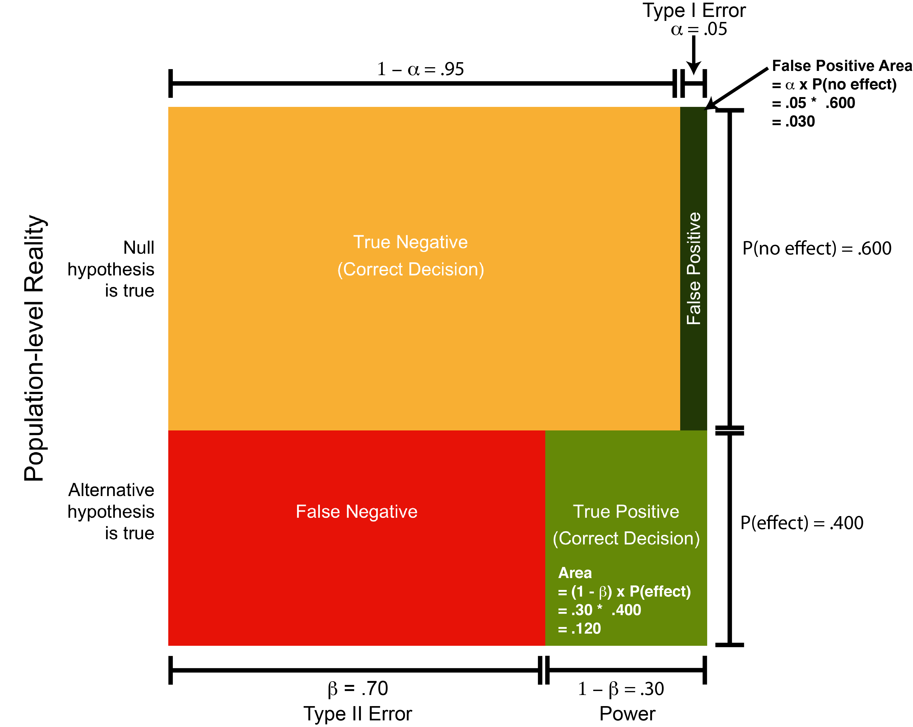

# Positive Predictive Value

## Required

The following CRAN packages must be installed:

| Required CRAN Packages |
|-------------------|
|pwr               |
|TOSTER            |


## Overview

At this point you've learned to be cautious when it comes to interpreting $p$-values. But so far, that's been more of a qualitative form of caution. In this section we attempt to make it a more quantitative form of caution. Specifically, we introduce you to the concept of positive predictive values (PPV) in the context of interpreting significant *p*-values. The PPV statistic provides us with an estimate of how likely it is there really is an effect when a *p*-value is significant. The approach for this chapter was inspired by a [blog](https://dirnagl.com/2014/09/22/p-value-vs-positive-predictive-value/) post.


## Informal explanation

### Many hypotheses

When you conduct an experiment to determine if an effect exists you start off fairly confident that the effect is there - otherwise you would not invest the time and money to run the study. Unfortunately only a minority of hypotheses are true. A recent examination of pre-registered studies determined that just over 40% of research hypotheses are true [@scheel2020excess]. Which correspondingly implies that approximately 60% of research hypotheses are false. That is, approximately 60% of studies fail to find the desired effect. 

One way to think about this finding is by imagining 1000 hypothesis as per Figure \@ref(fig:ppvfig1). In this figure there are 1000 squares. Each square represents an hypothesis worthy of being tested. We've shaded the squares to indicate which hypotheses are true or false. Specifically, 40% of the 1000 hypotheses (i.e., 400 squares) are shaded green to indicate the hypotheses are true. In contrast, 60% of the 1000 hypotheses (i.e., 600 squares) are shaded yellow to indicate the hypotheses are false.  

```{r ppvfig1, echo = FALSE, out.width = "90%", fig.scap = "One-thousand hypotheses represented as squares.", fig.cap="One-thousand hypotheses represented as squares. True hypotheses are indicated by the color green. False hypotheses are indicated by the color yellow."}
knitr::include_graphics("ch_ppv/images/fig1.png")
```


### Type I Error

Even when an hypothesis is false there still a chance we will obtain a significant result (i.e., $p$ < .05). More specifically, we will obtain a significant result 5% of the time when the null hypothesis is true and there is no effect (i.e., $\alpha = .05$). In terms of our example, this means that of the 600 false hypotheses, we would obtain a significant result for 30 of them (i.e., .05 * 600 = 30). These 30 false positive significance tests are illustrated in Figure \@ref(fig:ppvfig2) below.

```{r ppvfig2, echo = FALSE, out.width = "90%", fig.scap= "False positive significance tests.", fig.cap = "False positive significance tests. False hypotheses for which the researcher obtained a significant result are indicated by dark green squares."}
knitr::include_graphics("ch_ppv/images/fig2.png")
```


### Power

Unfortunately, even when an hypothesis is true we won't always obtain a significant *p*-value. Low sample sizes in psychology are common. As a result most studies in psychology only have a 30% chance of finding an effect if there is one. That is, the typical value for statistical power in psychology is around .30. This typical statistical power level is illustrated in the context of our example in Figure \@ref(fig:ppvfig3) below. In this figure, hypotheses that were true but obtained non-significant *p*-values are indicated by red squares. In contrast, the hypotheses that were true and obtained significant *p*-values are indicated by green squares; there are 120 green squares.

```{r ppvfig3, echo = FALSE, out.width = "90%", fig.scap = "True positive signficance tests.", fig.cap = "True positive signficance tests. True hypotheses for which the researcher obtained a significant result are indicated by green squares. True hypotheses for which the researcher obtained a non-significant result are indicated by red squares." }
knitr::include_graphics("ch_ppv/images/fig3.png")
```

### Calculating PPV

You can see from the blue outline in Figure \@ref(fig:ppvfig4), below, that there two ways to obtain a significant *p*-value. Specifically, you can obtain a significant *p*-value when the null hypothesis is true (a false positive *p*-value). As well, you can obtain a significant *p*-value when the null hypothesis is false (a true positive *p*-value). As a researcher, when we obtain a significant *p*-value we don't know if it's a true-positive or a false-positive. We calculate PPV to determine how likely it is there is an effect when the *p*-value is significant.


```{r ppvfig4, echo = FALSE, out.width = "90%", fig.cap = "xx"}
knitr::include_graphics("ch_ppv/images/fig4.png")
```


As illustrated in Figure \@ref(fig:ppvfig5), below, the positive predictive value (PPV) is simply the ratio of the true-positive *p*-values over all the *p*-values (true positive or true negative). 


```{r ppvfig5, echo = FALSE, out.width = "40%", fig.align='center', fig.cap = "Graphical illustration of the PPV formula."}
knitr::include_graphics("ch_ppv/images/fig5.png")
```


Placing numbers into the equation:

$$
\begin{align}
PPV &= \frac{120 }{120  + 30} \\
&= \frac{120}{150} \\
&= 0.80
\end{align}
$$

We see that the positive predictive value is .80 in this circumstance. That is, if we obtain a significant *p*-value there is an 80% chance there really is an effect.

##  Formal explanation

A more formal explanation of PPV can be made by thinking in terms of the area of square that is 1.0 units by 1.0 units. The length of each side corresponds a length of 1.0 because probabilities range from 0 to 1.0. Indeed, we can represent the probability of an hypothesis being true, P(effect), or false, P(no effect), along the right edge of the square. This is illustrated in Figure \@ref(fig:ppvfig6) below.

```{r ppvfig6, echo = FALSE, out.width = "90%", fig.cap = "Representing probabilities on a square"}
knitr::include_graphics("ch_ppv/images/fig6.png")
```

### No effect

Likewise, we can indicate the probability of a Type I Error on the diagram as well. Specifically, $\alpha = .05$ is the distance, moving right to left, from the top right corner of the square. This is illustrated in Figure \@ref(fig:ppvfig7) below.

```{r ppvfig7, echo = FALSE, out.width = "90%", fig.cap = "Representing Type I Error on the square"}
knitr::include_graphics("ch_ppv/images/fig7.png")
```


So far the probability of there being no effect, P(no effect), was indicated by a length (.600). Likewise, the probability of there being a Type I Error was indicated by a length (.05). 

$$
\begin{align}
P(\text{no effect}) &= 0.600 \\
P(\text{Type I Error}) &= 0.05 \\
\end{align}
$$

We can use these together to determine the dark green area (nearly black area) on Figure \@ref(fig:ppvfig7) which represents the joint probability of there being no effect and obtaining a Type I Error. You can see the probability .030 is similar to the count of 30 we had for this area in the informal explanation.


$$
\begin{align}
P(\text{no effect} \cap \text{Type I Error}) &= P(\text{Type I Error})P(\text{no effect})  \\
&= (\alpha) P(\text{no effect}) \\
&= (.05)(.600) \\
&= 0.030
\end{align}
$$

### Effect

So far the probability of there being an effect, P(effect), was indicated by a length (.400). Likewise, the probability of finding that effect (i.e., power) can be indicated by a length (.30) as per Figure \@ref(fig:ppvfig8) below. 


```{r ppvfig8, echo = FALSE, out.width = "90%", fig.cap = "Representing power on the square"}

```


In this figure there are two important distances that represent probabilities as indicated below. Note that we often refer to power using the notation $1 - \beta$. 


$$
\begin{align}
P(\text{effect}) &= 0.400 \\
(1 - \beta) &= 0.30 \\
\end{align}
$$

We can use these together to determine the dark green area on the figure which represents the joint probability of there being an effect and obtaining a significant *p*-value. You can see the joint probability .030, below, is similar to the count of 30 we had for this area in the informal explanation.


$$
\begin{align}
P(\text{effect} \cap \text{sig. p-value}) &= (1 - \beta)P(\text{effect})\\
&= (.30)(.400) \\
&= 0.120
\end{align}
$$

### Calculation

We can then calculate positive predictive value using the same logic as the informal case - but using formal equations. You can see in the equations below that some probabilities (.030, .120, and .150) correspond to the counts (30, 120, and 150) from the informal explanation above.

$$
\begin{align}
PPV &= \frac{P(\text{effect} \cap \text{sig. p-value})}{P(\text{effect} \cap \text{sig. p-value}) + P(\text{no effect} \cap \text{sig. p-value})} \\
&= \frac{(1 - \beta)P(\text{effect})}{(1 - \beta)P(\text{effect}) + \alpha P(\text{no effect})}\\
&= \frac{(.30)(.400)}{(.30)(.400) + (.05)(.600)}\\
&= \frac{0.120}{0.120 + 0.030}\\
&= \frac{0.120}{0.150}\\
&= 0.80\\
\end{align}
$$

Thus, the positive predictive value is .80. This indicates that if you obtain a significant *p*-value in your study there is an 80% chance there really is an effect.


### Alternative calculation

You might also see positive predictive values expressed using an odds ratio (OR). This can create confusion - but it's important to realize this alternative version of the formula is just an algebraic rearrangement. You can see this alternative version of the formula below and note that you obtain the same answer.

$$
\begin{align}
PPV &= \frac{(1 - \beta)(OR)}{(1 - \beta)(OR) + \alpha}\\
&= \frac{(1 - \beta)(\frac{P(\text{effect})}{P(\text{no effect})})}{(1 - \beta)(\frac{P(\text{effect})}{P(\text{no effect})}) + \alpha}\\
&= \frac{(.30)(\frac{.400}{.600})}{(.30)(\frac{.400}{.600}) + \alpha}\\
&= \frac{(.30)(0.6666667)}{(.30)(0.6666667) + .05}\\
&= \frac{.20}{.20 + .05}\\
&= 0.80\\
\end{align}
$$


### Touchstone

You may, or may not, have noticed something familiar when we started working with the square as means of describing the numbers required for the positive predictive value calculation. Specifically, the square is very similar to the standard 2 x 2 table used to represents Type I Errors (false positives) and Type II Errors (false negatives). In Figure \@ref(fig:ppvfig9) I've placed a colour coded version of this table so that you can see the similarities with the calculation approach used above.


```{r ppvfig9, echo = FALSE, out.width = "90%", fig.cap = "Table illustrating Type I (false positives) and Type II Errors (false negatives)."}
knitr::include_graphics("ch_ppv/images/fig9.png")
```


## Calculating power for your study

Although we do a sample size analysis before collecting data - we are often are unable to obtain the desired sample size. We can determine the consequences of failing to obtain the desired sample size by calculating positive predictive value. The first stepping in doing so is calculating the power for your study based on the number of participants you actually obtained.

To calculate the power for your study you need to use the same estimate of the population effect size that you used in original sample size analysis. You merely enter that same smallest effect size of interest (i.e., population level effect) and your obtained sample size into the R functions and it will return the power for your study - based on the sample size you actually obtained.

The examples below all illustrate a population-level effect (i.e., smallest effect size of interest from the original power analysis) and the obtained sample size. Check out the next section to see how to use this information to calculate the positive predictive value for your study.

### Power independent groups $t$-test

```{r}
library(pwr)
# Based on the previous study modify the settings below.
# For alternative: use "greater" for one-sided 
# and "two.sided" for two-sided test
alternative <- "greater"
pop_d <- .24
sample_size_per_group <- 25

pwr_out <- pwr.t.test(d = pop_d, 
                      n = sample_size_per_group,
                      type = "two.sample",
                      alternative = alternative)
```

Then we need to print our power / sample size analysis:

```{r}
print(pwr_out)

```

This analysis reveals that a) if we assume the population effect size is .24 ($\delta = .24$) and b) use a sample size of 25 per group, then our resulting power is 0.21. That is, if an effect exists, we have a 21% chance of finding it.


### Power repeated measures $t$-test

```{r}
library(pwr)
# Based on the previous study modify the settings below.
# For alternative: use "greater" for one-sided 
# and "two.sided" for two-sided test
alternative <- "greater"
pop_d <- .17
n <- 30

pwr_out <- pwr.t.test(d = pop_d, 
                      n = n,
                      type = "paired",
                      alternative = alternative)
```

Then we need to print our power / sample size analysis:

```{r}
print(pwr_out)

```

This analysis reveals that a) if we assume the population effect size for our repeated measures $t$-test is 0.17 ($\delta = 0.17$) and b) we have a sample size of 30, then our resulting power is 0.23. That is, if an effect exists, we have a 23% chance of finding it. 


### Power correlations

#260 to #100
```{r}
library(pwr)
# Based on the previous study modify the settings below.
# For alternative: use "greater" for one-sided 
# and "two.sided" for two-sided test
alternative <- "greater"
pop_r <- .18
n <- 100

pwr_out <- pwr.r.test(r = pop_r, 
                      n = n,
                      alternative = alternative)
```

Then we need to print our power / sample size analysis:

```{r}
print(pwr_out)

```

This analysis reveals that a) if we assume the population correlation is .18 ($\rho = .18$) and b) we use a sample size of 100, then our resulting power is 0.56. That is, if an effect exists, we have a 56% chance of finding it. 

### Equivalence independent *t*-test

#### Standardized units

```{r}
library(TOSTER)
n_per_group = 40
powerTOSTtwo(alpha = 0.05,
             N  = n_per_group,
             low_eqbound_d = -0.40,
             high_eqbound_d = 0.40)
```

#### Raw units

```{r}
library(TOSTER)
n_per_group = 40

powerTOSTtwo.raw(alpha = 0.05,
                 N  = n_per_group,
                 sdpooled = 2.50,
                 low_eqbound = -1,
                 high_eqbound = 1)
            
```


### Equivalence repeated *t*-test

#### Standardized units

```{r}
library(TOSTER)
n <- 10
powerTOSTpaired(alpha = 0.05,
                N = n,
                low_eqbound_dz = -0.6325,
                high_eqbound_dz = 0.6325)
            
```

#### Raw units

```{r}
library(TOSTER)
n <- 10
powerTOSTpaired.raw(alpha = 0.05,
                    N = n,
                    sdif = 1.581,
                    low_eqbound = -1,
                    high_eqbound = 1)
            
```

### Equivalence correlation

```{r}
library(TOSTER)
n <- 75
powerTOSTr(alpha = .05,
           N = n,
           low_eqbound_r = -.20, 
           high_eqbound_r = .20)
```


## Calculating PPV for your study

To calculate PPV for your study you simply use the previously presented formula for positive predictive value. Imagine that you conducted an independents groups t-test and determined your power was .21 you would calculate positive predictive value as below. You may assume the probability of your hypothesis being true is .400.

$$
\begin{align}
PPV &= \frac{(1 - \beta)P(\text{effect})}{(1 - \beta)P(\text{effect}) + \alpha P(\text{no effect})}\\
&= \frac{(.21)(.400)}{(.21)(.400) + (.05)(.600)}\\
&= 0.74\\
\end{align}
$$

Thus, if you obtained a significant *p*-value in this scenario there is only a 74% chance there really is an effect.


