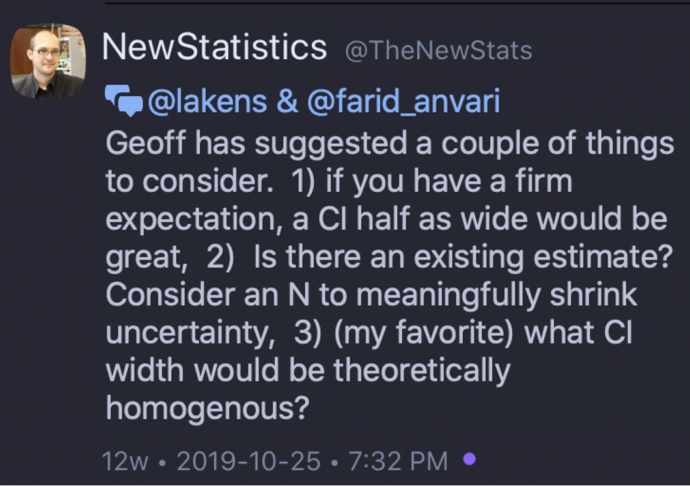

# Precision and sample size 

## Required

The following CRAN packages must be installed:

| Required CRAN Packages |
|-------------------|
|MBESS              |
|TOSTER             |

## Overview

In the previous two chapter, we reviewed the sample size planning using the traditional NHST approach as well as equivalence testing. In this chapter, we focus on determining the appropriate sample size for your study using the precision approach. Specifically, we review determining the desired sample size based on the effect size and desired confidence interval width.

## Precision

A confidence interval provides an interval estimate of the population parameter. If you took multiple samples from a population and constructed a confidence interval for each sample the confidence intervals would likely all be different. More specifically, each confidence interval is likely to have a different range and width. Over a large number of samples 95% of the confidence intervals would overlap with the population parameter. 

Interpretation of confidence intervals can be challenging. **Prior** to collecting your data we say there is a 95% chance a constructed confidence interval will overlap with the population parameter. Once you have collected your data and obtained the end points for your sample confidence interval - interpretation is more difficult. Indeed, a specific interval will either overlap with the population parameter or not; unfortunately, you don't know which is the case. Consequently, once you have a specific confidence interval with end points, based on your data, you should only interpret it as plausible range of values for the population parameter -  don't associate the 95% probability with interpretting the confidence interval once you have constructed it.

Imagine you are about to conduct a correlation study (*N* = 100) and you plan to construct a confidence interval around that correlation. At this point, prior to data collection, there is a 95% chance that the confidence interval you construct around the sample correlation will overlap with the population correlation (i.e., the population parameter). You collect your data and find $r$ = .35, 95% CI [.16, .51]. Now that you have a specific confidence interval how do you interpret it? You can say the confidence interval is plausible range of the values for the population correlation. You should **not** say there is a 95% chance that population correlation is in the .16 to .51 range. Why not? Once the data is collected and you have a specific interval with end points (e.g., .16 to .51) statisticians think of the interval as overlapping with the population correlation (a probability of 1.00) or not (a probability of 0). Thus, once you have a specific interval, after data collection, the probability that it contains the population parmater is 1.00 or 0 - you just don't know which. So a convienient way to think about the range is by using the word **plausible** which is not associated with a probability. We simply say the confidence interval uses sample data to provide a plausible range of values for the population parameter (e.g., population correlation). 

Using confidence intervals for research can, from one perspective, be a fundamental shift in your thinking about how to interpret results. Null hypothesis significance testing allows for a simplistic conclusion - the population effect size may not be exactly zero. This is a form fo categorical decision making: effect / no effect. In contrast, the using confidence intervals to interpret your data is an **estimation** approach: How large is the effect and how uncertain is my estimate of the effect size? Moreover, using the estimation approach makes it a small jump to drawing scientific conclusions using meta-analysis [see @schmidt2014methods]. You can learn more about confidence interval / estimation approach by checking out this video [workshop](https://www.psychologicalscience.org/members/new-statistics). Alternatively, you can check out these general articles @cumming2009inference, @cumming2014new, @calin2019new.  @calin2019estimation.

There are two parts to planning using precision:

1. Determining the effect size of interest (reviewed in previous chapters on smallest effect size of interest).

2. Indicating the desired width of the confidence interval.

Unfortunately, there is little consensus of how to pick the desired width of the confidence interval. Our sense is that the width of the confidence interval should not be larger than the effect size. That, is your uncertainty should not be larger than the effect itself. For example, if you specified a smallest size of interest as $\delta$ = 0.40 then you would specify a width of 0.40 as well. Likewise, with correlations, if you specified a smallest effect size of interest as $r$ = .30 then you would indicate a desired with of .30 as well. 

More stringent advise was offered, indirectly by Geoff Cumming, on social media:

```{r, echo = FALSE, out.width="40%"}

```


Below I present a series of examples for determining the sample size for your study using the less stringent approach of setting the confidence interval width to be the same as the effect size. 

You can read more about planning for precision in @rothman2018planning.

### Precision Independent *t*-test

```{r}
library(MBESS)

ss.aipe.smd(delta = 0.40,
            width = 0.40)

# Returns sample size per group

```


### Precision Repeated *t*-test

```{r}
library(MBESS)

ss.aipe.sm(sm = 0.40,
            width = 0.40)

```

### Precision Correlation

```{r}
library(MBESS)
rho <- .30
rho2 <- rho * rho

ss.aipe.R2(Population.R2 = rho2, 
           width = rho2,
           p = 1)
```


