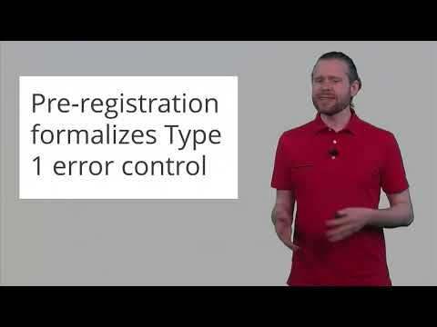
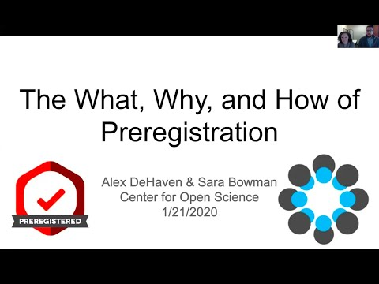

# Open Science Preregistration

## Overview

It's helpful to distinguish between preregistration and registered reports. This week we see a series of video that describe each of these approaches  One of the most population options for preregistering a study is to use the Open Science Framework (OSF) which was created by the Center for Open Science (COS). In this [video](https://youtu.be/9YuNGB3vNOw) you obtain an overview of preregistration and the OSF. 

```{r, out.width="40%", echo = FALSE}
knitr::include_graphics("ch_preregistration/images/prereg_overview.jpg")
```

## Daniel Simmons Interview

Daniel Simmons provides information about registered reports. Pay particular attention to the problems associated with finding an unexpected effect in a data set and then trying to test a hypothesis related to that effect with the same data. You can watch the video [here](https://youtu.be/LYfZr5poCkQ).

```{r, out.width="40%", echo = FALSE}

```

## Preregistration Impact

Learn about the statistical impact of preregistration in this video. As in the previous video, pay particular attention to the problems associated with finding an unexpected effect in a data set and then trying to test a hypothesis related to that effect with the same data. You can watch the video [here](https://youtu.be/-fz_kZvlWpw).

```{r, out.width="40%", echo = FALSE}

```

## Preregistration Details

In this video you will learn the "nuts and bolts" of preregistration using the OSF. You can watch the video [here](https://youtu.be/8QK2-udwoK8).

```{r, out.width="40%", echo = FALSE}

```


## Learn more

Learn more about preregistration at this [website](https://www.cos.io/initiatives/prereg).
