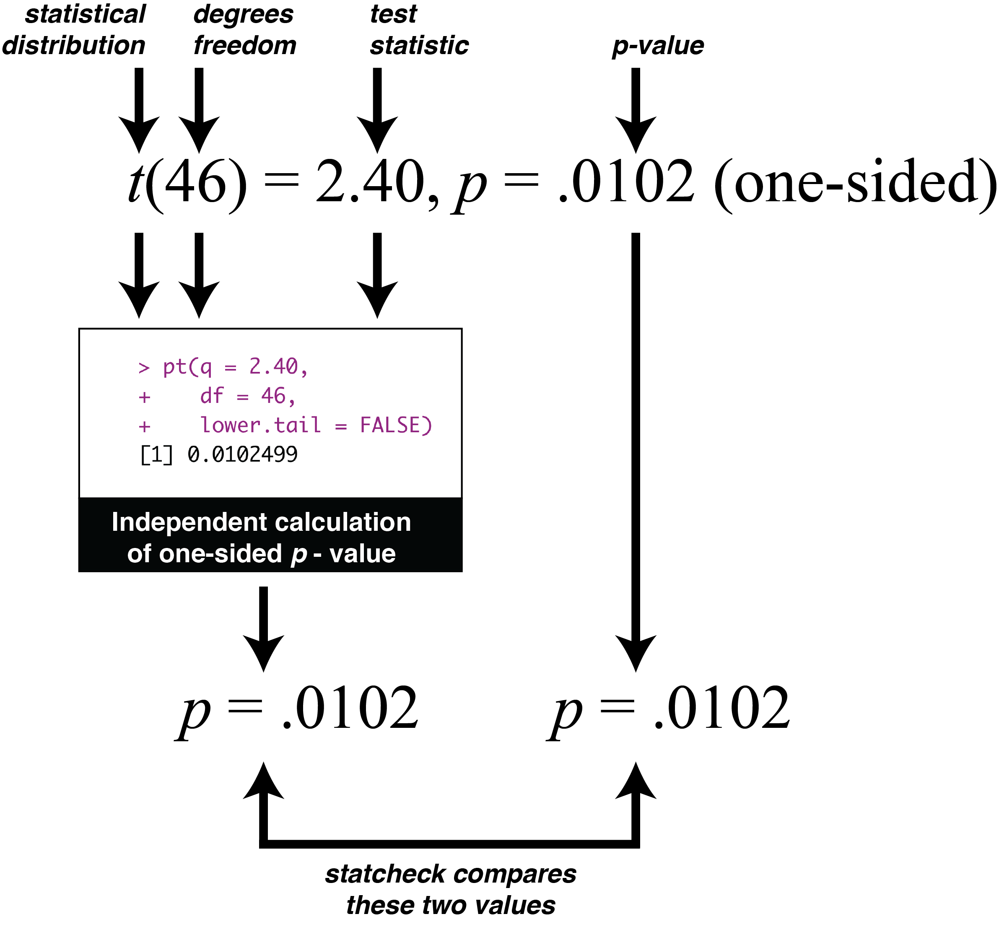
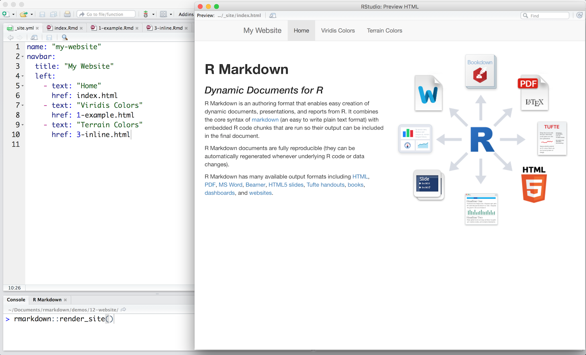
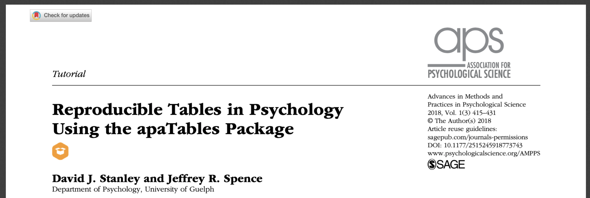

# Research Tools

## statcheck

One concern associated with the replicability crisis is that the numbers reported in published articles are simply wrong. The numbers could be wrong due to typos or due to deliberate alteration (to ensure *p* < .05). Interestingly, one study decided to check if the *p*-values published in articles were correct [@nuijten2016prevalence]. The authors checked the articles using the software [statcheck](https://cran.r-project.org/package=statcheck). You can think of statcheck as a statistical spell checker that independently recreates the *p*-values in an article and checks if the reported *p*-value is correct. The authors used this process on over 250,000 *p*-values reported in eight major journals between 1985 and 2013. They found that roughly 50% of journal articles had a least one  reporting error. Moreover, one in eight journal articles had a reporting error sufficiently large that it likely altered the conclusions of the paper. Note that incorrect *p*-values reported were typically smaller than they should been such that the incorrectly reported *p*-value was less than .05. That's quite a large number of studies with incorrect *p*-values! 

### statcheck software

Fortunately, you can use statcheck on your own work before submitting it to an adviser or a journal. The statcheck software is available, as a [website](http://statcheck.io), a [plug-in](http://statcheck.io/word-add-in.php) for Microsoft Word, and as an [R package](https://cran.r-project.org/web/packages/statcheck/index.html). You can see the GitHub page for statcheck [here](https://github.com/MicheleNuijten/statcheck).

### statcheck website

The statcheck website is easy to use. Just upload your PDF or Word document and it will perform the statcheck scan to determine if the numbers in your papers are correct / internally consistent. You can try it out with the PDF of a published article.

```{r, echo = FALSE, out.width = "60%"}
knitr::include_graphics("ch_tools/images/statcheck_website.png")
```

You can see the first few rows of the statcheck output for an article below:

```{r, echo = FALSE, out.width = "60%"}
knitr::include_graphics("ch_tools/images/statcheck_output.png")
```


### statcheck and Word

Interestingly, statcheck will soon be available as plug-in for Word -- as illustrated below. As you type it will perform the statcheck scan to determine if the numbers in your papers are correct / internally consistent. You can see the GitHub page for statcheck Word plug-in [here](https://github.com/WillemSleegers/statcheck-word).

```{r, echo = FALSE, out.width = "80%"}
knitr::include_graphics("ch_tools/images/statcheck_word.png")
```

### statcheck process

Exactly how does statcheck work? Statcheck is based on the fact that authors report redundant information in their papers. For example, an author might report the statistics: *t*(46) = 2.40, *p* = .0102 (one-sided). Or in the past report this information using a *p*-value threshold: *t*(46) = 2.40, *p* < .05 (one-sided). The first part of this reporting, *t*(46) = 2.40, can be used to independently generate the *p*-value, as illustrated below. The software does so and then simply compares the independently generated *p*-value with the reported *p*-value (e.g., *p* = 0102) or *p*-value threshold (*p* < .05). You would think the independently generated *p*-value and the reported *p*-value would always match. But as illustrated by [@nuijten2016prevalence] at least 50% of papers of a problem with the *p*-values reported matching the correct *p*-value.

```{r, echo = FALSE, out.width = "80%"}

```


### statcheck validity

Although there were some initial concerns about the validity of statcheck, subsequent [research](https://psyarxiv.com/tcxaj/download?format=pdf) on the package indicates an impressive validity level of roughly 90% (or a little higher/lower depending on the settings used). Indeed, in July of 2016, the journal *Psychological Science* started using statcheck on all submitted manuscripts - once they based an initial screen. Journal editor, Stephen Lindsey, [reports](https://www.nature.com/news/stat-checking-software-stirs-up-psychology-1.21049) there has been little resistance to doing so "Reaction has been almost non-existent."

## rmarkdown / bookdown

One approach to avoiding errors in your article/thesis is to create a dynamic document. In this type of document you do not type the numbers into the document. Rather the document contains your analysis script (hidden from readers) and it inserts the calculated values into the text of the document. The exciting part of this type of document is that a single rmarkdown document and produce a number output formats such as PDF, Word, Power Point, HTML - as illustrated in the diagram below.

```{r, echo = FALSE, out.width = "60%", cap = "apaTables paper header"}

```


You can learn more about rmarkdown in this [video](https://vimeo.com/178485416). I suggest you read the official [documentation](https://rmarkdown.rstudio.com/lesson-1.html) to get started. Incidently, the PDF course assignments are made with rmardown - as well as this website!

Some other great resources:

* [R Markdown: The Definitive Guide](https://bookdown.org/yihui/rmarkdown/)

* [R Markdown Cookbook](https://bookdown.org/yihui/rmarkdown-cookbook/)

* [bookdown: Authoring Books and Technical Documents with R Markdow](https://bookdown.org/yihui/bookdown/)


## papaja

You may also find the [papaja package](https://github.com/crsh/papaja) helpful - and an easy way to use rmarkdown. It is a based on the rmarkdown extension called bookdown. This package is specifically designed to make it easy to use rmarkdown/bookdown to maka an APA style paper. Indeed that's the basis for the odd package name: **Preparing APA Journal Articles** (papaja).

I suggest you read the extensive papaja (documentation)[https://crsh.github.io/papaja_man/introduction.html]. It will be worth your while!

The only slight complication with papaja is the fact it is not on the CRAN and can't be installed in the usual way. But it's still straight forward. You can install papaja with the commands below - taken from the papaja website.

```{r, eval = FALSE}
# Install devtools package if necessary
if(!"devtools" %in% rownames(installed.packages())) install.packages("devtools")

# Install the stable development verions from GitHub
devtools::install_github("crsh/papaja")
```

Indeed, once papaja is installed - you simply have to select the APA template before you enter your rmarkdown, as illustrated below:

```{r, echo = FALSE, out.width = "60%", cap = "apaTables paper header"}
knitr::include_graphics("ch_tools/images/papaja_template.png")
```

## apaTables

If you don't want to learn rmarkdown you may find the [apaTables](https://cran.r-project.org/package=apaTables) package useful - it can easily create the most commonly used APA tables formatted for Microsoft Word. The [documentation](https://dstanley4.github.io/apaTables/articles/apaTables.html) has extensive examples.  You can also see the published guide by @stanley2018reproducible.

```{r, echo = FALSE, out.width = "60%", cap = "apaTables paper header"}

```

## Retracted articles

As you write-up your research you need to be concerned with the problem of citing research papers that have been retracted. This problem is substantially larger than you might first expect; indeed, one group of researchers found that retracted papers often received the majority their citations **after** retraction [@madlock2015lack]. Therefore, take the extra time to confirm the papers you cite have not been retracted! Moreover, don't assume because an article was published in a high-impact journal that it is a high quality article - and not likely to be retracted. The truth is the opposite. Retraction rates correlate positively with journal impact factor (how often articles in that journal are cited). Specifically, journals with high impact factors have the higest retraction rate [@fang2011retracted].

```{r, echo = FALSE, out.width = "60%", cap = "apaTables paper header"}
knitr::include_graphics("ch_tools/images/retract_impact.png")
```


### DOI

But how do you go about determining if a paper has been retracted? There are websites you can check like [retraction watch](https://retractionwatch.com). It can, however, be time consuming to check for every article in this website. There is an easier approach but it requires you know the DOI number for each article you cite.

What is a DOI number? All modern journal articles have a DOI (digital object identifier) number associated with them. This is a unique number that identifies the article and can be used to access the document.

You can see a DOI number on a PDF:

```{r, echo = FALSE, out.width = "60%", cap = "DOI number on a PDF"}
knitr::include_graphics("ch_tools/images/doi_pdf.png")
```

Or you can see a DOI number on the website:

```{r, echo = FALSE, out.width = "60%", cap = "DOI number on a website"}
knitr::include_graphics("ch_tools/images/doi_website.png")
```


### retractiondatabase.org

If you don't have the DOI number for an article you can search for it at [http://retractiondatabase.org](http://retractiondatabase.org). The interface is illustrated below.

```{r, echo = FALSE, out.width = "100%", cap = "DOI number on a website"}
knitr::include_graphics("ch_tools/images/retractiondb.png")
```

 
### openretractions.com

However, if you have the DOI number for an article, an easier approach is use the [http://openretractions.com](http://openretractions.com) website. At this website you type in the DOI number for an article and it checks if that article has been retracted.

```{r, echo = FALSE, out.width = "60%", cap = "Open retractions website"}
knitr::include_graphics("ch_tools/images/openretractions.png")
```


### retractcheck

Even better, you can use the [retractcheck](https://cran.r-project.org/package=retractcheck) R package. With this package you can check large batches of DOI numbers with openretractions.com to see if the corresponding articles have been retracted. You can use this package by the command line or via the [website](https://frederikaust.shinyapps.io/retractcheck_shinyapp/) illustrated below.

```{r, echo = FALSE, out.width = "60%", cap = "Open retractions website"}
knitr::include_graphics("ch_tools/images/retractcheck_website.png")
```


