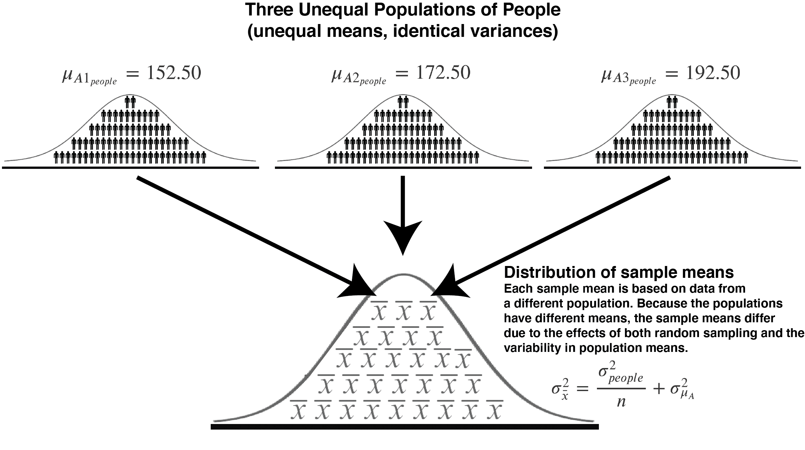
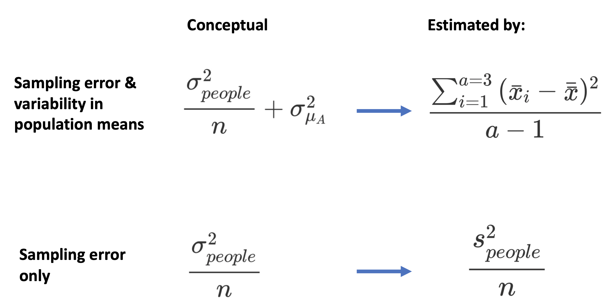
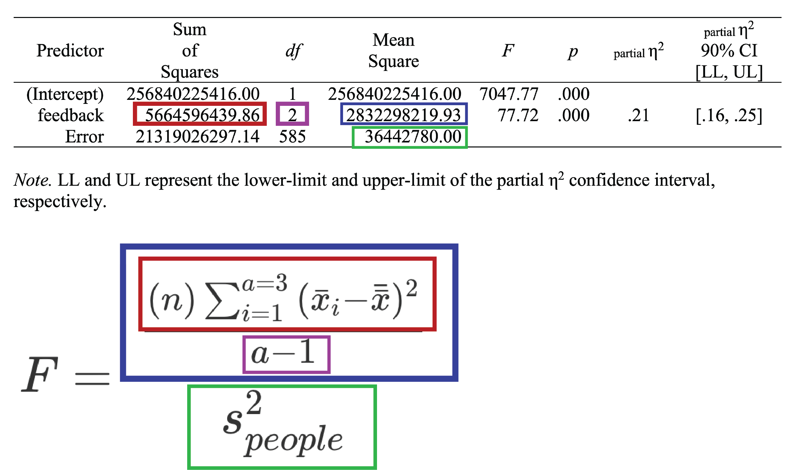

# Deeper dive: Sampling and ANOVA

## Now: Different Population Means

In the last chapter, we examined a scenario with multiple populations where the **population means were identical**. Consequently, sample means differed for one reason: random sampling error. This meant the formulas for a) total variance [observed variance] and b) random sampling variance [expected variance] were estimates of the **same** quantity.

**In this chapter**, we examine a scenario with multiple populations where the **population means are different**.  Consequently, sample means will differ for two reasons. More specifically, sample means will differ due to differences among the population mean and random sampling error.  This means the formulas for a) total variance [observed variance] and b) random sampling variance [expected variance] are estimates of **different** quantities.

## Theory sample mean variance 

### Single population (theory)

Although the focus of this chapter is multiple populations, we begin with a single population. Recall that when there is a single population we express the variance in sample means using the formula below. This formula is conceptual one that calculates the variance in sample means due to sampling error for a given population variance and sample size.

$$
\begin{aligned} 
\sigma_{\bar{x}}^2 &= \text{variance due to sampling error}\\
&= \frac{\sigma_{people}^2}{\text{sample size}}\\
&= \frac{\sigma_{people}^2}{n}\\
\end{aligned}
$$


### Multiple populations (theory)

When there are multiple populations with identical variances, but different population means, that same formula applies for sampling error. That is, because the populations of people all of have the same variance, we can use the old formula to calculate the variability in sample means due to sampling error. In ANOVA, we ASSUME the various populations have the same variance - here we KNOW the multiple populations have the same variance (becausee we are creating them in the computer later).

$$
\begin{aligned} 
\text{variance due to sampling error} &= \frac{\sigma_{people}^2}{\text{sample size}}\\
&= \frac{\sigma_{people}^2}{n}\\
\end{aligned}
$$


However, when there are multiple populations we also have to take into account the **variability in population means** when determining the *total variance of sample means*. We use $a$ to indicate the number of populations. If there are three populations then $a = 3$. We use the formula below to calculate the **variance of the population means**:

$$
\begin{aligned} 
\text{variance in population means} &= \sigma_{\mu_A}^2 \\
&= \frac{\sum (\mu_{A_i}-\mu_{\mu_A})^2}{a} \\
\end{aligned}
$$


where 

$$
\mu_{\mu_A} =  \frac{\sum{\mu_A}}{a}
$$


When there are multiple populations the variability in sample means is due to both variability in population means (above) and sampling error.

$$
\begin{aligned} 
\sigma_{\bar{x}}^2 &= \text{variance due to sampling error} + \text{variance in population means} \\
&= \frac{\sigma_{people}^2}{n} + \sigma_{\mu_A}^2\\
\end{aligned}
$$


Importantly, if the populations all have the same mean then  $\sigma_{\mu_A}^2=0$. When this happens, sample means differ only due to sampling error. 


  Goal| Formula | Expected value | degrees of feedom |
:--------------:|:--------------:|:------------------:|:---------------:|
Estimated total variance [observed variance] | $\frac{\sum(\bar{x_i}-\bar{\bar{x}})^2}{a-1}$ |$\frac{\sigma_{people}^2}{n} + \sigma_{A}^2$ | $a-1$
Estimated variance sampling error [expected variance] | $\frac{s_{people}^2}{n}$ |$\frac{\sigma_{people}^2}{n}$ | $n-1$

The table above summarizes the different estimate goals of the two formulas. Consider the "Expected value" (or Expected Mean Square) column. When the populations means are the same then $\sigma_{A}^2  = 0$. When the population means are different, then $\sigma_{A}^2>0$. 

Note that when the population mean are the same, and $\sigma_{A}^2$ becomes $0$, the "Expected value" is becomes the same for both formulas. That is, they are both estimates of the same quantity, namely, $\frac{\sigma_{people}^2}{n}$. We examined that scenario in the last chapter.

In this chapter, our final goal is to examine the multiple population scenario where $\sigma_{A}^2>0$. That is, that situation where the two formulas are estimates of different quantities. But we begin with a review of the single population scenario.

## Practice sample mean variance 


### Single population (practice)

Let's quickly revisit the scenario where there is a single population with a mean of 172.50 and a variance of 156.3236. Sample means (n = 5) will only differ due to sampling error. We can calculate the variance due to sampling error with the Expected Variance equation below.

$$
\begin{aligned} 
\text{variance due to sampling error} &= \frac{\sigma_{people}^2}{n}\\
&= \frac{156.3236}{5}\\
&= 31.26472\\
\end{aligned}
$$

Thus, where there is a single population (with variance 156.3236) and the sample size is n = 5, sample means will differ only due to sampling error. The variance in the sample means will be 31.26472.


We can confirm this with the R code below. We create a population and then take 9,000 sample means.


```{r,include = FALSE}
library(tidyverse)
```

```{r}
library(tidyverse)
library(learnSampling)

set.seed(1) # set random number seed
pop1 <- make_population(mean = 172.50, variance = 156.3236)

set.seed(1)
sample_means <- get_mean_samples(pop1,
                                 n = 5,
                                 number.of.trials = 9000)
```

The first few rows of the data set with 9,000 sample mean is below:

```{r}
head(sample_means)
```

The trial column indicate which trial (of the 10,000) is represented in that row. The source population column indicate the population we obtain the sample from (1 since we only had 1 population). The sample mean column indicate the sample mean in that trial.

```{r}
sample_means %>%
  summarise(var_means = var(sample_mean))
```

We take the variance of all of those sample means and get a value of 30.80005 which closely approximately the actual value of 31.26472 (which we get when using an infinite number of sample means.)

### Multiples population, equal $\mu$ (practice)

Now let's see what happens when we have three populations with different means - as illustrated in the table and figure below. Notice the mean for all three populations is 172.50 in the table below. This means, $\sigma_{A}^2 = 0$. 


| Population |  Mean        | Variance        |
|:----------:|:------------:|:----------------|
| 1          | $\mu_{A1_{people}}= 172.50$ |  $\sigma_{1_{people}}^2= 156.3236$ |
| 2          | $\mu_{A2_{people}}= 172.50$ |  $\sigma_{2_{people}}^2= 156.3236$ |
| 3          | $\mu_{A3_{people}}= 172.50$ |  $\sigma_{3_{people}}^2= 156.3236$ |


We created a scenario where the sample means differed to random sampling only when we created three populations with identical means (and variances). This situation is depicted in the scenario below.

```{r sim3poprepeat, out.width = "100%", echo=FALSE, fig.cap= "Sampling from three populations with the same mean (and variance)"}
knitr::include_graphics("ch_deeper_sampling/images/pop_equal_means.png")
```


Because the populations have equal variances we calculate the variance due to sampling error the way we did previously:

$$
\begin{aligned} 
\text{variance due to sampling error} &= \frac{\sigma_{people}^2}{n}\\
&= \frac{156.3236}{5}\\
&= 31.26472\\
\end{aligned}
$$


But we also have to calculate the variance in population means. But to calculate the variance of the population means we need the **mean of the population means**. This value is calculated below - it's simply the average of 172.50 repeated three times:

$$
\begin{aligned} 
\mu_{\mu_A} &=  \frac{\sum{\mu_A}}{a} \\
&=  \frac{\mu_{A1}+\mu_{A2}+\mu_{A3}}{a} \\
&=  \frac{172.50 + 172.50 + 172.50}{3} \\
&= \frac{517.50}{3}\\
&= 172.50 \\
\end{aligned}
$$

We use this value to calculate the variance of the population means. Which we find to be 0 because the population means are all the same.

$$
\begin{aligned} 
\sigma_{\mu_A}^2 &=  \frac{\sum (\mu_{A_i}-\mu_{\mu_A})^2}{a} \\
&=  \frac{(\mu_{A_1} - \mu_{\mu_A})^2 + (\mu_{A_2} - \mu_{\mu_A})^2 + (\mu_{A_3} - \mu_{\mu_A})^2}{3} \\
&=  \frac{(172.50 - 172.50)^2 + (172.50 - 172.50)^2 + (172.50 - 172.50)^2}{3} \\
&=  \frac{0}{3} \\
&=  0\\
\end{aligned}
$$

Thus, as indicated above: $\sigma_{A}^2 = 0$. 

So the total variance is sample means is:

$$
\begin{aligned} 
\sigma_{\bar{x}}^2 &= \text{variance due to sampling error} + \text{variance in population means} \\
&= \frac{\sigma_{people}^2}{n} + \sigma_{\mu_A}^2\\
&= 31.26472 + 0\\
&= 31.26472\\
\end{aligned}
$$

We can confirm this with the simulation below. **In this simulation we still take 9000 sample means but its 3000 from each of the three populations**.

```{r}
library(tidyverse)
library(learnSampling)

set.seed(1)
pop1 <- make_population(mean = 172.50, variance = 156.3236)
pop2 <- pop1 # populations are identical
pop3 <- pop1 # populations are identical

set.seed(1)
sample_means <- get_mean_samples(pop1, pop2, pop3,
                                 n = 5,
                                 number.of.trials = 9000)
```

The first few rows of the data set with 9,000 sample mean is below:

```{r}
head(sample_means)
```

The trial column indicate which trial (of the 9,000) is represented in that row. The source population column indicate the population we obtain the sample from (1 since we only had 1 population). The sample mean column indicate the sample mean in that trial.

```{r}
sample_means %>%
  summarise(var_means = var(sample_mean))
```


We take the variance of all of those sample means and get a value of 30.80005 which closely approximately the actual value of 31.26472 (which we get when using an infinite number of sample means.) 


**That is, when multiple populations have identical means, the variance of sample means from those populations is due entirely to sampling error. That variance of sample means is represented by the formula below:**

$$
\text{variance due to sampling error} = \frac{\sigma_{people}^2}{n}\\
$$


### Multiples population, different $\mu$ (practice)

Now let's see what happens when we have three populations with different means - as illustrated in the table and figure below. The different populations means indicate that $\sigma_{A}^2>0$.

| Population |  Mean        | Variance        |
|:----------:|:------------:|:----------------|
| 1          | $\mu_{A1_{people}}= 152.50$ |  $\sigma_{1_{people}}^2= 156.3236$ |
| 2          | $\mu_{A2_{people}}= 172.50$ |  $\sigma_{2_{people}}^2= 156.3236$ |
| 3          | $\mu_{A3_{people}}= 192.50$ |  $\sigma_{3_{people}}^2= 156.3236$ |


```{r sim3poprepeatunequal, out.width = "100%", echo=FALSE, fig.cap= "Sampling from three populations with the same mean (and variance)"}

```


Because the populations have equal variances (even if the means are different) we calculate the variance due to sampling error the way we did previously:

$$
\begin{aligned} 
\text{variance due to sampling error} &= \frac{\sigma_{people}^2}{n}\\
&= \frac{156.3236}{5}\\
&= 31.26472\\
\end{aligned}
$$


But we also have to calculate the variance in population means. But to calculate the variance of the population means we need the mean of the population means. This value is calculated below - notice that we are simply averaging the three population means: 152.5, 172.5, and 192.5.

$$
\begin{aligned} 
\mu_{\mu_A} &=  \frac{\sum{\mu_A}}{a} \\
&=  \frac{\mu_{A1}+\mu_{A2}+\mu_{A3}}{a} \\
&=  \frac{152.50 + 172.50 + 192.50}{3} \\
&= \frac{517.50}{3}\\
&= 172.50 \\
\end{aligned}
$$


We use this value to calculate the variance of the population means. **Which we find to be larger than zero because the population means are different.**

$$
\begin{aligned} 
\sigma_{\mu_A}^2 &=  \frac{\sum (\mu_{A_i}-\mu_{\mu_A})^2}{a} \\
&=  \frac{(\mu_{A_1} - \mu_{\mu_A})^2 + (\mu_{A_2} - \mu_{\mu_A})^2 + (\mu_{A_3} - \mu_{\mu_A})^2}{3} \\
&=  \frac{(152.50 - 172.50)^2 + (172.50 - 172.50)^2 + (192.50 - 172.50)^2}{3} \\
&=  \frac{(-20)^2 + (0)^2 + (20)^2}{3} \\
&=  \frac{400 + 0 + 400}{3} \\
&=  \frac{800}{3} \\
&=  266.6667\\
\end{aligned}
$$

Thus, as indicated above, $\sigma_{A}^2>0$.

So the total variance is sample means is a combination of the variance in the population means and random sampling error:

$$
\begin{aligned} 
\sigma_{\bar{x}}^2 &= \text{variance due to sampling error} + \text{variance in population means} \\
&= \frac{\sigma_{people}^2}{n} + \sigma_{\mu_A}^2\\
&= 31.26472 + 266.6667\\
&= 297.9314\\
\end{aligned}
$$

We can confirm this with the simulation below. **In this simulation we still take 9000 sample means but its 3000 from each of the three populations**.

```{r}
library(tidyverse)
library(learnSampling)

set.seed(1)
pop1 <- make_population(mean = 172.50, variance = 156.3236)
pop2 <- make_population(mean = 152.50, variance = 156.3236)
pop3 <- make_population(mean = 192.50, variance = 156.3236)

set.seed(1)
sample_means <- get_mean_samples(pop1, pop2, pop3,
                                 n = 5,
                                 number.of.trials = 9000)
```

The first few rows of the data set with 9,000 sample mean is below:

```{r}
head(sample_means)
```

The trial column indicate which trial (of the 9,000) is represented in that row. The source population column indicate the population we obtain the sample from (1 since we only had 1 population). The sample mean column indicate the sample mean in that trial.

```{r}
sample_means %>%
  summarise(var_means = var(sample_mean))
```


We take the variance of all of those sample means and get a value of 297.7683 which closely approximately the actual value of 297.9314 (which we get when using an infinite number of sample means.)

**That is, when multiple populations have different means, the variance of sample means from those populations is due to both sampling error and the variance of the population means. That variance of sample means is represented by the formula below:**

$$
\sigma_{\bar{x}}^2 = \frac{\sigma_{people}^2}{n} + \sigma_{\mu_A}^2\\
$$

## Back to ANOVA

### Conceptual/Expected $F$-values

In the preceding simulations we saw how the variance of the distribution of sample means was different in the a) population means the same scenario and b) population means different scenario. That is, when the population means were different the variance of the distribution of sample means was larger.  Think about this finding in terms of an experiment.

Consider a scenario where you are interested in examining the effect of crowding on aggressive behavior. Your dependent variable is aggressive behavior. Your independent variable is Crowding with three levels: low, medium, and high. Your study has 5 people in each of these three conditions. The 5 people's aggression scores in the low crowding condition represent a sample aggression scores from a low crowding population. Likewise, the 5 people's aggression scores in the medium crowding condition represent a sample aggression scores from a medium crowding population. Finally, the 5 people people's aggression scores in the high crowding condition represent a sample aggression scores from a high crowding population. 

You calculate a sample mean for each of the three conditions. You are asking if there is an effect of crowding on aggression. To answer this question we need to think of the distribution of sample means that would occur if you repeats the study thousands of times. If you repeated the study thousand of times, and crowding had now effect on aggression the distribution of sample means differ only due to sampling error and be described by the formula below. We think of this formula as describing the distribution of sample means under the Null Hypothesis (i.e., the scenario where the population means are equal.)

$$
\begin{aligned} 
\sigma_{\bar{x}}^2 &= \text{variance due to sampling error} \\
&= \frac{\sigma_{people}^2}{n} \\
\end{aligned}
$$


In contrast, if the crowding manipulation did influence aggressive behavior, this means there are different population means for the three crowding conditions. If the population means are different, then means the variance for the distribution of sample means would correspond to:

$$
\begin{aligned} 
\sigma_{\bar{x}}^2 &= \text{variance due to sampling error} + \text{variance in population means} \\
&= \frac{\sigma_{people}^2}{n} + \sigma_{\mu_A}^2\\
\end{aligned}
$$


Conceptually, an $F$-value represents the comparison of these two approaches:

$$
\begin{aligned} 
F &= \frac{\text{total variance}}{\text{variance due to sampling error}}\\
&= \frac{\text{variance due to sampling error} + \text{variance in population means}}{\text{variance due to sampling error}}\\
&= \frac{\frac{\sigma_{people}^2}{n} + \sigma_{\mu_A}^2}{\frac{\sigma_{people}^2}{n}}\\
\end{aligned}
$$

### Two scenarios

Consider what happens to the above $F$-value when the population means are **all the same**. In this case the variance in population means is zero, $\sigma_{\mu_A}^2=0$. When this happens, the numerator and denominator are the same - so the expected $F$-value is 1.00.

Now consider what happens to the above $F$-value when the population means are **different**. In this case, the variance of population means is larger than zero, $\sigma_{\mu_A}^2 > 0$. When this happens, the numerator is larger than the denominator - so the expected $F$-value is greater than 1.00.

## Calculation

The $F$-value formulas presented above are for the expected values. How do we calculate $F$-values in practice? The formula below estimates the variance in sample means due to all sources (sampling error and the variance in population means): 

$$
s_{\bar{x}}^2 = \frac{\sum_{i=1}^{a=3}{(\bar{x}_i - \bar{\bar{x}})^2}}{a-1}
$$


In contrast, the formula below estimates the variance due to sampling error alone:

$$
\begin{aligned} 
s_{\bar{x}}^2 = \frac{s_{people}^2}{n}
\end{aligned}
$$


Consequently, in practice we calculate $F$-values using the equation below.

$$
\begin{aligned} 
F &= \frac{\frac{\sum_{i=1}^{a=3}{(\bar{x}_i - \bar{\bar{x}})^2}}{a-1}}{\frac{s_{people}^2}{n}}
\end{aligned}
$$


```{r formulamap, out.width = "100%", echo=FALSE, fig.cap= "Linking conceptual and calculation formulas for the F-value."}

```

## A confusing rearrangement

Unfortunately, most textbooks don't present $F$-values in the conceptually easy to follow way presented above. Instead, they use the algebraic rearrangement presented below. The rearrangement is important, however, because it is the basis for how information is presented in an ANOVA table. Unfortunately, when the rearrangement is used - it's hard to understand the equation. Below we show the **conceptual** rearrangement of the formula (i.e., the rearrangement of the expected values).

$$
\begin{aligned} 
F &= \frac{\frac{\sigma_{people}^2}{n} + \sigma_{\mu_A}^2}{\frac{\sigma_{people}^2}{n}}*1\\
&= \frac{\frac{\sigma_{people}^2}{n} + \sigma_{\mu_A}^2}{\frac{\sigma_{people}^2}{n}}*\frac{n}{n}\\
&= \frac{n(\frac{\sigma_{people}^2}{n} + \sigma_{\mu_A}^2)}{n(\frac{\sigma_{people}^2}{n})}\\
&= \frac{\sigma_{people}^2 + n \sigma_{\mu_A}^2}{ \sigma_{people}^2}\\
&= \frac{\sigma_{error}^2 + n \sigma_{\mu_A}^2}{ \sigma_{error}^2}\\
\end{aligned}
$$

Likewise, the calculation version is often presented in a different way - which is also harder to understand:

$$
\begin{aligned} 
F &= \frac{\frac{\sum_{i=1}^{a=3}{(\bar{x}_i - \bar{\bar{x}})^2}}{a-1}}{\frac{s_{people}^2}{n}}\\
&= \frac{\frac{\sum_{i=1}^{a=3}{(\bar{x}_i - \bar{\bar{x}})^2}}{a-1}}{\frac{s_{people}^2}{n}}*1\\
&= \frac{\frac{\sum_{i=1}^{a=3}{(\bar{x}_i - \bar{\bar{x}})^2}}{a-1}}{\frac{s_{people}^2}{n}}*\frac{n}{n}\\
&= \frac{n \frac{\sum_{i=1}^{a=3}{(\bar{x}_i - \bar{\bar{x}})^2}}{a-1}}{n \frac{s_{people}^2}{n}}\\
&= \frac{\frac{n \sum_{i=1}^{a=3}{(\bar{x}_i - \bar{\bar{x}})^2}}{a-1}}{s_{people}^2}\\
\end{aligned}
$$

## Worked example

A researcher was interested in people's reactions to video game feedback. Participants were randomly assigned to each of three conditions: negative feedback (subjects were insulted for their lack of ability to learn the game by a person over a loudspeaker who was reported to be in a control booth monitoring their performance), positive feedback (subjects were encouraged at how well they were doing), and a control condition in which subjects did not receive feedback. The dependent measure was video game score.

| Feedback  |  Mean        | Variance        |      n          |
|:----------:|:------------:|:----------------:|:----------------:|
| negative          | $\bar{x}_{negative}= 17498.97959$ |  $s_{negative}^2= 41157141$ | n = 196|
| none          | $\bar{x}_{none}= 20196.90306$     |  $s_{none}^2= 37084531$ |n=196|
| positive          | $\bar{x}_{positive}= 25003.62245$ |  $s_{positive}^2= 31086669$ |n=196|


First, we estimate the population variance:

$$
\begin{aligned}
s_{people}^2 &= \frac{s_{negative}^2+s_{none}^2+s_{positive}^2}{3}\\
&= \frac{41157141+37084531+31086669}{3}\\
&= 36442780\\
\end{aligned}
$$


Second, we estimate the variance in sample means as if sampling error was the only source of variability:

$$
\begin{aligned}
s_{\bar{x}}^2 &= \frac{s_{people}^2}{n}\\
&= \frac{36442780}{196}\\
&= 185932.6\\
\end{aligned}
$$


Third, we estimate the variance in the distribution of sample means due to all sources:

$$
\begin{aligned}
s_{\bar{x}}^2 &= \frac{\sum_{i=1}^{a=3}{(\bar{x}_i - \bar{\bar{x}})^2}}{a-1}\\
&= \frac{(\bar{x}_{negative}-\bar{\bar{x}})^2+(\bar{x}_{none}-\bar{\bar{x}})^2+(\bar{x}_{positive}-\bar{\bar{x}})^2}{3-1}\\
&= \frac{(17498.97959-20899.83503)^2+(20196.90306-20899.83503)^2+(25003.62245-20899.83503)^2}{3-1}\\
&= 14450501.13
\end{aligned}
$$

Fourth, we compare those two estimates in a ratio:

$$
\begin{aligned}
F &= \frac{\text{variance due to sampling error} + \text{variance in population means}}{\text{variance due to sampling error}}\\
&= \frac{\frac{\sum_{i=1}^{a=3}{(\bar{x}_i - \bar{\bar{x}})^2}}{a-1}}{\frac{s_{people}^2}{n}}\\
&= \frac{14450501.13}{\frac{36442780}{196}}\\
&= 77.72\\
\end{aligned}
$$

The rearrangement of the $F$-value equation is below. This can be used to understand the other components of the $F$-table.

$$
\begin{aligned}
F &= \frac{ \frac{(n)\sum_{i=1}^{a=3}{(\bar{x}_i - \bar{\bar{x}})^2}}{a-1}}{s_{people}^2}\\
&= \frac{(196)14450501.13}{36442780}\\
&= 77.72\\
\end{aligned}
$$

Below we see this formula mapped to the $F$-table. Pay attention to the **feedback** line of this table.

```{r ftablelabeled, out.width = "100%", echo=FALSE, fig.cap= "Mapping formulas to the F-table."}

```

## p-value

Notice on the **feedback** line of the output that the $p-value$ is very small $p<.001$. How did we obtain this value?

The F-value is obtained by creating a simulation where there is no effect. We do as we did in the last chapter. First, we assume the population means were identical. Second, we assume the population variances are identical. Third, we imagine taking three samples ($a = 3$), one for each population, each $n = 5$. Fourth, we imagine creating an F-value from the data. Fifth, we imagine repeating this process a large number of times. The results is the distribution of F-values that you would obtain if there was no effect. Then we see how the F-value from our study ($F = 77.72$) fits into this distribution. 

In the previous chapter, we created this exact distribution. See it presented again below. Notice the F-value from our study ($F = 77.72$) can't fit on this axis range.

```{r, eval = TRUE, echo = FALSE}
load(file = "ch_deep_sampling/data_ratio_3pop.RData")
```

```{r graph3popag, out.width="100%", echo=FALSE, fig.cap ="Variance ratio when there are three identical populations of people"}
library(ggplot2)

ggplot(data = data_ratios3, mapping = aes(x = var_ratio)) +
  geom_histogram(breaks = seq(0, 10, by = .5)) +
  scale_x_continuous(breaks = seq(0,10, by = .5)) +
  coord_cartesian(xlim = c(0,10), ylim = c(0, 40000)) +
  xlab("Variance Ratio: (approach_1_total_var / approach_2_expected)") +
  ylab("Frequency") +
  theme_classic()
```

So we make the graph again, with a wider x-axis. Now we can see the F-value from our study ($F = 77.72$) is quite unlikely when the means and variances for the three populations are all the same. The F-value from our study is indicated by the vertical red line.

```{r graph3popnewaxis, out.width="100%", echo=FALSE, fig.cap ="Next axes: variance ratio when there are three identical populations of people"}
library(ggplot2)

ggplot(data = data_ratios3, mapping = aes(x = var_ratio)) +
  geom_histogram(breaks = seq(0, 10, by = .5)) +
  geom_vline(xintercept = 77.72, color = "red", size = 1) +
  scale_x_continuous(breaks = seq(0,80, by = 5)) +
  coord_cartesian(xlim = c(0,80), ylim = c(0, 40000)) +
  xlab("Variance Ratio: (approach_1_total_var / approach_2_expected)") +
  ylab("Frequency") +
  theme_classic()
```

Because the red line is so extreme, our $p-value$ is very low $p<.0001$. **This is the probability of our data (or more extreme data), assuming the population means are all the same.**

Consequently, we say the ANOVA is significant. We began by assuming the population means were all the same. Under this assumption, our study result is incredibly unlikely. Consequently, we reject the assumption, that the population means are all the same, and conclude the population means may be different.

## Take a moment

Take a moment and think about all of the math and logic we've used to come to this point. In particular, take note of the fact that we are making conclusions at the population-level not the sample-level.

##  Summary

|          Attribute           |                                  Parameter Calculation                                   |                               Estimate of Parameter                               | Reflects         |
|:----------------------------:|:----------------------------------------------------------------------------------------:|:---------------------------------------------------------------------------------:|:----------------:|
|      Method 1: Observed Variance      |  $\sigma_{\bar{x}}^2 = \frac{\sum_{i=1}^{K=\infty}{(\bar{x}_i - \mu_{\bar{x}})^2}}{K}$   |    $s_{\bar{x}}^2 = \frac{\sum_{i=1}^{a}{(\bar{x}_i - \bar{\bar{x}})^2}}{a-1}$    | Sampling Error & Variance of Population Means |
|    Method 2: Expected Variance    |                    $\sigma_{\bar{x}}^2 = \frac{\sigma_{people}^2}{n}$                    |                     $s_{\bar{x}}^2 = \frac{s_{people}^2}{n}$                      | Just Sampling Error |

