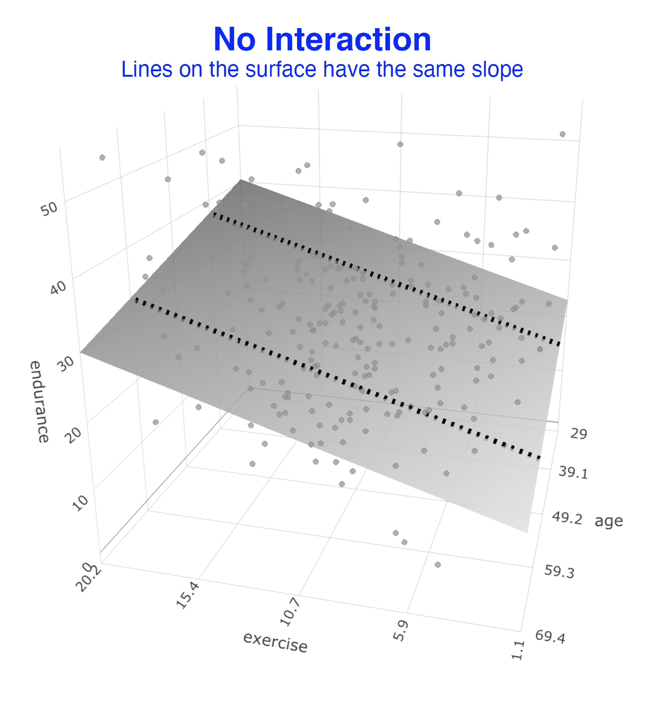
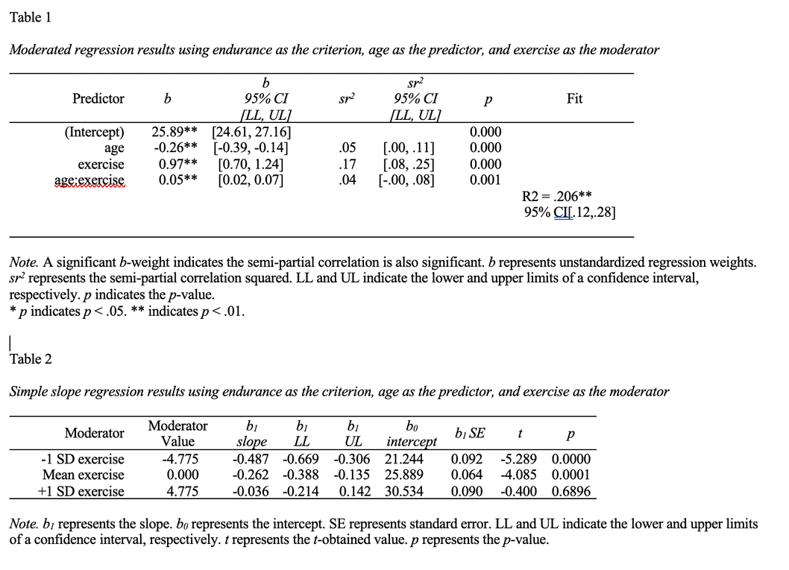

# Moderated multiple regression

```{r, include=FALSE}
library(tidyverse)
library(fastInteraction)
```
The following CRAN packages must be installed:

| Required CRAN Packages |
|-------------------|
|tidyverse          |
|remotes            |

The following GitHub packages must be installed:

| Required GitHub Packages |
|--------------------------|
|dstanley4/fastInteraction |


After the remotes package is installed, it can be used to install a package from GitHub:

```{r, eval = FALSE}
remotes::install_github("dstanley4/fastInteraction")
```

## Overview

In this chapter we present a brief overview of moderated multiple regression. In an ANOVA you can have two variables interact to predict a dependent variable. In this ANOVA scenario, the predictors are the categorical ANOVA variables. When our predictors are continuous variables (e.g., height, weight, etc) they can still interact to predict the dependent variable (i.e., criterion). In this chapter we primarily focus on how to obtain the required information from R to write up a continous variable interaction (also known as a moderated multiple regression). For an understanding of the underlying theory I strongly encourage you to read *Chapter 7: Interactions among continuous variables* in Cohen, Cohen, West, and Aiken (2003):


```{r, echo = FALSE, out.width="30%"}
knitr::include_graphics("ch_mmr/images/ccwa_cover.png")
```

Cohen, J., Cohen, P., West, S. G., & Aiken, L. S. (2013). Applied multiple regression/correlation analysis for the behavioral sciences. Routledge.

## Scenario

Imagine a scenario where we are interested in predicted endurance from participant age and exercise.

We can load the data:

```{r, message=FALSE}
library(tidyverse)

data_endurance <- read_csv("data_endurance.csv")
```

We can see the structure of the data:

```{r}
glimpse(data_endurance)
```

## Overview

### No interaction

In a typical two variable regression we would attempt to solve this equation:


$$ \hat{Y} = b_0 + b_1age + b_2exercise $$
We would do so using this R code:


```{r}
lm_no_int <- lm(endurance ~ age + exercise,
                data = data_endurance)
```

The result would be the a regression surface that fits the data as illustrated below. In this graph we did **not** assess whether there was an interaction (i.e., a moderating effect). This is just a standard two predictor regression. We illustrate the extent to which exercise and age predict endurance. You can consider the regression surface a series of best-fit lines. All of the lines on this surface have the same slope. That means in this statistical model the relation between exercise and endurance is not influenced by age -- because the slopes of the lines on the surface are the same and do not change with age of participants.


```{r, echo = FALSE, out.width="35%"}

```


### Interaction

We might wonder if the relation between exercise (a predictor) and endurance (the criterion) depends on the age of participants (a predictor). In other words, we might wonder if the relation between exercise and endurance is **moderated** by age. This is conceptually identical to an interaction effect in an ANOVA. 

We determine if there is a moderated relation by adding a product term to the regression. This is simply a new data column created by multiplying the age and exercise columns. If the *b*-weight (i.e., $b_3$) for for this product column (i.e., age*exercise) is significant  - we say there is an interaction or a moderated relation. The regression equation we need to solve is below:

$$ \hat{Y} = b_0 + b_1age + b_2exercise + b_3(age)(exercise)$$

We solve this equation using the code:


```{r}
lm_int <- lm(endurance ~ age + exercise + I(age*exercise),
             data = data_endurance)
```

When we examined the output for this regression, we found that that $b_3$ was significant. This indicates there is a moderated relation. The relation between exercise and endurance does depend on age. We can see this moderated relation in the graph below. As before imagine the surface is composed of a series of best-fit lines. Because there is a moderated relation the slopes of the lines change as we move across this surface.  You can see this clearly in the graph below. This illustrate the slope for the exercise -- endurance relation changes depending on the age of participants. That is, it illustrates the nature of the moderated relation.


```{r, echo = FALSE, out.width="35%"}
knitr::include_graphics("ch_mmr/images/mmr_int.png")
```


### Comparison

We present both graphs below so you can more easily see the difference between them. When you look at the *No Interaction* graph you can see the best-fit surface is composed of a series of straight lines that are parallel (i.e., all have the same slope) but all orientated a particular angle. In contrast, when you look at the *Interaction* graph you can see that it is also composed of a series of straight lines but the overall surface looks curves because the lines composing the best-fit surface have different slopes. 

**Interpretation note:** Notice that the difference between the *No Interaction* surface and the *Interaction* surface is the largest near the edges of the surface. Consequently, the inclusion of product terms typically makes the largest improvement in fit for the people who score at the extremes of the surface. In contrast, the inclusion of product terms typically makes a minor improvement in fit for the people who are near the middle of the surface (i.e., the majority of people). Keep that in mind as you interpret the increase in fit that results from the inclusion of the product terms.


```{r, echo = FALSE, out.width="90%"}
knitr::include_graphics("ch_mmr/images/mmr_both.png")
```


## fastInteraction

If you want to actually conduct a moderated regression and solve the equation below, there is an easy way to do it.


$$ \hat{Y} = b_0 + b_1age + b_2exercise + b_3(age)(exercise)$$

You simply use the fast.int() command in the fastInteraction package does the following:

1. Conducts the regression (i.e., the lm command); including mean centering of predictors if desired (see Cohen, Cohen, West, and Aiken, 2003).

2. Creates the 2D graph

3. Creates the 3D graph

4. Creates two APA style tables to describe the analyses


To run the analysis you use the code below:


```{r}
library(fastInteraction)

new_axis_labels <- list(criterion = "Endurance",
                        predictor = "Age (centered)",
                        moderator = "Exercise (centered)")

mmr_output <- fast.int(data = cohen_exercise,
                       criterion = endurance,
                       predictor = age,
                       moderator = exercise,
                       center.predictors = TRUE,
                       axis.labels = new_axis_labels,
                       path = "tables_mmr.doc")
```

### Graphing in 3D

You can obtain the 3D graph (which can be rotated) using the code:


```{r}
mmr_output$graph3D
```

### Unformatted 2D graph


You can obtain the 2D graph (cross-section of the 3D surface) with the code below. We need to adjust the graph a bit before it's presentable. But to do so we first need to inspect tables created by the fast.int() command.

```{r}
unformatted_ggplot_graph <- mmr_output$graph2D.unformatted

print(unformatted_ggplot_graph)
```


### Tables

We inspect MS Word file created by the fast.int() command below. The commands save the table in the file "tables_mmr.doc" -- as specified. It presents the results of the various regression in tables corresponding to APA style.

```{r, echo=FALSE, out.width="80%"}

```

### Formatted 2D graph

We inspect the Table output and find the value for -1/+1 SD of the moderator (age) in Table 2. In this case, we find the value is 4.775. So we use this to set the *x*-axis ticks That way the ticks on the *x*-axis correspond to standard deviations.

```{r}

custom_formatted_ggplot_graph <- unformatted_ggplot_graph +
  coord_cartesian(ylim = c(10, 40)) +
  scale_y_continuous(breaks = seq(10, 40, by = 5)) +
  scale_x_continuous(breaks = seq(-4.775*2, 4.775*2, by = 4.775)) +
  labs(x = "Exercise (centered)",
       y = "Endurance",
       linetype = "Age (centered)") +
  theme_classic(18)

print(custom_formatted_ggplot_graph)
```

#### Saving

We can save the 2D plot with the following command:

```{r, eval = FALSE}
ggsave("graph_2D_interaction.png", custom_formatted_ggplot_graph)
```


## Power/sample size analysis

If you examine a large number of studies involving moderated multiple regression you will see that the $sr^2$ (i.e., $\Delta R^2$) for the product term (e.g., age*exercise) typically ranges from .01 to .04 and only rarely falls out of this range - regardless of the variables involved. Consequently, to conduct a sample size analysis for a moderated mulitple regression you need to do three things:

1. Estimate the size of the $sr^2$ value (i.e., in the .01 to .04 range) for your study.

2. Estimate the overall $R^2$ value for your study.

3. Plug both of those values into the [sample size calculation](https://dstanley4.github.io/psyc6060bookdown/sample-size-for-multiple-regression.html#sample-size-using-sr2) provided in the multiple regression lecture.


