# Next Step Resources

## OSF

You can pre-register your study and upload your study materials via a free account:

* [OSF](https://osf.io)

Don't forget you should also pre-register your outlier strategy. See [@leys2019classify] for guidance.

* [Leys, C., Delacre, M., Mora, Y. L., Lakens, D., & Ley, C. (2019). How to classify, detect, and manage univariate and multivariate outliers, with emphasis on pre-registration. International Review of Social Psychology, 32(1).](https://biblio.ugent.be/publication/8619726/file/8646347.pdf)

Also don't forget to pre-register any analyses involving control variables. Control variables should be pre-registered with very specific predictions. See [@breaugh2008important]  and [@spector2011methodological] for guidance.

* [Breaugh, J. A. (2008). Important considerations in using statistical procedures to control for nuisance variables in non-experimental studies. Human Resource Management Review, 18(4), 282-293.](https://psycnet.apa.org/doi/10.1016/j.hrmr.2008.03.001)

* [Spector, P. E., & Brannick, M. T. (2011). Methodological urban legends: The misuse of statistical control variables. Organizational Research Methods, 14(2), 287-305.](https://doi.org/10.1177%2F1094428110369842)


## Transparency checklist

Be sure to check out the [Transparency checklist](http://www.shinyapps.org/apps/TransparencyChecklist/). This is a great tool to help you ensure your process is transparent.

## Helpful web apps

Daniel Lakens has a number of very helpful web apps to help you with sample size planning and other issues. I encourage you to check them out [here](https://lakens.github.io/shiny_apps/).

As well, check out [Designing Experiments](https://designingexperiments.com/shiny-r-web-apps/) for some other helpful tools. Sampling size planning, effect size calculations, and more!


## Minimizing mistakes

I strongly encourage you to check out [@rouder2019minimizing] and [@strand2021error] to learn how to minimize mistakes in your research. 

* [Rouder, J. N., Haaf, J. M., & Snyder, H. K. (2019). Minimizing mistakes in psychological science. Advances in Methods and Practices in Psychological Science, 2(1), 3-11.](https://doi.org/10.1177%2F2515245918801915)

* [Strand, J. (2021). Error Tight: Exercises for Lab Groups to Prevent Research Mistakes.](https://psyarxiv.com/rsn5y)


## Avoiding *p*-hacking

See both of these articles [@wicherts2016degrees; @stratton2005ensure] to obtain advice on how to avoid *p*-hacking and other problems.

* [Wicherts, J. M., Veldkamp, C. L., Augusteijn, H. E., Bakker, M., Van Aert, R., & Van Assen, M. A. (2016). Degrees of freedom in planning, running, analyzing, and reporting psychological studies: A checklist to avoid p-hacking. Frontiers in psychology, 7, 1832.](https://doi.org/10.3389/fpsyg.2016.01832)

* [Stratton, I. M., & Neil, A. (2005). How to ensure your paper is rejected by the statistical reviewer. Diabetic medicine, 22(4), 371-373](http://gornbein.bol.ucla.edu/how%20to%20ensure%20rejection.pdf). Obviously, the advice in this article is "reverse-keyed".

* Also don't forget about the [Guelph Psychology Department Thesis Guidelines Website](https://www.uoguelph.ca/psychology/graduate/thesis-statistics). The website is largely based on the advice of [@wicherts2016degrees] but is slightly broader in focus and provides Department specific advice.


## Writing articles

I suggest you check out [@gernsbacher2018writing] "Writing empirical articles: Transparency, reproducibility, clarity, and memorability. Advances in methods and practices in psychological science" for excellent advice on writing articles (pictured below). Conversely, I suggest you AVOID "Writing the Empirical Journal Article" by Daryl Bem because this article has been described by some as a "how to guide" for p-hacking (i.e., finding the prettiest path in the garden of forking analysis paths).

* [Gernsbacher, M. A. (2018). Writing empirical articles: Transparency, reproducibility, clarity, and memorability. Advances in methods and practices in psychological science, 1(3), 403-414.](https://doi.org/10.1177%2F2515245918754485)

```{r, out.width="50%", echo=FALSE}
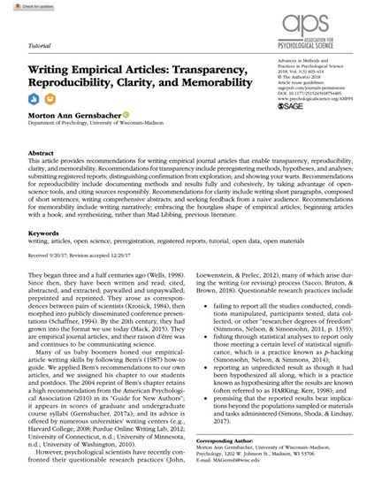
```

## Writing with R

The packages described below are very helpful for learning to write papers within RStudio. 

### rmarkdown / bookdown

One approach to avoiding errors in your article/thesis is to create a dynamic document. In this type of document you do not type the numbers into the document. Rather the document contains your analysis script (hidden from readers) and it inserts the calculated values into the text of the document. The exciting part of this type of document is that a single rmarkdown document and produce a number output formats such as PDF, Word, Power Point, HTML - as illustrated in the diagram below.

```{r, echo = FALSE, out.width = "60%", cap = "apaTables paper header"}
knitr::include_graphics("ch_tools/images/rmarkdown_docs.png")
```


You can learn more about rmarkdown in this [video](https://vimeo.com/178485416). I suggest you read the official [documentation](https://rmarkdown.rstudio.com/lesson-1.html) to get started. Incidently, the PDF course assignments are made with rmardown - as well as this website!

Some other great resources:


* [R Markdown: The Definitive Guide](https://bookdown.org/yihui/rmarkdown/) by Xie, Allaire, and Grolemund. Free.

* [R Markdown Cookbook](https://bookdown.org/yihui/rmarkdown-cookbook/) by Xie, Dervieux, and Riederer. Free.

* [bookdown: Authoring Books and Technical Documents with R Markdow](https://bookdown.org/yihui/bookdown/) by Xie. Free.

* Karl Broman's [website](https://kbroman.org/knitr_knutshell/) has many helpful tips. Especially this [page](https://kbroman.org/knitr_knutshell/pages/Rmarkdown.html).

### papaja

You may also find the [papaja package](https://github.com/crsh/papaja) by Frederik Aust helpful. It's an easy way to use rmarkdown. It is a based on the rmarkdown extension called bookdown. This package is specifically designed to make it easy to use rmarkdown/bookdown to make an APA style paper. Indeed that's the basis for the odd package name: **Preparing APA Journal Articles** (papaja). 

I suggest you read the extensive papaja (documentation)[https://crsh.github.io/papaja_man/introduction.html]. It will be worth your while!

The only slight complication with papaja is the fact it is not on the CRAN and can't be installed in the usual way. But it's still straight forward. You can install papaja with the commands below - taken from the papaja website.

```{r, eval = FALSE}
# Install devtools package if necessary
if(!"devtools" %in% rownames(installed.packages())) install.packages("devtools")

# Install the stable development verions from GitHub
devtools::install_github("crsh/papaja")
```

Indeed, once papaja is installed - you simply have to select the APA template before you enter your rmarkdown, as illustrated below:

```{r, echo = FALSE, out.width = "60%", cap = "apaTables paper header"}
knitr::include_graphics("ch_tools/images/papaja_template.png")
```

### apaTables

If you don't want to learn rmarkdown you may find the [apaTables](https://cran.r-project.org/package=apaTables) package useful - it can easily create the most commonly used APA tables formatted for Microsoft Word. The [documentation](https://dstanley4.github.io/apaTables/articles/apaTables.html) has extensive examples.  You can also see the published guide by @stanley2018reproducible.

```{r, echo = FALSE, out.width = "60%", cap = "apaTables paper header"}
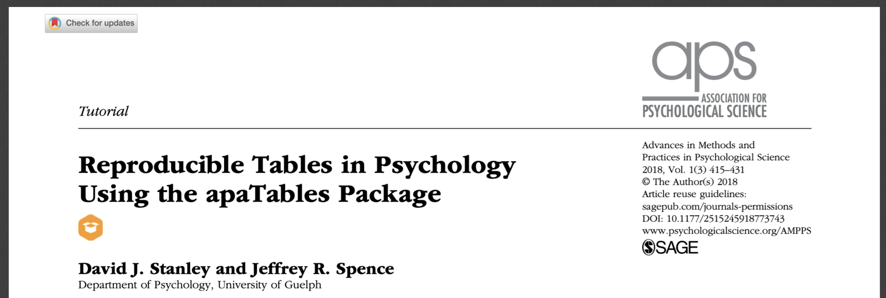
```

## Writing with statcheck

One concern associated with the replicability crisis is that the numbers reported in published articles are simply wrong. The numbers could be wrong due to typos or due to deliberate alteration (to ensure *p* < .05). Interestingly, one study decided to check if the *p*-values published in articles were correct [@nuijten2016prevalence]. The authors checked the articles using the software [statcheck](https://cran.r-project.org/package=statcheck). You can think of statcheck as a statistical spell checker that independently recreates the *p*-values in an article and checks if the reported *p*-value is correct. The authors used this process on over 250,000 *p*-values reported in eight major journals between 1985 and 2013. They found that roughly 50% of journal articles had a least one  reporting error. Moreover, one in eight journal articles had a reporting error sufficiently large that it likely altered the conclusions of the paper. Note that incorrect *p*-values reported were typically smaller than they should been such that the incorrectly reported *p*-value was less than .05. That's quite a large number of studies with incorrect *p*-values! 

### statcheck software

Fortunately, you can use statcheck on your own work before submitting it to an adviser or a journal. The statcheck software is available, as a [website](http://statcheck.io), a [plug-in](http://statcheck.io/word-add-in.php) for Microsoft Word, and as an [R package](https://cran.r-project.org/web/packages/statcheck/index.html). You can see the GitHub page for statcheck [here](https://github.com/MicheleNuijten/statcheck).

### statcheck website

The statcheck website is easy to use. Just upload your PDF or Word document and it will perform the statcheck scan to determine if the numbers in your papers are correct / internally consistent. You can try it out with the PDF of a published article.

```{r, echo = FALSE, out.width = "60%"}
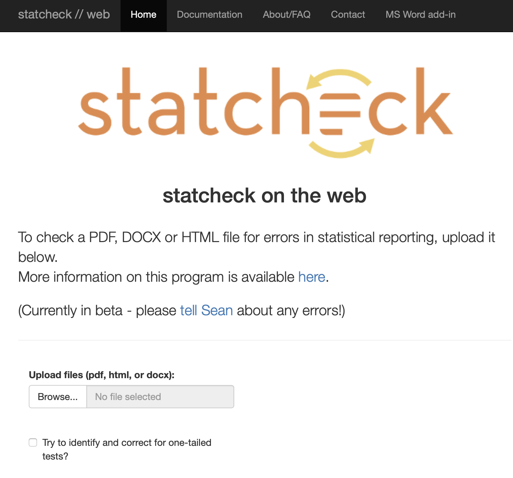
```

You can see the first few rows of the statcheck output for an article below:

```{r, echo = FALSE, out.width = "60%"}
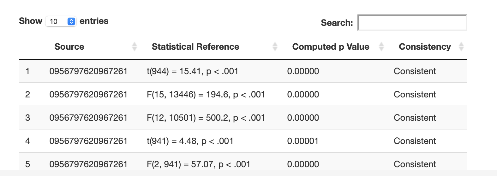
```


### statcheck and Word

Interestingly, statcheck will soon be available as plug-in for Word -- as illustrated below. As you type it will perform the statcheck scan to determine if the numbers in your papers are correct / internally consistent. You can see the GitHub page for statcheck Word plug-in [here](https://github.com/WillemSleegers/statcheck-word).

```{r, echo = FALSE, out.width = "80%"}
knitr::include_graphics("ch_tools/images/statcheck_word.png")
```

### statcheck process

Exactly how does statcheck work? Statcheck is based on the fact that authors report redundant information in their papers. For example, an author might report the statistics: *t*(46) = 2.40, *p* = .0102 (one-sided). Or in the past report this information using a *p*-value threshold: *t*(46) = 2.40, *p* < .05 (one-sided). The first part of this reporting, *t*(46) = 2.40, can be used to independently generate the *p*-value, as illustrated below. The software does so and then simply compares the independently generated *p*-value with the reported *p*-value (e.g., *p* = 0102) or *p*-value threshold (*p* < .05). You would think the independently generated *p*-value and the reported *p*-value would always match. But as illustrated by [@nuijten2016prevalence] at least 50% of papers of a problem with the *p*-values reported matching the correct *p*-value.

```{r, echo = FALSE, out.width = "80%"}
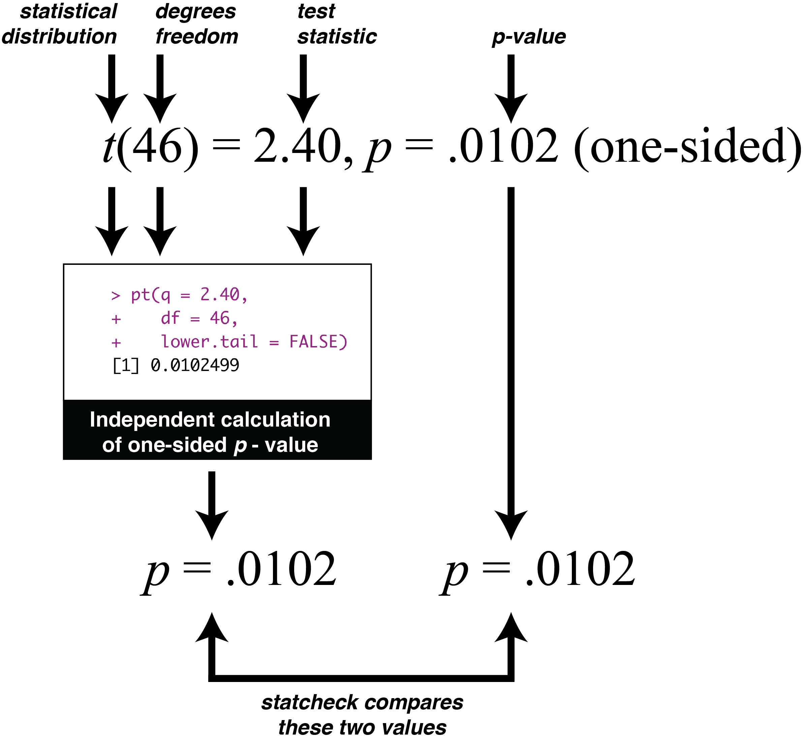
```


### statcheck validity

Although there were some initial concerns about the validity of statcheck, subsequent [research](https://psyarxiv.com/tcxaj/download?format=pdf) on the package indicates an impressive validity level of roughly 90% (or a little higher/lower depending on the settings used). Indeed, in July of 2016, the journal *Psychological Science* started using statcheck on all submitted manuscripts - once they passed an initial screen. Journal editor, Stephen Lindsey, [reports](https://www.nature.com/news/stat-checking-software-stirs-up-psychology-1.21049) there has been little resistance to doing so "Reaction has been almost non-existent."


## Journal rankings via the TOP Factor

When you're done writing - you need to decide upon a journal. You can see journal rankings based on the Transparency and Openness Promotion Guidelines at the [Top Factor website](https://www.topfactor.org).

## Statistics books

If you want to learn more about statistics I suggest [@maxwell2017designing], [@cohen2014applied], and [@baguley2012serious].

* [Maxwell, S. E., Delaney, H. D., & Kelley, K. (2017). Designing experiments and analyzing data: A model comparison perspective. Routledge.](https://www.amazon.ca/Designing-Experiments-Analyzing-Data-Perspective/dp/1138892289/ref=sr_1_1?dchild=1&qid=1629119503&refinements=p_27%3AKen+Kelley&s=books&sr=1-1&text=Ken+Kelley) by Maxwell, Delaney, and Kelley. This book has a fantastic website ([https://designingexperiments.com](https://designingexperiments.com)) with online tools and R scripts. 

* [Cohen, J., Cohen, P., West, S. G., & Aiken, L. S. (2014). Applied multiple regression/correlation analysis for the behavioral sciences. Psychology press.](https://www.amazon.ca/Multiple-Regression-Correlation-Analysis-Behavioral/dp/0805822232) by Cohen, Cohen, West, and Aiken. This is the "go to" resource if you are conducting moderated multiple regression. A great book on regression beyond just moderation though.

* [Baguley, T. (2012). Serious stats: A guide to advanced statistics for the behavioral sciences. Macmillan International Higher Education.](https://www.amazon.ca/Serious-Stats-advanced-statistics-behavioral/dp/0230577180/ref=sr_1_1?dchild=1&keywords=serious+stats&qid=1629126084&sr=8-1) by Baguley. The book title tells you everything you need to know about this one.

* [Hayes, A. F. (2017). Introduction to mediation, moderation, and conditional process analysis: A regression-based approach. Guilford publications.](https://www.amazon.ca/Introduction-Mediation-Moderation-Conditional-Analysis/dp/1609182308/ref=sr_1_3?dchild=1&keywords=Introduction+to+mediation%2C+moderation%2C+and+conditional+process+analysis%3A+A+regression-based+approach.+Guilford+publications.&qid=1629717582&sr=8-3). Many people use the approach in this book when they have multiple mediators and moderators. The PROCESS [website]((https://processmacro.org/index.html) has the R-script for the PROCESS macro.

## General R books

There are many R books out there. I believe that you will find these most helpful:


* [Data Visualization](https://socviz.co) by Healy. Free.

* [Fundamentals of Data Visualization](https://clauswilke.com/dataviz/) by Wilke. Free.

* [R Graphics Cookbook](https://r-graphics.org/index.html) by Chang. Free.

* [ggplot2](https://ggplot2-book.org/index.html) by Wickham. Free.

* [R for Data Science](https://r4ds.had.co.nz) by Wickham and Grolemund. Free.

* [Hands-On Programming with R](https://rstudio-education.github.io/hopr/) by Grolemund. Free.

* [Advanced R](https://adv-r.hadley.nz) by Wickham. Free.

* [Art of R Programming](https://nostarch.com/artofr.htm) by Matloff.


Then some books that are great but less likely to by used by psychology folks:

* [Mastering Shiny](https://mastering-shiny.org) by Wickham. Free.

* [R packages](https://r-pkgs.org) by Wickham Free.


* [Efficient R Programming](https://csgillespie.github.io/efficientR/) by Lovelace. Free.

* [Text Mining with R](https://www.tidytextmining.com) by Silge and Robinson. Free.


* [Javascript for R](https://book.javascript-for-r.com) by Coene. Free.

* [Practical Data Science with R](https://www.manning.com/books/practical-data-science-with-r-second-edition?query=practical%20datas%20science%20with%20r) by Zumel and Mount.

* [Functional Programming in R](https://www.amazon.ca/Functional-Programming-Advanced-Statistical-Analysis/dp/148422745X/ref=sr_1_2?crid=2PYTJ42R507CT&keywords=functional+programming+in+r&qid=1655326113&s=books&sprefix=functional+programming+in+r%2Cstripbooks%2C98&sr=1-2) by Mailund. 

* [Deep learning with R](https://www.manning.com/books/deep-learning-with-r) Chollet and Allaire.

* [Extending R](https://www.amazon.ca/Extending-R/dp/B07452L4XB) by Chambers.

## Retracted articles

As you write-up your research you need to be concerned with the problem of citing research papers that have been retracted. This problem is substantially larger than you might first expect; indeed, one group of researchers found that retracted papers often received the majority their citations **after** retraction [@madlock2015lack]. Therefore, take the extra time to confirm the papers you cite have not been retracted! Moreover, don't assume because an article was published in a high-impact journal that it is a high quality article - and not likely to be retracted. The truth is the opposite. Retraction rates correlate positively with journal impact factor (how often articles in that journal are cited). Specifically, journals with high impact factors have the higest retraction rate [@fang2011retracted].

```{r, echo = FALSE, out.width = "60%", cap = "apaTables paper header"}
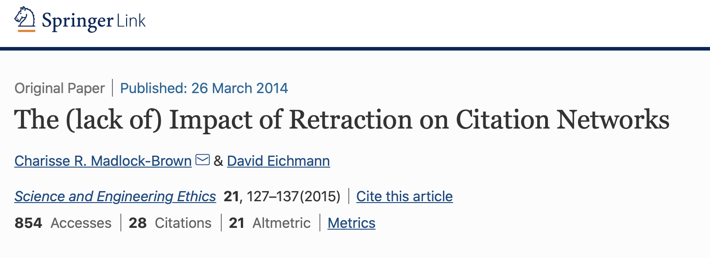
```


### DOI

But how do you go about determining if a paper has been retracted? There are websites you can check like [retraction watch](https://retractionwatch.com). It can, however, be time consuming to check for every article in this website. There is an easier approach but it requires you know the DOI number for each article you cite.

What is a DOI number? All modern journal articles have a DOI (digital object identifier) number associated with them. This is a unique number that identifies the article and can be used to access the document.

**You can see a DOI number on a PDF:**

```{r, echo = FALSE, out.width = "60%", cap = "DOI number on a PDF"}
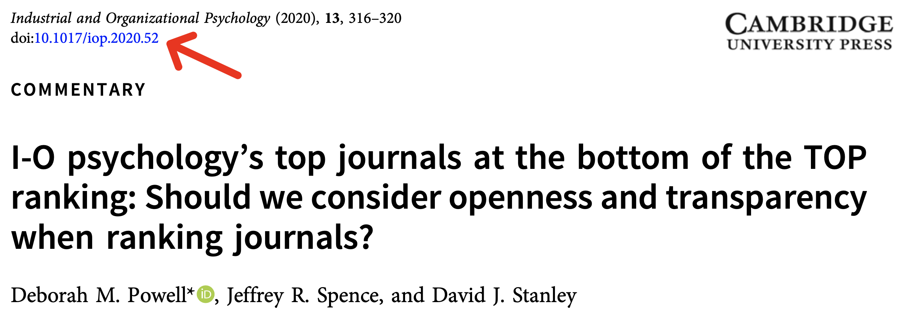
```

**Or you can see a DOI number on the website:**

```{r, echo = FALSE, out.width = "60%", cap = "DOI number on a website"}
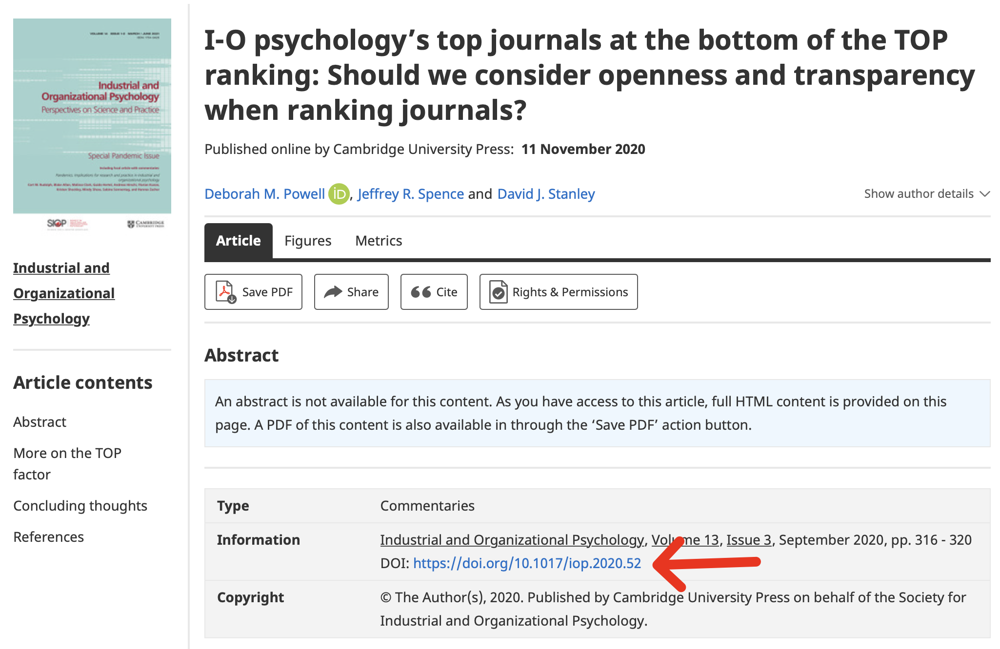
```

**Retraction search with DOI**

You can enter the DOI up on the [search site](http://retractiondatabase.org/RetractionSearch.aspx) as illustrated below. Then click the Search button. You will get the search output. Notice the yellow box in the lower left which indicates this article has **NOT** been retracted.

```{r, echo = FALSE, out.width = "60%", cap = "DOI number on a website"}
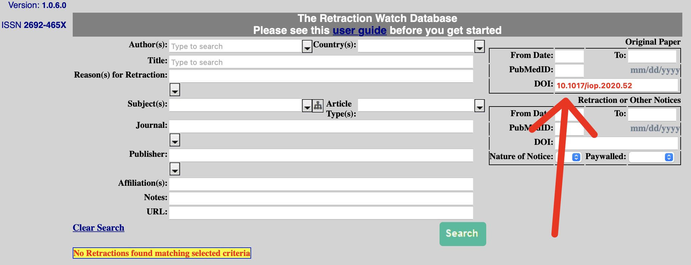
```

### retractiondatabase.org

If you don't have the DOI number for an article you can search for by article title or author at [http://retractiondatabase.org](http://retractiondatabase.org/RetractionSearch.aspx) as you can see from the interface below.

```{r, echo = FALSE, out.width = "100%", cap = "DOI number on a website"}
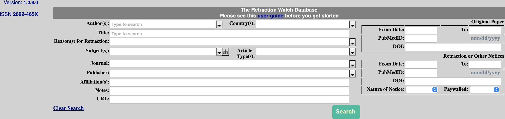
```

 
### openretractions.com

However, if you have the DOI number for an article, an easier approach is use the [http://openretractions.com](http://openretractions.com) website. At this website you type in the DOI number for an article and it checks if that article has been retracted.

```{r, echo = FALSE, out.width = "60%", cap = "Open retractions website"}
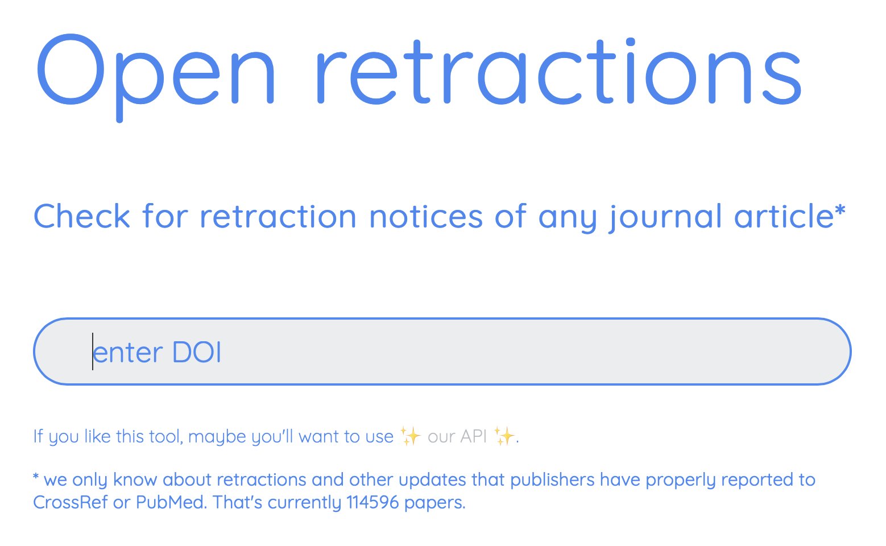
```


### retractcheck

Even better, you can use the [retractcheck](https://cran.r-project.org/package=retractcheck) R package. With this package you can check large batches of DOI numbers with openretractions.com to see if the corresponding articles have been retracted. You can use this package by the command line or via the [website](https://frederikaust.shinyapps.io/retractcheck_shinyapp/) illustrated below.

```{r, echo = FALSE, out.width = "60%", cap = "Open retractions website"}
knitr::include_graphics("ch_tools/images/retractcheck_website.png")
```

## Big data

Occasionally psychology researchers deal with big data. File sizes can be quite large with big data. Check out the [arrow package](https://cran.r-project.org/web/packages/arrow/index.html), specifically, the write_parquet() command as means of using smaller file sizes. This approach can make sharing a file on GitHub, or emailing it to a colleague, substantially easier.

```{r, echo = FALSE, out.width = "60%", cap = "Arrow package"}
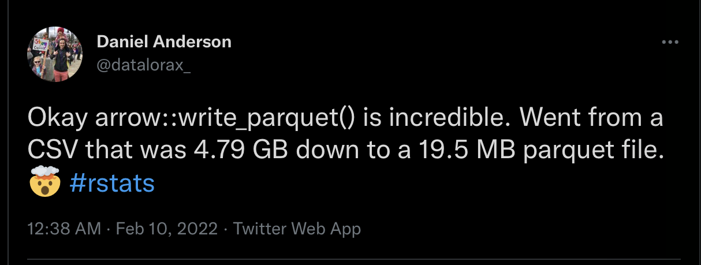
```


