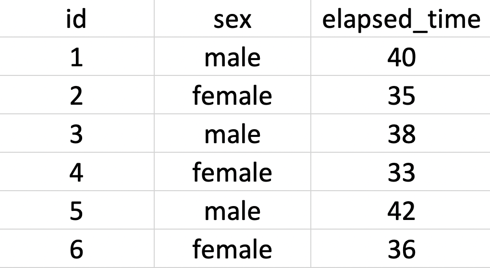

# Cookbook

The chapter provide a series of "Cookbook" receipes for starting different types of analysis scripts.

```{r, include=FALSE}
library(tidyverse)
```

## Required Packages


The data files below are used in this chapter. 

| Required Data |
|-------------------|
|[data_ex_between.csv](data_ex_between.csv)|
|[data_ex_within.csv](data_ex_within.csv) |
|[data_food.csv](data_food.csv) |
|[data_item_scoring.csv](data_item_scoring.csv) |
|[data_item_time.csv](data_item_time.csv) |


The following CRAN packages must be installed:

| Required CRAN Packages |
|-------------------|
|apaTables          |
|Hmisc              |
|janitor            |
|psych              |
|skimr              |
|tidyverse          |

**Important Note:** You should NOT use library(psych) at any point! There are major conflicts between the psych package and the tidyverse. We will access the psych package commands by preceding each command with psych:: instead of using library(psych).


## Following the examples

Below we present example scripts transforming raw data to analytic data for various study designs (experimental and survey). These examples illustrate the value of using the naming conventions outlined previously. Don't just read the example - follow along with the projects by creating a separate script for each example.  Resist the urge to cut and paste from this document - type the script yourself.

When first learning iPhone/Mac software development, I did so by taking a course at [Big Nerd Ranch](https://www.bignerdranch.com) - yes, that's a real place. They advised in their material (and now book) the following: "We have learned that “going through the motions” is much more important than it sounds. Many times we will ask you to start typing in code before you understand it. We realize that you may feel like a trained monkey typing in a bunch of code that you do not fully grasp. But the best way to learn coding is to find and fix your typos. Far from being a drag, this basic debugging is where you really learn the ins and outs of the code. That is why we encourage you to type in the code yourself. You could just download it, but copying and pasting is not programming. We want better for you and your skills.", p. xiv, [@keur2020]. This is excellent advice for a beginning statistician or data scientist as well. And as an aside: if you want to learn iPhone programming you can't go wrong with the Big Nerd Ranch guide!

As you work through this chapter, create your own new script for each example. In light of the above advice, avoid copying and pasting code - type it out; you will be the better for it. 


Getting started:

**The Class: R Studio in the Cloud Assignment**

1. The data should be in the assignment project automatically. Just start the assignment. 

For everyone in the class, that's it.

For those of you not in the class, and reading this work, see the two options below:

**R Studio Cloud, custom project**

1. Create a new Project using the web interface

2. Upload all the example data files into the project. The data files needed are listed at the beginning of this chapter. The upload button can be found on the Files tab.

**R Studio Computer, custom project**

1. Create a folder on your computer for the example

2. Place all the example data files in that folder. The data files needed are listed at the beginning of this chapter.

3. Use the menu item File > New Project... to start the project

4. On the window that appears select "Existing Directory"

5. On the next screen, press the "Browse" button and find/select the folder with your data

6. Press the Create Project Button

Regardless of whether your are working from the cloud, or locally, you should now have an R Studio project with your data files in it. 

We anticipate that many people will doubtless want to refer back to an encapsulated set of instructions for each design. Therefore the example for each design is written in a way that it stands alone. A consequence of this approach is that there is some redundancy in the code across examples. We see this a strength  - because readers will see the commonalities across differ types of designs.

As you make a script for each example:

* Recall the instruction from Chapter 1 about putting the date and your name in the script via comments.

* Recall the instruction from Chapter 1 about running library(tidyverse) before you type the rest of each script - this provides you with tidyverse autocomplete for the script.

* After you type each new block of code in an example, save your script.

* After you type each new block of code in an example, do two additional things: 1) Session Restart R, 2) Run your script using Source with Echo.

## Entering data into spreadsheets

The first example uses a data file data_ex_between.csv that corresponds to a fictitious example where we recorded the run times for a number of male and female participants. How did we create this data file? We used a spreadsheet to enter the data, as illustrated in Figure  \@ref(fig:spreadsheetbetween). Programs like Microsoft Excel and Google Sheets are good options for entering data. 

```{r spreadsheetbetween, echo = FALSE, out.width="40%", fig.cap = "Spreadsheet entry of running data"}

```

The key to using these types of programs is to save the data as a .csv file when you are done. CSV is short for Comma Separated Values. After entering the data in Figure \@ref(fig:spreadsheetbetween) we saved it as data_ex_between.csv. There is no need to do so, but if you were to open this file in a text editor (such as TextEdit on a Mac or Notepad on Windows) you would see the information displayed in Figure   \@ref(fig:csvsheetbetween). You can see there is one row per person and the columns are created by separating each values by a comma; hence, comma separated values. 

```{r csvsheetbetween, echo = FALSE, out.width="25%", fig.cap = "Text view of CSV data"}
knitr::include_graphics("ch_enter_load/images/screenshot_csv_between.png")
```

There are many ways to save data, but the CSV data is one of the better ones because it is a non-proprietary format. Some software, such as SPSS, uses a proprietary format (e.g., .sav for SPSS) this makes it challenging to access that data if you don't have that (often expensive) software. One of our goals as scientists is to make it easy for others to audit our work - that allows science to be self-correcting. Therefore, choose an open format for your data like .csv.


## Experiment: Between 

This section outlines a workflow appropriate for when you plan to a conduct independent-groups *t*-test or a between-participants ANOVA.

To Begin:

* Use the Files tab to confirm you have the data: data_ex_between.csv

* Start a new script for this example. Don't forget to start the script name with "script_".

As noted previously, these data correspond to a design where the researcher is interested in comparing run times (elapsed_time) based on sex (male/female). 

```{r, results=FALSE, message=FALSE}
# Date: YYYY-MM-DD
# Name: your name here
# Example: Between-participant experiment

# Load data
library(tidyverse)

my_missing_value_codes <- c("-999", "", "NA")

raw_data_between <- read_csv(file = "data_ex_between.csv",
                     na = my_missing_value_codes)
```

We load the initial data into a raw_data_between data set but immediately make a copy that we will work with called analytic_data_between. It's good to keep a copy of the raw data for reference in the event that you encounter problems.

```{r}
analytic_data_between <- raw_data_between

```

After loading the data we do initial cleaning to remove empty row/columns and ensure proper naming for columns:

```{r, results=FALSE, message=FALSE}
library(janitor)

# Initial cleaning
analytic_data_between <- analytic_data_between %>%
  remove_empty("rows") %>%
  remove_empty("cols") %>%
  clean_names()
```

You can confirm the column names follow our naming convention with the glimpse() command. 

```{r}
glimpse(analytic_data_between)
```

### Creating factors

Following initial cleaning, we identify categorical variables as factors. If you plan to conduct an ANOVA - it's critical that all predictor variables are converted to factors. Inspect the glimpse() output - if you followed our data entry naming conventions, categorical variables should be of the type character. We have one variable, sex, that is a categorical variable of type character (i.e., chr). The participant id column is categorical as well, but of type double (i.e., dbl) which is a numeric column.


```{r}
glimpse(analytic_data_between)
```

You can quickly convert all character columns to factors using the code below. In this case, the code just converts the sex column to a factor. Because there is only one column (sex) being converted to a factor, we could have treated it the same way as the id column below. However, we use this code because of its broad applicability to many scripts.

```{r}
analytic_data_between <- analytic_data_between %>%
  mutate(across(.cols = where(is.character),
                .fns = as_factor))

```

The participant identification number in the id column is a numeric column, so it was not converted by the above code. The id column is converted to a factor with the code below.

```{r}
analytic_data_between <- analytic_data_between %>%
  mutate(id = as_factor(id))
```

You can ensure both the sex and id columns are now factors using the glimpse() command. 

```{r}
glimpse(analytic_data_between)
```

This example is so small it's clear you didn't miss converting any columns to factors. In general, however, at this point you should inspect the output of the glimpse() command and make sure you have converted all categorical variables to factors - especially those you will use as predictors.


### Factor screening

Inspect the levels of each factor carefully. Make sure the factor levels of each variable are correct. Examine spelling and look for additional unwanted levels. For example, you wouldn't want to have the following levels for sex: male, mmale, female. Obviously,  mmale is an incorrectly typed version of male. Scan all the factors in your data for erroneous factor levels. The code below displays the factor levels:


```{r}
analytic_data_between %>%
  select(where(is.factor)) %>%
  summary()
```


The order of the levels influences how graphs are generated. In these data, the sex column has two levels: male and female in that order. The code below adjusts the order of the sex variable because we want the x-axis of a future graph to display columns in the left to right order: female, male. 

```{r}
analytic_data_between <- analytic_data_between %>%
  mutate(sex = fct_relevel(sex,
                           "female",
                           "male"))
```


You can see the new order of the factor levels with summary():
```{r}
analytic_data_between %>%
  select(where(is.factor)) %>%
  summary()
```


### Numeric screening

For numeric variables, you should search for impossible values. For example, in the context of this example you want to ensure that none of the elapsed_times are impossible, or so large they appear to be data entry errors. One option for doing so is the summary command again. This time, however, we use "is.numeric" in the where() command.

```{r}
analytic_data_between %>%
  select(where(is.numeric)) %>%
  summary()
```

Scan the min and max values to ensure there are not any impossible values. If necessary, go back to the original data source and fix these impossible values. Alternatively, you might need to change them to missing values (i.e., NA values). 

In this example all the values are reasonable values. However, if we discovered an out of range value (or values) for elapsed time, we could convert those values to missing values with the code below. This code changes (i.e., mutates) a value in the elapsed_time column to become NA (not available or missing) if that value is less than zero. If the value is greater than, or equal to zero, it stays the same. Note that when using this command we have to be very specific in terms of specifying our missing value. It usually needs to be one of NA_real_ or NA_character_. For numeric columns use NA_real_ and for character columns use NA_character_. 

```{r, eval = FALSE}
analytic_data_between <- analytic_data_between  %>% 
    mutate(elapsed_time = case_when(
      elapsed_time < 0 ~ NA_real_,
      elapsed_time >= 0 ~ elapsed_time))
```

Once you are done numeric screening, the data is ready for analysis.

## Within Data Entry

If you have a study that involves within-participant predictors naming conventions can become examples. When you have a single repeated measures predictor like occasion in the previous running example, it is often necessary to spread the level of that variable over multiple columns (e.g., march, may, july).

When you have multiple repeated-measures predictors the situation is even more complicated. In this case, each column name needs to represent the levels of multiple repeated measures predictors at the time of data entry. For example, imagine you are a food researcher interested in taste ratings (the dependent variable) for various foods and contexts. You have a predictor, food type (i.e., food_type), with three levels (pizza, steak, burger). You have a second predictor, temperature, with two levels (hot, cold). All participants taste all foods at all temperatures. Thus, six columns are required to record taste rating for each participant: pizza_hot, pizza_cold, steak_hot, steak_cold, burger_hot, and burger_cold. Notice how each name contains one level of each predictor variable. The levels by the two predictor variables are separated by a single underscore. This should be the only underscore in the variable name because that underscore will be used by the computer when changing the data to the tidy format. If you had two underscores in a name like "italian_pizza_hot" you would confuse the pivot_longer() command when it attempts to create a tidy version of the data. The computer would think there were three repeated-measures predictors instead of two. Thus, when dealing with repeated measures predictors, only use underscores to separate levels of predictor variables in column names.

## Experiment: Within one-way

This section outlines a workflow appropriate for when you have a repeated measures design with a single repeated measures predictor. The data corresponds to a design where the researcher is interested in comparing run times (elapsed_time) across three different occasions (march/may/july).

To Begin:

* Use the Files tab to confirm you have the data: data_ex_within.csv

* Start a new script for this example. Don't forget to start the script name with "script_".


```{r, results='hide'}
# Date: YYYY-MM-DD
# Name: your name here
# Example: Within-participant experiment

# Load data
library(tidyverse)

my_missing_value_codes <- c("-999", "", "NA")

raw_data_within <- read_csv(file = "data_ex_within.csv",
                     na = my_missing_value_codes)
```

We load the initial data into raw_data_within but immediately make a copy that we will work with called analytic_data_within. It's good to keep a copy of the raw data for reference if you encounter problems.

```{r}
analytic_data_within <- raw_data_within

```

After loading the data we do initial cleaning to remove empty row/columns and ensure proper naming for columns:

```{r, results=FALSE, message=FALSE}
library(janitor)

# Initial cleaning
analytic_data_within <- analytic_data_within %>%
  remove_empty("rows") %>%
  remove_empty("cols") %>%
  clean_names()
```

You can confirm the column names following our naming convention with the glimpse command - and see the data type for each column.

```{r}
glimpse(analytic_data_within)
```

### Creating factors

Following initial cleaning, we identify categorical variables as factors. If you plan to conduct an ANOVA - it's critical that all predictor variables are converted to factors. Inspect the glimpse() output - if you followed our data entry naming conventions, categorical variables should be of the type character. 


```{r}
glimpse(analytic_data_within)
```

We have one variable, sex, that is a categorical variable of type character (i.e., chr). The participant id column is categorical as well, but of type double (i.e., dbl) which is a numeric column.

You can quickly convert all character columns to factors using the code below. In this case, this just converts the sex column to a factor. Because there is only one column (sex) being converted to a factor, we could have treated it the same was as the id column below. However, we use this code because of its broad applicability to many scripts.

```{r}
analytic_data_within <- analytic_data_within %>%
  mutate(across(.cols = where(is.character),
                .fns = as_factor))

```

The participant identification number in the id column is a numeric column, so it was not converted by the above code. The id column is converted to a factor with the code below.

```{r}
analytic_data_within <- analytic_data_within %>%
  mutate(id = as_factor(id))
```

You can ensure both the sex and id columns are now factors using the glimpse() command. 

```{r}
glimpse(analytic_data_within)
```

This example is so small it's clear you didn't miss converting any columns to factors. In general, however, at this point you should inspect the output of the glimpse() command and make sure you have converted all categorical variables to factors - especially those you will use as predictors.


### Factor screening

Inspect the levels of each factor carefully. Make sure the factor levels of each variable are correct. Examine spelling and look for additional unwanted levels. For example, you wouldn't want to have the following levels for sex: male, mmale, female. Obviously,  mmale is an incorrectly typed version of male. Scan all the factors in your data for erroneous factor levels. The code below displays the factor levels:

```{r}
analytic_data_within %>%
  select(where(is.factor)) %>%
  summary()
```

The order of the levels influences how graphs are generated. In these data, the sex column has two levels: male and female in that order. The code below adjusts the order of the sex variable because we want the x-axis of a future graph to display columns in the left to right order: female, male. 

```{r}
analytic_data_within <- analytic_data_within %>%
  mutate(sex = fct_relevel(sex,
                           "female",
                           "male"))
```


You can see the new order of the factor levels with summary():
```{r}
analytic_data_within %>%
  select(where(is.factor)) %>%
  summary()
```


### Numeric screening

For numeric variables, it is important to find and remove impossible values. For example, in the context of this example you want to ensure none of the elapsed_times are impossible (i.e., negative) or clearly data entry errors.

Because we have several numeric columns that we are screening, we use the skim() command from the skimr package. The skim() command quickly provides basic descriptive statistics. In the output for this command there are also several columns that begin with p: p0, p25, p50, p75, and p100 (p25 and p75 omitted in output due to space). These columns correspond to the 0th, 25th, 50th, 75th, and 100th percentiles, respectively. The minimum and maximum values for the data column are indicated under the p0 and p100 labels. The median is the 50th percentile (p50). The interquartile range is the range between p25 and p75.


```{r, eval = FALSE}
library(skimr)

analytic_data_within %>%
  select(where(is.numeric)) %>%
  skim()
```

```{r, echo=FALSE}
library(tidyverse)
library(skimr)

outdf <- analytic_data_within %>%
  select(where(is.numeric)) %>%
  skim_without_charts() %>%
  as_tibble() %>%
  select(-skim_type) %>%
    rename_with(.fn = str_remove,
              .cols = everything(),
              pattern = "numeric.") %>%
  select(-p25, -complete_rate, -p75) %>%
  as.data.frame()

outdf$mean = round(outdf$mean,2)
outdf$sd = round(outdf$sd,2)

outdf
```

Scan the minimum and maximum values (p0 and p100) to ensure there are not any impossible values. If necessary, go back to the original data source and fix these impossible values. Alternatively, you might need to change them to missing values (i.e., NA values). 

In this example all the values are reasonable values. However, if we discovered an out of range value (or values) for elapsed time we could convert those values to missing values with the code below. This code changes (i.e., mutates) a value in the march column to become NA (not available or missing) if that value is less than zero. If the value is greater than or equal to zero, it stays the same. Note that when using this command we have to be very specific in terms of specifying our missing value. It usually needs to be one of NA_real_ or NA_character_. For numeric columns use NA_real_ and for character columns use NA_character_. 

```{r, eval = FALSE}
analytic_data_within <- analytic_data_within  %>% 
    mutate(march = case_when(
      march < 0 ~ NA_real_,
      march >= 0 ~ march))
```


### Pivot to tidy data

The analytic data in it's current form does not conform to the tidy data specification. Inspect the data with the print() command. Notice thatthere is not a column for occasion (with levels march/may/july). Instead, there are three columns each of which represents a level of occasion. The levels of occasion are spread across three columns called march, may, and july. Each of these columns contains elapsed time for participants in that month. 

```{r}
print(analytic_data_within)
```

The pivot_longer() command below coverts our data to the tidy data format. In this command we specify the columns march, may, and july are all levels of a single variable called occasion. We specify the columns involved with the cols argument. The code march:july after the cols argument selects the march column, the july column, and all the columns in-between. Each column contains elapsed times at level of the variable occasion. The names_to argument is used to indicate that a new column called occasion should be created to hold the different months. The value_to argument is used to indicate that a new column called elapsed_time should created to hold all the values from the march, may, and july columns.

```{r}
analytic_data_within_tidy <- analytic_data_within %>%
  pivot_longer(cols = march:july,
               names_to = "occasion",
               values_to = "elapsed_time"
  )
```

You can see the data in the new format below. 
```{r}
print(analytic_data_within_tidy)
```

Notice that the new column occasion is of the type character. We need it to be a factor. So use the code below to do so:

```{r}
analytic_data_within_tidy <- analytic_data_within_tidy %>%
  mutate(occasion = as_factor(occasion))
```

You can confirm that occasion is now a factor with the glimpse() command. Once this is complete, you are done preparing your one-way within participant analytic data.

```{r}
glimpse(analytic_data_within_tidy)
```

You now have two data sets analytic_data_within and analytic_data_within_tidy. You can calculate descriptive statistics, correlations and general cross-sectional analyses using the analytic_data_within data set. If you want to conduct a repeated measures ANOVA you use the analytic_data_within_tidy data set. Both data sets are now ready for analysis.

## Experiment: Within N-way

This section outlines a workflow appropriate for when you have a repeated measures design with multiple repeated measures predictors. The data corresponds to a design where the researcher is interested in assessing the taste of food as a function of food type (pizza/steak/burger) and temperature (hot/cold).

To Begin:

* Use the Files tab to confirm you have the data: data_food.csv

* Start a new script for this example. Don't forget to start the script name with "script_".

 
```{r, results='hide', message = FALSE}
# Date: YYYY-MM-DD
# Name: your name here
# Example: 2-way within-participant experiment

# Load data
library(tidyverse)

my_missing_value_codes <- c("-999", "", "NA")

raw_data_within_nway <- read_csv(file = "data_food.csv",
                     na = my_missing_value_codes)
```

We load the initial data into raw_data_within_nway but immediately make a copy that we will work with called analytic_data_within_nway. It's good to keep a copy of the raw data for reference if you encounter problems.

```{r}
analytic_data_within_nway <- raw_data_within_nway

```

After loading the data we do initial cleaning to remove empty row/columns and ensure proper naming for columns:

```{r, results=FALSE, message=FALSE}
library(janitor)

# Initial cleaning
analytic_data_within_nway <- analytic_data_within_nway %>%
  remove_empty("rows") %>%
  remove_empty("cols") %>%
  clean_names()
```

You can confirm the column names following our naming convention with the glimpse command - and see the data type for each column.

```{r}
glimpse(analytic_data_within_nway)
```

### Creating factors

Following initial cleaning, we identify categorical variables as factors. If you plan to conduct an ANOVA - it's critical that all predictor variables are converted to factors. In this example, there are two categorical variables id and sex, but both are represented numerically.  As revealed by the glimpse() output.


```{r}
glimpse(analytic_data_within_nway)
```

We convert both the sex and id columns to factors with the mutate() command below:

```{r}
analytic_data_within_nway <- analytic_data_within_nway %>%
  mutate(id = as_factor(id),
         sex = as_factor(sex))
```

The sex column is a factor but we have to tell the computer that 1 indicates male and 2 indicates female.

```{r}
analytic_data_within_nway <- analytic_data_within_nway %>%
  mutate(sex = fct_recode(sex,
                          male = "1",
                          female = "2"))
```

You can ensure all of these columns are now factors using the glimpse() command. 

```{r}
glimpse(analytic_data_within_nway)
```

Inspect the output of the glimpse() command and make sure you have converted all categorical variables to factors - especially those you will use as predictors. As noted in the previous examples, its common to have additional columns that are categorical predictors but appear in the glimpse() output as being of the type character. That is not the case in these data, but if it were the command below would turn them into factors:

```{r, eval = FALSE}
analytic_data_within_nway <- analytic_data_within_nway %>%
  mutate(across(.cols = where(is.character),
                .fns = as_factor))

```

### Factor screening

Inspect the levels of each factor carefully. Make sure the factor levels of each variable are correct. Examine spelling and look for additional unwanted levels. For example, you wouldn't want to have the following levels for sex: male, mmale, female. Obviously,  mmale is an incorrectly typed version of male. Scan all the factors in your data for erroneous factor levels. The code below displays the factor levels:


```{r}
analytic_data_within_nway %>%
  select(where(is.factor)) %>%
  summary()
```

The order of the levels influences how graphs are generated. In these data, the sex column has two levels: male and female in that order. The code below adjusts the order of the sex variable because we want the x-axis of a future graph to display columns in the left to right order: female, male. 

```{r}
analytic_data_within_nway <- analytic_data_within_nway %>%
  mutate(sex = fct_relevel(sex,
                           "female",
                           "male"))
```


You can see the new order of the factor levels with summary():

```{r}
analytic_data_within_nway %>%
  select(where(is.factor)) %>%
  summary()
```

### Numeric screening

For numeric variables, it's important find and remove impossible values. For example, in the context of this example you want to ensure none of the taste ratings the six columns (pizza_hot, pizza_cold, steak_hot, steak_cold, burger_hot, and burger_cold) are outside the range of the 1 to 10 rating scale.

Because we have several numeric columns that we are screening, we use the skim() command from the skimr package. The skim() command quickly provides basic descriptive statistics. In the output for this command there are also several columns that begin with p: p0, p25, p50, p75, and p100 (p25 and p75 omitted in output due to space). These columns correspond to the 0th, 25th, 50th, 75th, and 100th percentiles, respectively. The minimum and maximum values for the data column are indicated under the p0 and p100 labels. The median is the 50th percentile (p50). The interquartile range is the range between p25 and p75.


```{r, eval = FALSE}
library(skimr)

analytic_data_within_nway %>%
  select(where(is.numeric)) %>%
  skim()
```

```{r, echo=FALSE}
library(tidyverse)

outdf <- analytic_data_within_nway %>%
  select(where(is.numeric)) %>%
  skim_without_charts() %>%
  as_tibble() %>%
  select(-skim_type) %>%
    rename_with(.fn = str_remove,
              .cols = everything(),
              pattern = "numeric.") %>%
  select(-p25, -complete_rate, -p75) %>%
  as.data.frame()

outdf$mean = round(outdf$mean,2)
outdf$sd = round(outdf$sd,2)

outdf
```

Scan the minimum and maximum values (p0 and p100) to ensure there are not any impossible values. That is, ensure all values are inside the 1 to 10 range for the dependent variable. If necessary, get back to the original data source and fix these impossible values. Alternatively, you might need to change them to missing values (i.e., NA values). 

In this example all the values are reasonable values. However, if we discovered an out-of-range value (or values) for elapsed time we could convert those values to missing values with the code below. This code changes (i.e., mutates) a value in the pizza_hot column to become NA (not available or missing) if that value is outside the 1 to 10 range of the rating scale. Note that when using this command we have to be very specific in terms of specifying our missing value. It usually needs to be one of NA_real_ or NA_character_. For numeric columns use NA_real_ and for character columns use NA_character_. 

```{r, eval = FALSE}
# Values lower than 1 are converted to missing values
analytic_data_within_nway <- analytic_data_within_nway  %>% 
    mutate(pizza_hot = case_when(
      pizza_hot < 1  ~ NA_real_,
      pizza_hot >= 1 ~ pizza_hot))

# Values greater than 10 are converted to missing values
analytic_data_within_nway <- analytic_data_within_nway  %>% 
    mutate(pizza_hot = case_when(
      pizza_hot > 10  ~ NA_real_,
      pizza_hot <= 10 ~ pizza_hot))

```


### Pivot to tidy data

The analytic data in its current form does not conform to the tidy data specification. Inspect the data with the print() command. Notice that columns do not exist for temperature (with levels hot/cold) or food type (with levels pizza/steak/burger). Instead, there are six columns that are combinations of the levels of these variables (i.e., pizza_hot, pizza_cold, steak_hot, steak_cold, burger_hot, and burger_cold). Each of these columns contains taste ratings on a 1 to 10 point scale.


```{r}
print(analytic_data_within)
```

We need to restructure the data into the tidy data format so that we have a food_type column and a temperature column to properly represent these predictors. As well, we need a column that contains all of the taste ratings that is clearly labeled taste. Doing all of these things will ensure we have one variable per column and one observation per row - consistent with the requirements of tidy data. The pivot_longer() command below coverts our data to the tidy data format. 

In this command we specify the columns march, may, and july are all levels of a single variable called occasion. We specify the columns involved with the cols argument. The code pizza_hot:burger_cold after the cols argument selects the pizza_hot column, the burger_cold column, and all the columns in between. Each column contains taste ratings at a combination of the levels for the variables food_type and temperature. The names_to argument is used to indicate that two new columns should be created to represent food and temperature. Notice the order food then temperature. This is consistent with our naming convention; in the column name pizza_hot the food_type is specified before temperature. The value_to argument is used to indicate that a new column called taste should created to hold all the values from the pizza_hot, pizza_cold, steak_hot, steak_cold, burger_hot, and burger_cold columns.


```{r}
analytic_data_nway_tidy <- analytic_data_within_nway %>%
  pivot_longer(cols = pizza_hot:burger_cold,
               names_to = c("food_type", "temperature"),
               names_sep = "_",
               values_to = "taste"
  )
```

You can see the data in the new format below. 

```{r}
print(analytic_data_nway_tidy)
```

Notice that the new column occasion is of the type character. We need it to be a factor. Use the code below to do so:

```{r}
analytic_data_nway_tidy <- analytic_data_nway_tidy %>%
  mutate(food = as_factor(food_type),
         temperature = as_factor(temperature))
```

You can confirm that occasion is now a factor with the glimpse() command. Once this is complete, you are done preparing your one-way within participant analytic data.

```{r}
glimpse(analytic_data_nway_tidy)
```


You now have two data sets analytic_data_within_nway and analytic_data_nway_tidy. You can calculate descriptive statistics, correlations and general cross-sectional analyses using the analytic_data_within_nway data set. If you want to conduct a repeated measures ANOVA you use the analytic_data_nway_tidy data set. Both data sets are now ready for analysis.

## Surveys: Single Occassion

This section outlines a workflow appropriate for when you have cross-sectional single occasion survey data. The data corresponds to a design where the researcher has measured, age, sex, eye color, self-esteem, and job satisfaction. Two of these, self-esteem and job satisfaction, were measured with multi-item scales with reverse-keyed items.

To Begin:

* Use the Files tab to confirm you have the data: data_item_scoring.csv

* Start a new script for this example. Don't forget to start the script name with "script_".


```{r, results='hide'}
# Date: YYYY-MM-DD
# Name: your name here
# Example: Single occasion survey

# Load data
library(tidyverse)

my_missing_value_codes <- c("-999", "", "NA")

raw_data_survey <- read_csv(file = "data_item_scoring.csv",
                     na = my_missing_value_codes)
```

We load the initial data into a raw_data_survey but immediately make a copy we will work with called analytic_data_survey. It's good to keep a copy of the raw data for reference if you encounter problems.

```{r}
analytic_data_survey <- raw_data_survey

```

Remove empty row and columns from your data using the remove_empty_cols() and remove_empty_rows(), respectively. As well, clean the names of your columns to ensure they conform to tidyverse naming conventions. 

```{r, results = "hide"}
library(janitor)

# Initial cleaning
analytic_data_survey <- analytic_data_survey %>%
  remove_empty("rows") %>%
  remove_empty("cols") %>%
  clean_names()
```

You can confirm the column names following our naming convention with the glimpse command - and see the data type for each column.

```{r}
glimpse(analytic_data_survey)
```

### Creating factors

Following initial cleaning, we identify categorical variables as factors. If you plan to conduct an ANOVA - it's critical that all predictor variables are converted to factors. Inspect the glimpse() output - if you followed our data entry naming conventions, categorical variables should be of the type character. 


```{r}
glimpse(analytic_data_survey)
```

We have two variables, sex and eye_color, that are categorical variable of type character (i.e., chr). The participant id column is categorical as well, but of type double (i.e., dbl) which is a numeric column. You can quickly convert all character columns to factors using the code below:

```{r}
analytic_data_survey <- analytic_data_survey %>%
  mutate(across(.cols = where(is.character),
                .fns = as_factor))

```

The participant identification number in the id column is a numeric column, so we have to handle that column on its own. 

```{r}
analytic_data_survey <- analytic_data_survey %>%
  mutate(id = as_factor(id))
```

You can ensure all of these columns are now factors using the glimpse() command. 

```{r}
glimpse(analytic_data_survey)
```

Inspect the output of the glimpse() command and make sure you have converted all categorical variables to factors - especially those you will use as predictors.

**Note:** f you have factors like sex that have numeric data in the column (e.g, 1 and 2) instead of male/female you need to handle the situation differently. The preceding section, Experiment: Within N-way, illustrates how to handle this scenario.

### Factor screening

Inspect the levels of each factor carefully. Make sure the factor levels of each variable are correct. Examine spelling and look for additional unwanted levels. For example, you wouldn't want to have the following levels for sex: male, mmale, female. Obviously, mmale is an incorrectly typed version of male. Scan all the factors in your data for erroneous factor levels. The code below displays the factor levels:

```{r}
analytic_data_survey %>%
  select(where(is.factor)) %>%
  summary()
```


Also inspect the output of the above summary() command paying attention to the order of the levels in the factors. The order influences how text output and graphs are generated. In these data, the sex column has two levels: male and female in that order. Below we adjust the order of the sex variable because we want the x-axis of a future graph to display columns in the left to right order: female, male.

```{r}
analytic_data_survey <- analytic_data_survey %>%
  mutate(sex = fct_relevel(sex,
                           "intersex",
                           "female",
                           "male"))
```

For eye color, we want a future graph to have the most common eye colors on the left so we reorder the factor levels:

```{r}
analytic_data_survey <- analytic_data_survey %>%
  mutate(eye_color = fct_infreq(eye_color))
```

You can see the new order of the factor levels with summary():
```{r}
analytic_data_survey %>%
  select(where(is.factor)) %>%
  summary()
```


### Numeric screening

For numeric variables, it's important to find and remove impossible values. For example, in the context of this example you want to ensure none of the Likert responses are impossible (e.g., outside the 1- to 5-point rating scale) or clearly data entry errors.

Because we have several numeric columns that we are screening, we use the skim() command from the skimr package. The skim() command quickly provides basic descriptive statistics. In the output for this command there are also several columns that begin with p: p0, p25, p50, p75, and p100 (p25 and p75 omitted in output due to space). These columns correspond to the 0th, 25th, 50th, 75th, and 100th percentiles, respectively. The minimum and maximum values for the data column are indicated under the p0 and p100 labels. The median is the 50th percentile (p50). The interquartile range is the range between p25 and p75.

Start by examining the range of non-scale items. In this case it's only age. Examine the output to see if any of the age values are unreasonable. As noted, in the output p0 and p100 indicate the 0th percentile and the 100th percentile; that is the minimum and maximum values for the variable. Check to make sure none of the age values are unreasonably low or high. If they are, you may need to check the original data source or replace them with missing values.

```{r, eval = FALSE}
library(skimr)
analytic_data_survey %>%
  select(age) %>%
  skim()
```
```{r, echo=FALSE}
library(skimr)

outdf <- analytic_data_survey %>%
  select(starts_with("age")) %>%
  skim_without_charts() %>%
  as_tibble() %>%
  select(-skim_type) %>%
    rename_with(.fn = str_remove,
              .cols = everything(),
              pattern = "numeric.") %>%
  select(-p25, -complete_rate, -p75) %>%
  as.data.frame()

outdf$mean = round(outdf$mean,2)
outdf$sd = round(outdf$sd,2)

outdf
```

With respect to the multi-item scales, it makes sense to look at sets of items rather than all of the items at once. This is because sometimes items from different scales use different response ranges. For example, one measure might use a response scale with a range from 1 to 5; whereas another measure might use a response scale with a range from 1 to 7. This is undesirable from a psychometric point of view, as discussed previously, but if it happens in your data - look at the scale items separately to make it easy to see out of range values.

We begin by looking at the items in the first scale, self-esteem. Possible items responses for this scale range from 1 to 5; make sure all responses are in this range. If any values fall outside this range, you may need to check the original data source or replace them with missing values - as described previously.


```{r, eval=FALSE}
analytic_data_survey %>%
  select(starts_with("esteem")) %>%
  skim()
```
```{r, echo=FALSE}
outdf <- analytic_data_survey %>%
  select(starts_with("esteem")) %>%
  skim_without_charts() %>%
  as_tibble() %>%
  select(-skim_type) %>%
    rename_with(.fn = str_remove,
              .cols = everything(),
              pattern = "numeric.") %>%
  select(-p25, -complete_rate, -p75) %>%
  as.data.frame()

outdf$mean = round(outdf$mean,2)
outdf$sd = round(outdf$sd,2)

outdf
```

Follow the same process for the job satisfaction items. Write that code on your own now. 

Possible item responses for the job satisfaction scale range from 1 to 5, make sure all responses are in this range. If any values fall outside this range, you may need to check the original data source or replace them with missing values - as described previously.


```{r, eval=FALSE}
analytic_data_survey %>%
  select(starts_with("jobsat")) %>%
  skim()
```
```{r, echo=FALSE}
outdf <- analytic_data_survey %>%
  select(starts_with("jobsat")) %>%
  skim_without_charts() %>%
  as_tibble() %>%
  select(-skim_type) %>%
    rename_with(.fn = str_remove,
              .cols = everything(),
              pattern = "numeric.") %>%
  select(-p25, -complete_rate, -p75) %>%
  as.data.frame()

outdf$mean = round(outdf$mean,2)
outdf$sd = round(outdf$sd,2)

outdf
```


### Scale scores

For each person, scale scores involve averaging scores from several items to create an overall score. The first step in the creation of scales is correcting the values of any reverse-keyed items.

#### Reverse-key items

The way you deal with reverse-keyed items depends on how you scored them. Imagine you had a 5-point scale. You could have scored the scale with the values 1, 2, 3, 4, and 5. Alternatively, you could have scored the scale with the values 0, 1, 2, 3, and 4. The mathematical approach you use to correcting reverse-keyed items depends upon whether the scale starts with 1 or 0.

In this example, we scored the data using the value 1 to 5; so that is the approach illustrated here. See the extra information box for details on how to fixed reverse-keyed items when the scale begins with zero.

In this data file all the reverse-keyed items were identified with the suffix "_likert5rev" in the column names. This suffix indicates the item was reverse keyed and that the original scale used the response points 1 to 5. We can see those items with the glimpse() command below. Notice that there are two reverse-keyed items - each on difference scales.

```{r}
analytic_data_survey %>%
  select(ends_with("_likert5rev")) %>%
  glimpse()
```

To correct a reverse-keyed item where the lowest possible rating is 1 (i.e, 1 on a 1 to 5 scale), we simply subtract all the scores from a value one more than the highest point possible on the scale (i.e., one more than 5). For example, if a 1 to 5 response scale was used we subtract each response from 6 to obtain the recoded value.

|  Original value | Math  | Recoded value |
|             :-: |  :-:  | :-:           |
| 1               | 6 - 1 | 5             |
| 2               | 6 - 2 | 4             |
| 3               | 6 - 3 | 3             |
| 4               | 6 - 4 | 2             |
| 5               | 6 - 5 | 1             |


The code below:

* selects columns that end with "_likert5rev" (i.e., both esteem and jobsat scales)
* subtracts the values in those columns from 6
* renames the columns by removing "_likert5rev" from the name because the reverse coding is complete

```{r,echo=TRUE,eval=TRUE}
analytic_data_survey <- analytic_data_survey %>% 
  mutate(6 - across(.cols = ends_with("_likert5rev")) ) %>% 
  rename_with(.fn = str_replace,
              .cols = ends_with("_likert5rev"),
              pattern = "_likert5rev",
              replacement = "_likert5")

```

You can use the glimpse() command to see the result of your work. If you compare these new values to those obtained from the previous glimpse() command you can see they have changed. Also notice the column names no longer indicate the items are reverse keyed.

```{r,echo=TRUE,eval=TRUE}
glimpse(analytic_data_survey)
```

```{block2, type='rmdcaution'}
If your scale had used response options numbered 0 to 4 the math is different.
For each item you would use subtract values from the highest possible point (i.e, 4) instead of one larger than the highest possible point.

|  Original value | Math  | Recoded value |
|             :-: |  :-:  | :-:           |
| 0               | 4 - 0 | 4             |
| 1               | 4 - 1 | 3             |
| 2               | 4 - 2 | 2             |
| 3               | 4 - 3 | 1             |
| 4               | 4 - 4 | 0             |

Thus, the mutate command would instead be:

  mutate(4 - across(.cols = ends_with("_likert5rev")) )
```

#### Creating scores

The process we use for creating scale scores deletes item-level data from analytic_data_survey. This is a desirable aspect of the process because it removes information that we are no longer interested in from our analytic data. That said, before we create scale score, we create a backup on the item-level data called analytic_data_survey_items. We will need to use this backup later to compute the reliability of the scales we are creating.

```{r}
analytic_data_survey_items <- analytic_data_survey
```

We want to make a self_esteem scale and plan to select items using starts_with("esteem"). But prior to doing this we make sure the start_with() command only gives us the items we want - and not additional unwanted items. The output below confirms there are not problems associated with using starts_with("esteem").

```{r}
analytic_data_survey %>%
  select(starts_with("esteem")) %>%
  glimpse()
```

Likewise, we want to make a job_sat scale and plan to select items using starts_with("jobsat"). The code and output below using starts_with("jobsat") only returns the items we are interested in.

```{r}
analytic_data_survey %>%
  select(starts_with("jobsat")) %>%
  glimpse()
```


We calculate the scale scores using the rowwise() command. The mean() command provides the mean of columns by default - not people. We use the rowwise() command in the code below to make the mean() command  work across columns (within participants) rather than within columns. The mutate command calculates the scale score for each person. The c_across() command combined with the starts_with() command ensures the items we want averaged together are the items that are averaged together. Notice there is a separate mutate line for each scale. The ungroup() command turns off the rowwise() command. We end the code block by removing the item-level data from the data set.

**Important:** Take note of how we name the scale variables (e.g., self_esteem, job_sat). We use a slightly different convention than our items. That is, these scale labels were picked so that they would *not* be selected by a starts_with("esteem") or starts_with("jobsat"). Why - because we later use those commands to remove the item-level data. We would want the command designed to remove the item-level data to also remove the scale we just calculated! This example illustrates how carefully you need to think about your naming conventions.

```{r}
analytic_data_survey <- analytic_data_survey %>% 
  rowwise() %>% 
  mutate(self_esteem = mean(c_across(starts_with("esteem")),
                               na.rm = TRUE)) %>%
  mutate(job_sat = mean(c_across(starts_with("jobsat")),
                               na.rm = TRUE)) %>%
  ungroup() %>%
  select(-starts_with("esteem")) %>%
  select(-starts_with("jobsat")) 
  
```

We can see our data now has the self_esteem column, a job_sat column, and that all of the item-level data has been removed.

```{r}
glimpse(analytic_data_survey)
```

You now have two data sets analytic_data_survey and analytic_data_survey_items. You can calculate descriptive statistics, correlations and most analyses using the analytic_data_survey. To obtain the reliability of the scales you just created though you will need to use the analytic_data_survey_items. Both sets of data are ready for analysis.


## Surveys: Multiple Occasions

This section outlines a workflow appropriate for when you have multiple occasion survey data. The data corresponds to a design where the researcher has measured, age, sex, eye color, self-esteem, and job satisfaction at each of two times points. Self-esteem and job satisfaction were measured with multi-item scales with reverse-keyed items.

To Begin:

* Use the Files tab to confirm you have the data: data_item_time.csv

* Start a new script for this example. Don't forget to start the script name with "script_".


```{r, results='hide'}
# Date: YYYY-MM-DD
# Name: your name here
# Example: Multiple occasion survey

# Load data
library(tidyverse)

my_missing_value_codes <- c("-999", "", "NA")

raw_data_occasions <- read_csv(file = "data_item_time.csv",
                               na = my_missing_value_codes)
```


We load the initial data into a raw_data_occasions but immediately make a copy we will work with called analytic_data_occasions. It's good to keep a copy of the raw data for reference if you encounter problems.

```{r}
analytic_data_occasions <- raw_data_occasions

```

Remove empty rows and columns from your data using the remove_empty("rows") and remove_empty("cols"), respectively. As well, clean the names of your columns to ensure they conform to tidyverse naming conventions. 

```{r, results = "hide"}
library(janitor)

# Initial cleaning
analytic_data_occasions <- analytic_data_occasions %>%
  remove_empty("rows") %>%
  remove_empty("cols") %>%
  clean_names()
```

You can confirm the column names following our naming convention with the glimpse command - and see the data type for each column.


```{r}
glimpse(analytic_data_occasions)
```

### Creating factors

Following initial cleaning, we identify categorical variables as factors. If you plan to conduct an ANOVA - it's critical that all predictor variables are converted to factors. Inspect the glimpse() output - if you followed our data entry naming conventions, categorical variables should be of the type character. 


```{r}
glimpse(analytic_data_occasions)
```

We have two variables, sex and eye_color, that are categorical variable of type character (i.e., chr). The participant id column is categorical as well, but of type double (i.e., dbl) which is a numeric column. You can quickly convert all character columns to factors using the code below:

```{r}
analytic_data_occasions <- analytic_data_occasions %>%
  mutate(across(.cols = where(is.character),
                .fns = as_factor))

```

The participant identification number in the id column is numeric, so we have to handle that column on its own. 

```{r}
analytic_data_occasions <- analytic_data_occasions %>%
  mutate(id = as_factor(id))
```

You can ensure all of these columns are now factors using the glimpse() command. 

```{r}
glimpse(analytic_data_occasions)
```

Inspect the output of the glimpse() command and make sure you have converted all categorical variables to factors - especially those you will use as predictors.

**Note:** If you have factors like sex that have numeric data in the column (e.g, 1 and 2) instead of male/female you need to handle the situation differently. The preceding section, Experiment: Within N-way, illustrates how to handle this scenario.

### Factor screening

Inspect the levels of each factor carefully. Make sure the factor levels of each variable are correct. Examine spelling and look for additional unwanted levels. For example, you wouldn't want to have the following levels for sex: male, mmale, female. Obviously,  mmale is an incorrectly typed version of male. Scan all the factors in your data for erroneous factor levels. The code below displays the factor levels:

```{r}
analytic_data_occasions %>%
  select(where(is.factor)) %>%
  summary()
```


Also inspect the output of the above summary() command paying attention to the order of the levels in the factors. The order influences how text output and graphs are generated. In these data, the sex column has two levels: male and female in that order. Below we adjust the order of the sex variable because we want the x-axis of a future graph to display columns in the left to right order: female, male.

```{r}
analytic_data_occasions <- analytic_data_occasions %>%
  mutate(sex = fct_relevel(sex,
                           "intersex",
                           "female",
                           "male"))
```

For eye color, we want a future graph to have the most common eye colors on the left so we reorder the factor levels:

```{r}
analytic_data_occasions <- analytic_data_occasions %>%
  mutate(eye_color = fct_infreq(eye_color))
```

You can see the new order of the factor levels with summary():

```{r}
analytic_data_occasions %>%
  select(where(is.factor)) %>%
  summary()
```

### Numeric screening

For numeric variables, it's important to find and remove impossible values. For example, in the context of this example you want to ensure none of the Likert responses are impossible (e.g., outside the 1- to 5-point rating scale) or clearly data entry errors.

Because we have several numeric columns that we are screening, we use the skim() command from the skimr package. The skim() command quickly provides basic descriptive statistics. In the output for this command there are also several columns that begin with p: p0, p25, p50, p75, and p100 (p25 and p75 are omitted in output due to space). These columns correspond to the 0th, 25th, 50th, 75th, and 100th percentiles, respectively. The minimum and maximum values for the data column are indicated under the p0 and p100 labels. The median is the 50th percentile (p50). The interquartile range is the range between p25 and p75.

Start by examining the range of non-scale items. In this case it's only age. Examine the output to see if any of the age values are unreasonable. As noted, p0 and p100 in the output indicate the 0th percentile and the 100th percentile; that is the minimum and maximum values for the variable. Check to make sure none of the age values are unreasonably low or high. If they are, you may need to check the original data source or replace them with missing values.

```{r, eval = FALSE}
library(skimr)
analytic_data_occasions %>%
  select(age) %>%
  skim()
```
```{r, echo=FALSE}
library(skimr)

outdf <- analytic_data_occasions %>%
  select(starts_with("age")) %>%
  skim_without_charts() %>%
  as_tibble() %>%
  select(-skim_type) %>%
    rename_with(.fn = str_remove,
              .cols = everything(),
              pattern = "numeric.") %>%
  select(-p25, -complete_rate, -p75) %>%
  as.data.frame()

outdf$mean = round(outdf$mean,2)
outdf$sd = round(outdf$sd,2)

outdf
```

With respect to the multi-item scales, it makes sense to look at sets of items rather than all of the items at once. This is because sometimes items from different scales use different response ranges. For example, one measure might use a response scale with a range from 1 to 5; whereas another measure might use a response scale with a range from 1 to 7. This is undesirable from a psychometric point of view, as discussed previously, but if it happens in your data - look at the scale items separately to make it easy to see out of range values.

We begin by looking at the items in the first scale, self-esteem. Possible item responses for this scale range from 1 to 5. Make sure all responses are in this range. If any values fall outside this range, you may need to check the original data source or replace them with missing values - as described previously.

Because we want to select the self-esteem items from both time 1 and time 2 we cannot use the starts_with() command. Instead we use the contains() command in the code below.

```{r, eval=FALSE}
analytic_data_occasions %>%
  select(contains("esteem")) %>%
  skim()
```
```{r, echo=FALSE}
outdf <- analytic_data_occasions %>%
  select(contains("esteem")) %>%
  skim_without_charts() %>%
  as_tibble() %>%
  select(-skim_type) %>%
    rename_with(.fn = str_remove,
              .cols = everything(),
              pattern = "numeric.") %>%
  select(-p25, -complete_rate, -p75) %>%
  as.data.frame()

outdf$mean = round(outdf$mean,2)
outdf$sd = round(outdf$sd,2)

outdf
```

Follow the same process for the job satisfaction items. Possible item responses for the job satisfaction scale range from 1 to 5, make sure all responses are in this range. If any values fall outside this range, you may need to check the original data source or replace them with missing values - as described previously.


```{r, eval=FALSE}
analytic_data_occasions %>%
  select(contains("jobsat")) %>%
  skim()
```
```{r, echo=FALSE}
outdf <- analytic_data_occasions %>%
  select(contains("jobsat")) %>%
  skim_without_charts() %>%
  as_tibble() %>%
  select(-skim_type) %>%
    rename_with(.fn = str_remove,
              .cols = everything(),
              pattern = "numeric.") %>%
  select(-p25, -complete_rate, -p75) %>%
  as.data.frame()

outdf$mean = round(outdf$mean,2)
outdf$sd = round(outdf$sd,2)

outdf
```

### Scale scores

For each person, scale scores involve averaging scores from several items to create an overall score. The first step in the creation of scales is correcting the values of any reverse-keyed items.

#### Reverse-key items

The way you deal with reverse-keyed items depends on how you scored them. Imagine you had a 5-point scale. You could have scored the scale with the values 1, 2, 3, 4, and 5. Alternatively, you could have scored the scale with the values 0, 1, 2, 3, and 4. The mathematical approach you use to correcting reverse-keyed items depends upon whether the scale starts with 1 or 0.

In this example, we scored the Likert items using the values 1 to 5. Therefore, we use the reverse keying approach for scales that being with 1. The preceding section, "Surveys: Single occasion", describes how the math differs when the response scale starts with 0. We encourage you to read that section before going further if you have not done so already.

In this data file all the reverse-keyed items were identified with the suffix "_likert5rev" in the column names. This suffix indicates the item was reverse keyed and that the original scale used the response points 1 to 5. We can see those items with the glimpse() command below. Notice that there are two reverse-keyed items - each on difference scales.

```{r}
analytic_data_survey %>%
  select(ends_with("_likert5rev")) %>%
  glimpse()
```


To correct reverse-keyed items where the lowest possible rating is 1 (i.e, 1 on a 1 to 5 scale), we simply subtract all the scores from a value one more than the highest possible rating (i.e., 6). 

The code below:

* selects columns that end with "_likert5rev" (i.e., both esteem and jobsat scales)
* subtracts the values in those columns from 6
* renames the columns by removing "_likert5rev" from the name because the reverse coding is complete

```{r,echo=TRUE,eval=TRUE}
analytic_data_occasions <- analytic_data_occasions %>% 
  mutate(6 - across(.cols = ends_with("_likert5rev")) ) %>% 
  rename_with(.fn = str_replace,
              .cols = ends_with("_likert5rev"),
              pattern = "_likert5rev",
              replacement = "_likert5")
```

You can use the glimpse() command to see the result of your work. If you compare these new values to those obtained from the previous glimpse() command you can see they have changed. Also notice the column names no longer indicate the items are reverse keyed.

#### Creating scores

The process we use for creating scale scores deletes item-level data from analytic_data_survey. This is a desirable aspect of the process because it removes information we no longer need. That said, before we create scale scores, we create a backup on the item-level data in analytic_data_survey called analytic_data_survey_items. We will need to use this backup later to compute the reliability of the scales we are creating.

```{r}
analytic_data_occasions_items <- analytic_data_occasions
```


We want to make a self_esteem scale and plan to select items using starts_with("t1_esteem"). Prior to doing this we make sure the start_with() command only gives us the items we want - and not additional unwanted items. The output below confirms there are not problems associated with using starts_with("t1_esteem").

```{r}
analytic_data_occasions %>%
  select(starts_with("t1_esteem")) %>%
  glimpse()
```

Repeat this set of commands using t2_esteem, t1_jobsat, and t2_jobsat. Make sure that those start_with() terms select only the relevant items and not others.

We calculate the scale scores using the rowwise() command. The mean() command provides the mean of columns by default - not people. We use the rowwise() command in the code below to make the mean() command  work across columns (within participants) rather than within columns. The mutate command calculates the scale score for each person. The c_across() command combined with the starts_with() command ensures the items we want averaged together are the items that are averaged together. Notice that there is a separate mutate line for each scale. The ungroup() command turns off the rowwise() command. We end the code block by removing the item-level data from the data set.

**Important:** Take note of how the names of the scale variables (e.g., esteem_t1, jobsat_t1) use a slightly different convention than our items. That is, these scale labels were picked so that they would *not* be selected by a starts_with("t1_esteem") or starts_with("t1_jobsat"). Why - because we later use those commands to remove the item-level data. We would want the command designed to remove the item-level data to also remove the scale we just calculated! This example illustrates how carefully you need to think about your naming conventions.


```{r}
analytic_data_occasions <- analytic_data_occasions %>% 
  rowwise() %>% 
  mutate(esteem_t1 = mean(c_across(starts_with("t1_esteem")),
                               na.rm = TRUE)) %>%
  mutate(esteem_t2 = mean(c_across(starts_with("t2_esteem")),
                               na.rm = TRUE)) %>%
  mutate(jobsat_t1 = mean(c_across(starts_with("t1_jobsat")),
                               na.rm = TRUE)) %>%
  mutate(jobsat_t2 = mean(c_across(starts_with("t2_jobsat")),
                               na.rm = TRUE)) %>%
  ungroup() %>%
  select(-starts_with("t1_esteem")) %>%
  select(-starts_with("t2_esteem")) %>%
  select(-starts_with("t1_jobsat")) %>%
  select(-starts_with("t2_jobsat"))

```

We can see our data now has the columns t1_esteem, t2_esteem, t1_jobsat, and t2_jobsat. As well, we can see that all of the item-level data has been removed from the data set.

```{r}
glimpse(analytic_data_occasions)
```

### Pivot to tidy data

The analytic data in its current form does not conform to the tidy data specification. Inspect the data with the print() command.
Notice that a single column is not used to represent esteem, jobsat, or time. Rather, there are four columns that are a mix of these variables. The consequence of this is that there are two esteem ratings/observations on each row and two jobsat ratings/observations on each row. Tidy data is structured so that each variable is represented in a single column and each observation has its own row.


```{r}
print(analytic_data_occasions)
```

The pivot_longer() command below coverts our data to the tidy data format. In this command we specify the columns with data by using esteem_t1:jobsat_t2; this selects these two columns and all of the columns between them. Each of these columns represents a dependent variable at a particular time in the format "variable_time" (e.g., esteem_t1). The code names_to = c(".value", "time") explains this format to R. It indicates that the first part of the column name (e.g., esteem) contains the name of the variable (expressed in the code as ".value"). It also indicates that the second part of the column name represents time. The line names_sep = "_" tells the R that the underscore character is used to separate the first part of the name from the second part of the name. When this code is executed it creates a tidy version of data set stored in analytic_survey_tidy.


```{r}
analytic_occasion_tidy <- analytic_data_occasions %>%
  pivot_longer(esteem_t1:jobsat_t2,
               names_to = c(".value", "time"),
               names_sep = "_")
```

You can see the new data with the print() command. Notice that each participant has multiple rows associated with them.

```{r}
print(analytic_occasion_tidy)
```

You now have three data sets The data analytic_occasion_tidy is appropriate for conducting a repeated measures ANOVA or more complicated analyses. The data analytic_data_occasions is appropriate for calculating descriptive statistics and correlations. The data analytic_occasions_items is appropriate for calculating the reliability of the scales you constructed. These data are ready for analysis.


## Basic descriptive statistics

Regardless of the design of the study, most researchers want to see descriptive statistics for the variables in their study. We offer three approaches for obtaining descriptive statistics below. For convenience we use the recent data set analytic_data_occasions. But recognize the commands below can be used with all the analytic data sets we created for the various designs.

### skim()

One approach is the skim() command from the skimr package. The skim() command quickly provides the basic descriptive statistics. In the output for this command there are also several columns that begin with p: p0, p25, p50, p75, and p100 (p25 and p75 are omitted in output due to space). These columns correspond to the 0th, 25th, 50th, 75th, and 100th percentiles, respectively. The minimum and maximum values for the data column are indicated under the p0 and p100 labels. The median is the 50th percentile (p50). The interquartile range is the range between p25 and p75. Notice that we run this command on the "wide" version of the data (analytic_data_occasions) rather than tidy version of the data (analytic_occasion_tidy).

```{r, eval = FALSE}
library(skimr)
skim(analytic_data_occasions)
```

```{r, echo=FALSE}
library(tidyverse)

outdf <- analytic_data_occasions %>%
  select(where(is.numeric)) %>%
  skim_without_charts() %>%
  as_tibble() %>%
  select(-skim_type) %>%
    rename_with(.fn = str_remove,
              .cols = everything(),
              pattern = "numeric.") %>%
  select(-p25, -complete_rate, -p75) %>%
  as.data.frame()

outdf$mean = round(outdf$mean,2)
outdf$sd = round(outdf$sd,2)

outdf
```

### apa.cor.table()

Another approach is the apa.cor.table() command from the apaTables package. This quickly provides the basic descriptive statistics as well as correlations among variable. As well, it will even create a Word document with this information, see Figure \@ref(fig:descapa). Notice that we run this command on the "wide" version of the data (analytic_data_occasions) rather than tidy version of the data (analytic_occasion_tidy).

```{r, eval = FALSE}
library(apaTables)
analytic_data_survey %>%
  select(where(is.numeric)) %>%
  apa.cor.table(filename = "apa_descriptives.doc")
```

```{r descapa, echo=FALSE, out.width="100%", fig.cap="Word document created by apa.cor.table"}
knitr::include_graphics("ch_enter_load/images/desc_apa.png")
```

### tidyverse

A final approach uses tidyverse commands. This approach is oddly long - and we won't describe how it works in detail. But, based on the information in the previous chapter you should be able to work out how this code works. Even though this code is long - it provide the ultimate in flexibility. If a new statistic is developed that you want to use, you can simply include the command for it in the desired_descriptives list and it will be included in your table. Notice that we run this command on the "wide" version of the data (analytic_data_occasions) rather than tidy version of the data (analytic_occasion_tidy).

```{r}
library(tidyverse)
# HMisc package must be installed. 
# Library command not needed for HMisc package.

desired_descriptives <- list(
  mean = ~mean(.x, na.rm = TRUE),
  CI95_LL = ~Hmisc::smean.cl.normal(.x)[2],
  CI95_UL = ~Hmisc::smean.cl.normal(.x)[3],
  sd = ~sd(.x, na.rm = TRUE),
  min = ~min(.x, na.rm = TRUE),
  max = ~max(.x, na.rm = TRUE),
  n = ~sum(!is.na(.x))
)

row_sum <- analytic_data_occasions %>% 
  summarise(across(.cols = where(is.numeric),
                   .fns =  desired_descriptives,
                   .names = "{col}___{fn}"))

long_summary <- row_sum %>%
  pivot_longer(cols = everything(),
               names_to = c("var", "stat"),
               names_sep = c("___"),
               values_to = "value")

summary_table <- long_summary %>% 
  pivot_wider(names_from = stat,
              values_from = value)

# round to 3 decimals
summary_table_rounded <- summary_table %>%
  mutate(across(.cols = where(is.numeric),
                .fns= round,
                digits = 3)) %>%
  as.data.frame()

print(summary_table_rounded)
```

### Cronbach’s alpha

If you want Cronbach’s alpha to estimate the reliability of the scale, you can use the alpha command from the psych package with the code below. Note we have to use the item-level data we previously created a copy of called analytic_data_survey_items. The glimpse() command illustrates this data set has all the original items (after reverse-key coding has been fixed).

```{r}
analytic_data_survey_items %>%
  glimpse()
```


We calculated reliability using psych::alpha() command.  Cronbach’s alpha is labeled “raw alpha” in the output. Cronbach's alpha is an estimate of the proportion of variability in observed scores that is due to actual differences among participants (rather than measurement error). Remember, never use library(psych), it will break the tidyverse packages. Instead, precede all psych package commands with psych:: as we do below with psych::alpha().

```{r, eval = TRUE}
rxx_alpha <- analytic_data_occasions_items %>%
  select(starts_with("t1_esteem")) %>%
  psych::alpha()

print(rxx_alpha$total)
```

