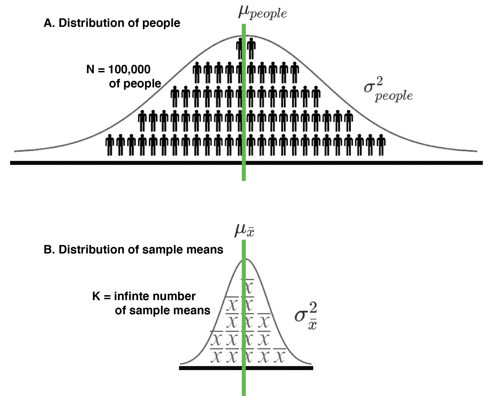
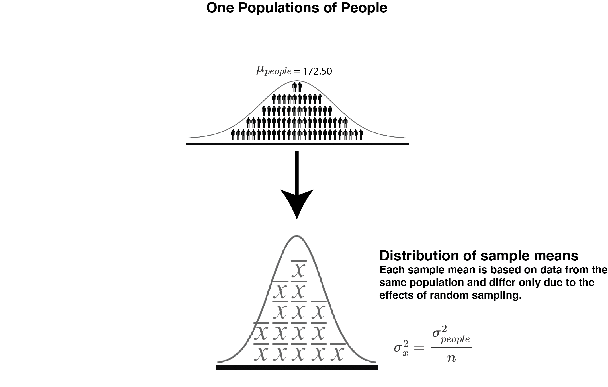
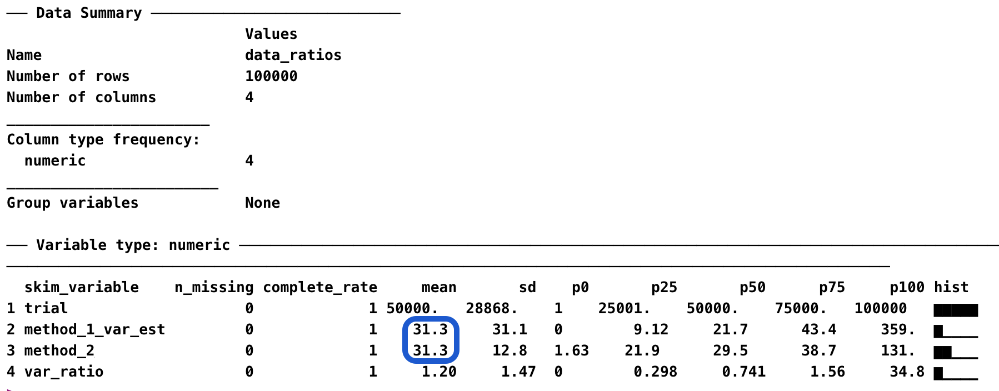
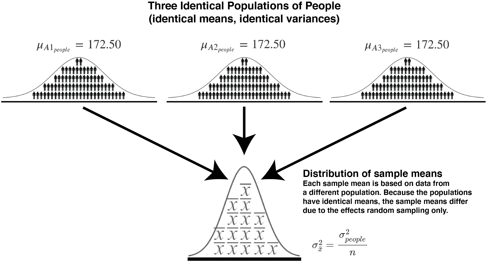
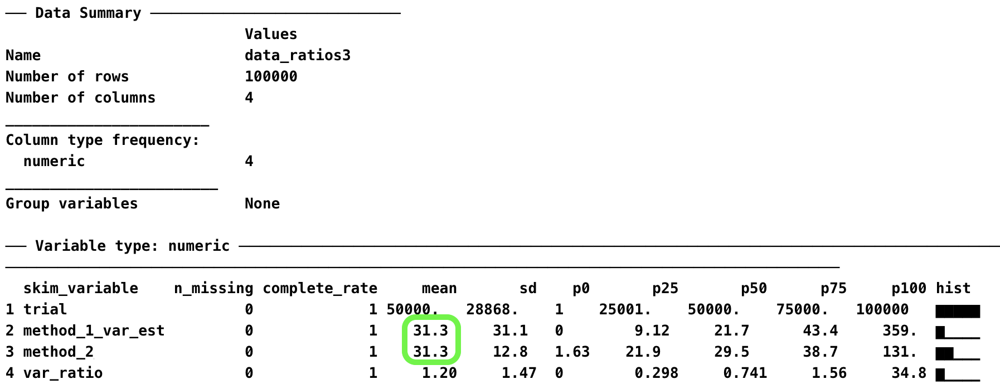
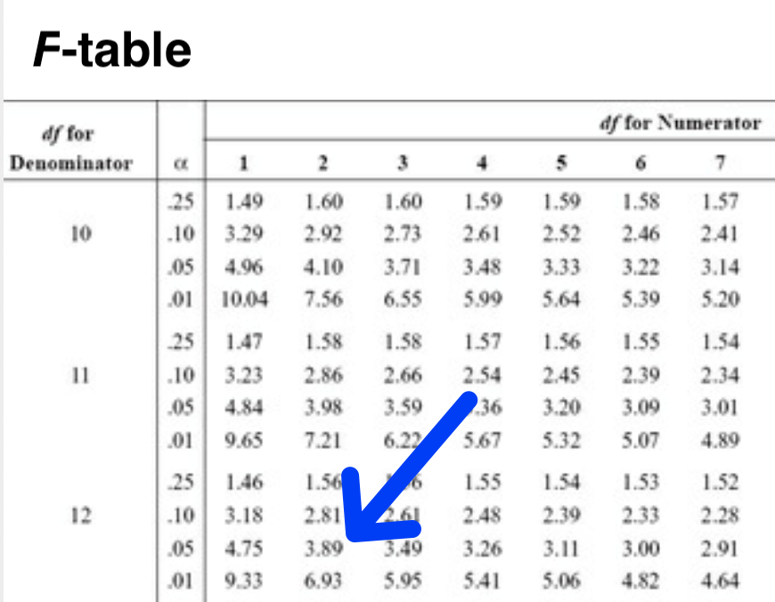

---
output:
  html_document: default
  pdf_document: default
---

# Deep dive: Sampling and ANOVA

## Equal population means

In this chapter we build from a one population scenario to a three population scenario where the three populations have the same mean.

## A tale of two formulas

In this chapter, we focus on describing the distribution of sample means. Our goal is to understand the logic behind two different formulas for estimating the variance of distribution of sample means. A thorough understanding of both of these two estimation approaches lays the foundation for understanding Analysis of Variance (ANOVA).

| Approach  | Estimation Formula | Goal  |
:----------:|:----:|:--------|
| Approach 1: Total |  $s_{\bar{x}}^2=\frac{\sum (\bar{x}-\bar{\bar{x}})^2}{a-1}$ | Estimate the variance of the sampling distribution. That is, estimate variance of sample mean due to all sources (population differences, random sampling error, etc.).
| Approach 2: CLT |   $s_{\bar{x}}^2=\frac{s_{people}^2}{n}$  | Estimate the variance in sample mean due ONLY to random sampling error.|


Understanding the logic behind both approaches for estimating the variance of the distribution of sample means is critical. In this chapter, where there is one population of people, the two approaches estimate the same thing - variabilty in sample means **due to random sampling**. However, in future chapters, where there are multiple populations of people with different means, the two approaches estimate different things. Consequently, to prepare you for those more complex future chapters, it's important to understand the logic behind both approaches in the simple case - where there is a single population of people.

**What we learn in this chapter (and the pattern of results we obtain) will serve as frame-of-reference for interpreting more complex situations in future chapters.**

## A student population

Consider a scenario where there is a large university with 100,000 students and we have the heights of all 100,000 students. We think of this as a population of student heights. The mean height of all 100,000 students is 172.50 cm and the variance is 156.3236 cm$^2$. The heights of all the university students are illustrated in Figure \@ref(fig:chdeepfigure1)A. This figure is shaded with stick figures wearing trousers that remind us this distribution represents people.

\

```{r chdeepfigure1, echo=FALSE, out.width="60%", fig.cap= "A distributionof people (A.) and a corresponding distribution of sample means (B.) can both be considered populations in some sense."}

```

The mean of a population of 100,000 student heights is calculated using Equation \@ref(eq:popmeanchdeep) below.

```{=tex}
\begin{equation} 
\mu_{people} = \frac{\sum_{i=1}^{N=100000}{X_i}}{N}
      (\#eq:popmeanchdeep)
\end{equation}
```
The variance of a population of 100,000 student heights is calculated using Equation \@ref(eq:popvardeep) below.

```{=tex}
\begin{equation} 
\sigma_{people}^2 = \frac{\sum_{i=1}^{N=100000}{(X_i - \mu_{people})^2}}{N}
      (\#eq:popvardeep)
\end{equation}
```
**For these 100,000 people the mean is** $\mu_{people}=172.50$ and the variance is $\sigma_{people}^2=156.3236$.

## Random sampling process

Now imagine that we are interested in studying the random sampling process. Specifically we are interested in examining the variability in sample means that occurs when taking random samples of students heights from the population of people (see Figure \@ref(fig:chdeepfigure1)). Indeed, imagine that we obtained a sample of $n$ = 5 students and measured their heights. Then we calculated a sample mean ($\bar{x}$) based on those heights. Then we repeated this sampling process an infinite number of times such that we have an infinite number of sample means each based on the heights of 5 students. This set of an **infinite number of sample means** is conceptually illustrated in Figure \@ref(fig:chdeepfigure1)B and we refer to it as the **sampling distribution of the mean**. Moreover, **because we sampled from a single population**, whose variance is 156.3236 (i.e., $\sigma_{people}^2 =156.3236$), the variability in sample means, when each sample size is 5 ($n=5$), is due to the random sampling error only.

## Population: What's in a name

Typically, in psychology, when we use the word "population" we are referring to a population of people with respect to some dependent variable - such as the heights illustrated in Figure \@ref(fig:chdeepfigure1)A. However, in statistics, a population is simply a set of elements (often people) about which we wish to draw conclusions. In this chapter, we shift our focus from thinking of the distribution of people in Figure \@ref(fig:chdeepfigure1)A as a population to **also** thinking of the distribution of sample means in Figure \@ref(fig:chdeepfigure1)B as a population. Doing so may seem counter intuitive but it the logical foundation for Analysis of Variance (ANOVA).

### Sample means in context

Thinking of the distribution of sample means as a population can be a bit tricky - since there are two populations that we could be referring to when we use the word "population". Notation helps to keep things straight. In this book, when we are talking about a distribution of people (see Figure \@ref(fig:chdeepfigure1)A), we use $N$ to indicate the number people in the population and $n$ to refer to the number of people in a subset of the population (what we typically refer to as a sample). Likewise, when we are talking about a distribution of sample means (see Figure \@ref(fig:chdeepfigure1)B), we use $K$ to indicate the number of sample means in the population.

Consider a concrete example. When we obtain a sample of five people's heights ($n$ = 5) we can think of the **people** in the sample as a subset of the population of people ($N$=100,000), see Figure \@ref(fig:chdeepfigure1)A. 

But we can also think of that single sample mean as mean a subset of an infinity large set of sample means,  see Figure \@ref(fig:chdeepfigure1)B. We use ($K = \infty$) to refer to the total number of sample mean in the population of sample means.

When we have one sample mean from this population of same mean we say $a = 1$. If we had three sample means from this population of sample means, \@ref(fig:chdeepfigure1)B, we would say $a = 3$.

### Distribution of sample means as a population

Because we are thinking of the distribution of sample means as a population we can calculate the mean and variance for the distribution of sample means. The mean of the population of sample means is calculated as below in Equation \@ref(eq:popmeanxbardeep). Notice that we used the symbol, $\mu_{\bar{x}}$, to represented this value. Further notice, the little $\bar{x}$ beside the $\mu$ in $\mu_{\bar{x}}$ which indicates it is sample means that are being averaged. As noted previously, we use $K$ instead of $N$ to represent the number of sample means (where $K$ = infinity, because there are an infinite number of sample means in the distribution)[^deep_sampling-1]. Notice the similarity between the formula for the mean of a distribution of people, Equation \@ref(eq:popmeanchdeep) above, and the formula for the mean of a distribution of sample means, Equation \@ref(eq:popmeanxbardeep).

[^deep_sampling-1]: I realize that it doesn't make sense to divide by infinity; however, in formal mathematics we would write this up in a different way describing the resulted value as an *expected value*. I use dividing by infinity simply as a way to show consistency with other formulas with the aim of increasing conceptual clarity at the expense of correct notation.

```{=tex}
\begin{equation} 
\mu_{\bar{x}} = \frac{\sum_{i=1}^{K=\infty}{\bar{x}_i}}{K}
      (\#eq:popmeanxbardeep)
\end{equation}
```
Using Equation \@ref(eq:popmeanxbardeep) we find that the mean of the sample means is 172.50 cm (i.e., $\mu_{\bar{x}} = 172.50$).

A key point to remember is that the mean of the sample means, $\mu_{\bar{x}}$, will always be the same as the mean of people's heights, $\mu_{people}$. Consequently, any conclusions we make the mean of sample means, $\mu_{\bar{x}}$ see Figure \@ref(fig:chdeepfigure1)B, will also apply to the mean of people, $\mu_{people}$ see Figure \@ref(fig:chdeepfigure1)A. This is a crucial point to keep in mind as we proceed through this chapter. Although we are ultimately interested in making conclusion about the mean of the people (i.e., $\mu_{people}$) - all our work in this chapter (and in ANOVA) is based on the mean of the distribution of sample means in Figure \@ref(fig:chdeepfigure1)B (i.e., $\mu_{\bar{x}}$).


## Sample mean distribution variance

When there is *one* **population of people** (see Figure \@ref(fig:chdeepfigure1)A) there is a single distribution of sample means that corresponds to that population (see Figure \@ref(fig:chdeepfigure1)B). In this scenario, the sample means differ only because of random sampling. There are two approaches for calculating the variance of this distribution of sample means.

### Approach 1: Total: Calculate the variance of infinite sample means

In this first method, we use an infinite number of sample means and simply calculate the variance, see Equation \@ref(eq:popvarxbardeep) below.

```{=tex}
\begin{equation} 
\sigma_{\bar{x}}^2 = \frac{\sum_{i=1}^{K=\infty}{(\bar{x}_i - \mu_{\bar{x}})^2}}{K}
      (\#eq:popvarxbardeep)
\end{equation}
```
Notice how Equation \@ref(eq:popvarxbardeep) for the variance of sample means in Figure \@ref(fig:chdeepfigure1)B, is similar to the formula we use for the variance of people, Equation \@ref(eq:popvardeep), in Figure \@ref(fig:chdeepfigure1)A. The formula for the variance of sample means, Equation \@ref(eq:popvarxbardeep), differs because we are using sample means ($\bar{x}$) instead of attributes of people ($X$). As well, we use $K$ to indicate the number of elements used (i.e., an infinite number of sample means) in the calculation rather than $N$.


| Distribution |          Attribute           |                                  Parameter Calculation                                   |                               Estimate of Parameter                               |
|:------------:|:----------------------------:|:----------------------------------------------------------------------------------------:|:---------------------------------------------------------------------------------:|
|    People    |           Variance           |          $\sigma_{people}^2 = \frac{\sum_{i=1}^{N}{(X_i - \mu_{people})^2}}{N}$          |   $s_{people}^2 = VAR = \frac{\sum_{i=1}^{n}{(x_i - \bar{x}_{people})^2}}{n-1}$   |
| Sample Means |      Approach 1: Variance      |  $\sigma_{\bar{x}}^2 = \frac{\sum_{i=1}^{K=\infty}{(\bar{x}_i - \mu_{\bar{x}})^2}}{K}$   |    $s_{\bar{x}}^2 = \frac{\sum_{i=1}^{a}{(\bar{x}_i - \bar{\bar{x}})^2}}{a-1}$    |


Obviously, using Equation \@ref(eq:popvarxbardeep) to calculate the variance of an infinite set of sample means is an impractical solution because we could never obtain the infinite number of samples and then calculate the variance for this set. Conceptually, however, it's good to keep this calculation method in mind - since it reminds us of principles we've already learned about the variance of populations [^deep_sampling-2]

[^deep_sampling-2]: As noted previously, this notation is incorrect and I should really have expressed this as an expected value to be correct. But for conceptual clarity I divided by infinity to make the linkages to other equations clear.

But imagine if we could obtain the full infinite set of sample means - then we could use the formula as below:

$$
\begin{aligned} 
\sigma_{\bar{x}}^2 &= \frac{\sum_{i=1}^{K=\infty}{(\bar{x}_i - \mu_{\bar{x}})^2}}{K}\\
&= 31.26472\\
\end{aligned} 
$$

Thus, the "population" variance of the distribution of sample means ($\sigma_{\bar{x}}^2$, see Figure \@ref(fig:chdeepfigure1)B) is **calculated**, based an infinite number of sample means ($K = \infty$) using Approach 1, to be $\sigma_{\bar{x}}^2 = 31.26472$.

**When there is only one population of people** this formula will reflect variability in sample means due to random sampling. When there is more than one population of people - it becomes more complicated. We'll discuss that situation in a future chapter.

### Approach 2: CLT: *Calculation* of variance due to sampling error

Fortunately, **when sampling error is the ONLY source of variability in sample means** there is a shortcut. We don't need to obtain an infinite number of sample means to determine the variance of the distribution of an infinite number of sample means, Figure \@ref(fig:chdeepfigure1)B. There is a "shortcut formula" we can use based on the Central Limit Theorem (CLT), see the formula below.

$$
\sigma_{\bar{x}}^2 = \frac{\sigma_{people}^2}{\text{sample size}}
$$

Be we more often see it represented completely symbolically as per Equation \@ref(eq:popvarCLTxbardeep) below.

```{=tex}
\begin{equation} 
\sigma_{\bar{x}}^2 = \frac{\sigma_{people}^2}{n}\\
      (\#eq:popvarCLTxbardeep)
\end{equation}
```

An inspection of Equation \@ref(eq:popvarCLTxbardeep) reveals the variance of the distribution of sample means **DUE TO RANDOM SAMPLING ERROR ONLY**(see Figure \@ref(fig:chdeepfigure1)B) depends on both the number of people in each sample ($n$) and the variability in the people's heights in the population (see Figure \@ref(fig:chdeepfigure1)B, $\sigma_{people}^2$).

The reason this formula works should not be obvious - at all. If you are looking at this formula trying to figure out why it works - I suggest you stop and just accept that it does work. If you want to understand why it works, I suggest you [consult](https://archive.org/details/statisticsfifthe00will) [@hays1994statistics] who provides a statistical proof for the Central Limit Theorem.

It's helpful, moving forward, to think of this formula ($\frac{\sigma_{people}^2}{n}$) as representing the *variability in means due to random sampling*. The formula was devired from teh Central Limit Theorem so we refer to it as the CLT approach. No matter the situation - this formula will always reflect the **variability in sample means due ONLY to random sampling**.

Previously, we learned that the variance of the distribution of people in Figure \@ref(fig:chdeepfigure1)A is $\sigma_{people}^2=156.3236$. Consequently, we can use Equation \@ref(eq:popvarCLTxbardeep) to calculate the variance of the distribution of sample means in Figure \@ref(fig:chdeepfigure1)B:

$$
\begin{aligned} 
\sigma_{\bar{x}}^2 &= \frac{\sigma_{people}^2}{n}\\
&= \frac{156.3236}{5}\\
&= 31.26472\\
\end{aligned} 
$$

Thus, the "population" variance of the distribution of sample means ($\sigma_{\bar{x}}^2$, see Figure \@ref(fig:chdeepfigure1)B) is **calculated**, using Approach 2 the CLT shortcut, to be $\sigma_{\bar{x}}^2 = 31.26472$.

### Ratio comparison of two approaches

To begin, we are looking at a distribution of sampling means **where the means differed only due to random sampling error**. In this situation, we have calculated the variance of the distribution of sample means using two different approaches.

-   Approach 1: Total variance of sample means calculated using sample means and the variance formula

-   Approach 2: Variance of sample means, due to random sampling error, calculated using CLT shortcut formula

Although we can just look at the numbers resulting from these two approaches and compare them, that's not how statisticians typically handle such comparisons. The approach used by statisticians to compare two numbers is to create a ratio. That is, take one number and divide it by the other number. If the two numbers are the same the ratio will be 1.00. If the ratio is larger than 1.00 it means the number on the top was bigger than the number on the bottom.


$$
\begin{aligned} 
\text{ratio comparing approaches} &= \frac{\text{total variance of sample means }}{\text{variance of sample means due to random sampling error}}\\
&=\frac{\frac{\sum_{i=1}^{A=\infty}{(\bar{x}_i - \mu_{\bar{x}})^2}}{A}}{\frac{\sigma_{people}^2}{n}}\\
&=\frac{31.26472}{31.26472}\\
&= 1.00\\
\end{aligned} 
$$

You can see the ratio comparing these two approaches below is 1.00 - so we conclude two approaches produced the same result. If the number on the top of the ratio was the *larger* of the two, then the value of the ratio would be greater than 1.00. In contrast, if the number on the top of the ratio was the *smaller* of the two, then the value of the ratio would be less than 1.00. Be sure you understand how to interpet the value of a ratio using these rules before continuing.

**CRITICAL: Think about what this means.** Both approaches produced the same number. The **total variance approach** resulted in the same number as the **random samplingly only approach**. *So we can conclude the only reason the sample means differed from each other was random sampling*. Go back and re-read this paragraph a few times until you are sure you understand this crucial point.

**CALCULATION VS ESTIMATION**. In this section, we focused on actually **calculating** the variance of the distribution of sample means using two approaches. But to actually **calculate** this variance we needed an infinite number of sample means (Approach 1) or knowledge of the population of people variance (Approach 2). Consequently, it's impractical to **calculate** either quantity.

In the next section, below, we recognize that we can likely never know or calculate the variance of the distribution of sample means. Instead, we focus on **estimating** the variance of the distribution of sample means. An **estimated value** is an approximation of the actual value that will differ due to the effects of random sampling.

```{r, include=FALSE}
# Set up sample information for rest of chapter
set.seed(20210901)
pop_sd = sqrt(156.3236)
pop_mean = 172.50

n_sample <- 5 #don't use n it's a reserved variable name for this package

sample_data <- round(rnorm(n_sample)*pop_sd+pop_mean)
sample_mean <- round(mean(sample_data),1)
sample_var <- var(sample_data)*(n_sample-1)/(n_sample)
est_pop_var <- round(var(sample_data),1)
df <-  n_sample-1
barx <- sample_mean
x1 <- sample_data[1]
x2 <- sample_data[2]
x3 <- sample_data[3]
x4 <- sample_data[4]
x5 <- sample_data[5]
sumx2 <- sum((sample_data-mean(sample_mean))^2)


sample_data2 <- round(rnorm(n_sample)*pop_sd+pop_mean)
sample_mean2 <- round(mean(sample_data2),1)
sample_var2 <- var(sample_data2)*(n_sample-1)/(n_sample)
est_pop_var2 <- round(var(sample_data2),1)
df2 <-  n_sample-1
barxb <- sample_mean2
x1b <- sample_data2[1]
x2b <- sample_data2[2]
x3b <- sample_data2[3]
x4b <- sample_data2[4]
x5b <- sample_data2[5]
sumx2b <- sum((sample_data2-mean(sample_mean2))^2)


sample_data3 <- round(rnorm(n_sample)*pop_sd+pop_mean)
sample_mean3 <- round(mean(sample_data3),1)
sample_var3 <- var(sample_data3)*(n_sample-1)/(n_sample)
est_pop_var3 <- round(var(sample_data3),1)
df3 <-  n_sample-1
barxc <- sample_mean3
x1c <- sample_data3[1]
x2c <- sample_data3[2]
x3c <- sample_data3[3]
x4c <- sample_data3[4]
x5c <- sample_data3[5]
sumx2c <- sum((sample_data3-mean(sample_mean3))^2)

dfpooled <- df+df2 + df3
est_pop_var_pooled <- (est_pop_var+est_pop_var2+est_pop_var3)/3

a <- 3
xbarbar <- round(mean(c(barx,barxb,barxc)), 3)
xbar_vector <- c(barx, barxb, barxc)
method1_var <- round(var(xbar_vector),3)


est_mean_var_clt <- est_pop_var_pooled/n_sample

```

## Estimating sample mean distribution variance

In this section we focus on estimating the variance of the distribution of sample means using sample data. Imagine that we obtained three samples (i.e., $a = 3$) and each sample has 5 people  (i.e., $n = 5$) from the population of people illustrated in Figure \@ref(fig:chdeepfigure1)A. The statistics for those three samples are presented below.

| Sample Number | Sample size ($n$) | Mean ($\bar{x} = \frac{\Sigma x_i}{n}$) | Variance ($s_{people}^2=\frac{\Sigma (x_i - \bar{x})^2}{n-1}$) |
|:-------------:|:-----------------:|:---------------------------------------:|:--------------------------------------------------------------:|
|       1       |         5         |             `r sample_mean`             |                        `r est_pop_var`                         |
|       2       |         5         |            `r sample_mean2`             |                        `r est_pop_var2`                        |
|       3       |         5         |            `r sample_mean3`             |                        `r est_pop_var3`                        |

### Approach 1: Estimate the total  variance of infinite sample means using 3 sample means

We can use the sample means presented in the table above to estimate the variance of the distribution of sample means as illustrated in the formula below. Recall, we use a lower case character, $a$, to represent the number of sample means (in the case because we have 3 sample means $a = 3$). We think of these three sample means as a subset ($a = 3$) of the distribution of an infinite number of sample means (i.e., a population of sample means, $K=\infty$) illustrated in Figure \@ref(fig:chdeepfigure1)B. Consequently, we use the standard approach of estimating the variance of a larger set of elements from a (i.e., a population of sample means) subset of those elements (i.e., a sample of sample means) by including "-1" in the denominator of the variance formula, see Equation \@ref(eq:estpopvarxbardeep) below.

```{=tex}
\begin{equation} 
s_{\bar{x}}^2 = \frac{\sum_{i=1}^{a=3}{(\bar{x}_i - \bar{\bar{x}})^2}}{a-1}
      (\#eq:estpopvarxbardeep)
\end{equation}
```
First, we calculate the mean of the three sample means ($\bar{\bar{x}}$) because we will need that in the variance formula.

$$
\begin{aligned} 
\bar{\bar{x}} &= \frac{\sum_{i=1}^{a=3}{\bar{x}_i}}{a}\\
&= \frac{\bar{x}_1+\bar{x}_2+\bar{x}_3}{a}\\
&= \frac{`r barx` + `r barxb`  + `r barxc` }{`r a`}\\
&= `r xbarbar`
\end{aligned} 
$$

Second, we estimate the variance of the population of sample means ($s_{\bar{x}}^2$, see Figure \@ref(fig:chdeepfigure1)B) using the set of sample means. Again, notice the use of "-1" in the denominator - [which we discussed previously in the sample accuracy chapter](https://dstanley4.github.io/psyc6060bookdown/sampling-accuracy.html#estimating-sigma2). The use of the "-1" in the denominator means we are not calculating the variance of these three sample means. Rather, when we use "-1" in the denominator we are **estimating** the variance of the population of sample means from which they were obtained (i.e., the distribution of sample means depicted in Figure \@ref(fig:chdeepfigure1)B).

$$
\begin{aligned} 
s_{\bar{x}}^2 &= \frac{\sum_{i=1}^{a=3}{(\bar{x}_i - \bar{\bar{x}})^2}}{a-1}\\
&= \frac{(\bar{x_1}- \bar{\bar{x}})^2+(\bar{x_2}- \bar{\bar{x}})^2+(\bar{x_3}- \bar{\bar{x}})^2}{a-1}\\
&= \frac{(`r (barx)` - `r (xbarbar)`)^2+(`r (barxb)`  - `r (xbarbar)`)^2+(`r (barxc)` - `r (xbarbar)`)^2}{3-1}\\
&= `r method1_var`
\end{aligned} 
$$

Thus, the "population" variance of the distribution of sample means ($\sigma_{\bar{x}}^2$, see Figure \@ref(fig:chdeepfigure1)B) is **estimated**, based on three sample means ($a = 3$) using Approach 1, to be $s_{\bar{x}}^2 = `r method1_var`$. Remember though `r method1_var` is just an *estimate* of the population value ($\sigma_{\bar{x}}^2$) based on three sample means.

**IMPORTANT:** The denominator of this variance calculation is $2$ (i.e., $3-1$). Therefore, we say there are 2 degrees of freedom associated with this estimate of the variance of the infinite number of sample means.

### Approach 2: CLT shortcut: *Estimation* of variance due to random sampling error

We can use the information presented in the table above in another way to estimate the variance of the distribution of sample means. Indeed, recall that than another approach to calculating the variance of the distribution of sample means is to use the shortcut formula based on the Central Limit Theorem (CLT), Equation \@ref(eq:popvarCLTxbardeep) above, repeated below for clarity.

$$
\begin{aligned}
\sigma_{\bar{x}}^2 &= \frac{\sigma_{people}^2}{n}\\
\end{aligned}
$$

#### Estimating $\sigma_{people}^2$ with $s_{people}^2$

The problem with the formula above is that you need to know the variance of the all the people in the population ($\sigma_{people}^2$) - and we don't know the variance of all the people in the population. But, we do have three samples from that population of people. Because the three samples are from the same population of people - we know each sample provides an estimate of the same (single) variance of people in the population. Therefore, we can combine those variance estimates into a better (or average) estimate of the variance of the people ($s_{people}^2$) in the population using the formula below.

$$
\begin{aligned}
s_{people}^2 &= MSE_{people}\\
&= \frac{\sum_{i=1}^{a=3}(n_i-1)s_i^2}{\sum_{i=1}^{a}(n_i-1)} \\
&= \frac{(n_1-1)s_1^2 + (n_2-1)s_2^2 + (n_3-1)s_3^2}{(n_1-1)+(n_2-1)+(n_3-1)} \\
&= \frac{(5-1)s_1^2 + (5-1)s_2^2 + (5-1)s_3^2}{(5-1)+(5-1)+(5-1)} \\
&= \frac{(5-1)`r est_pop_var` + (5-1)`r est_pop_var2` +(5-1)`r est_pop_var3`}{(5-1) + (5-1) + (5-1)} \\
&= \frac{`r 4*est_pop_var` + `r 4*est_pop_var2` + `r 4*est_pop_var3`}{15 -3} \\
&= \frac{`r as.character((4*est_pop_var + 4*est_pop_var2 +  4*est_pop_var3))`}{12} \\
&= `r est_pop_var_pooled` \\
\end{aligned}
$$

**IMPORTANT:** The denominator of this variance calculation is $12$ (i.e., $a(n-1)=3(5-1)=3(4)=12$). Therefore, we say there are 12 degrees of freedom associated with this estimate of the variance of the people in the population.

When the three sample sizes are the same the above formula just boils down to an average:

$$
\begin{aligned}
s_{people}^2 &= MSE_{people}\\
&= \frac{s_1^2 + s_2^2 + s_3^2}{3} \\
&= \frac{`r est_pop_var` + `r est_pop_var2` + `r est_pop_var3` }{3} \\
&= \frac{660.7}{3} \\
&= `r est_pop_var_pooled` \\
\end{aligned}
$$

The number we just calculated, $s_{people}^2 =`r est_pop_var_pooled`$, is an estimate of the variance of the population of people illustrated in Figure \@ref(fig:chdeepfigure1)A. You could think of this number as an average variance estimate.

We created the average variance estimate,$s_{people}^2 =`r est_pop_var_pooled`$, by combining three sample estimates of the variance of the population of people. Each sample estimate was based on 5 people (i.e., 4 degrees of freedom). But the average variance estimate we just calculated ( $s_{people}^2 =`r est_pop_var_pooled`$) is based on 15 people - people from all three samples (i.e., 12 degrees of freedom). Because we combined people from all three samples the average variance estimate is a better estimate of the variance of the population of people than any single sample estimate. In technical terms, we say the variance estimate we just calculated is a better estimate because of the higher degrees of freedom (12) compared to an individual sample estimate (with only 4 degrees of freedom).

We use different names to refer to the resulting average variance estimate - we could just call it a better estimate of the population variance ($s_{people}^2$). But, statisticians also use the term pooled variance ($s_{pooled}^2$) to refer it. Other times, statisticians use the term Mean Square Error ($MSE$) to refer to it. You should realize that these are all just synonyms for variance of the population of people illustrated in Figure \@ref(fig:chdeepfigure1)A: $s_{people}^2 = s_{pooled}^2 = MSE_{people} = MSE$.

#### Estimating $\sigma_{\bar{x}}^2$ with CLT


**If we assume that random sampling error is the only source of variance in the distribution of sample means** we can estimate $\sigma_{\bar{x}}^2$ using the formula we derived from the Central Limit Theorem. 

More specifically, armed with the estimate of the variance of the people in the population ($s_{people}^2$) we can use the CLT shortcut formula to obtain an estimate of the variance of the distribution of sample means using Equation \@ref(eq:estpopvarmeansclt) below.

```{=tex}
\begin{equation} 
s_{\bar{x}}^2 = \frac{s_{people}^2}{n}
      (\#eq:estpopvarmeansclt)
\end{equation}
```
Putting in values:

$$
\begin{aligned} 
s_{\bar{x}}^2 &= \frac{s_{people}^2}{n}\\
&= \frac{`r est_pop_var_pooled` }{5}\\
&= `r est_mean_var_clt`
\end{aligned} 
$$

Thus, using Approach 2: CLT shortcut, our estimate of the variance of the distribution of sample means, **due to random sampling error** is $s_{\bar{x}}^2 = `r est_mean_var_clt`$.

**IMPORTANT:** This estimate of the variance of the distribution of sample means was based on using an estimate of the variance of the people in the population (i.e., $s_{people}^2 =`r est_pop_var_pooled`$). There were 12 degrees of freedom associated with $s_{people}^2$ which $s_{\bar{X}}^2$ depends upon. So we say there are 12 degrees of freedom associated with $s_{\bar{X}}^2$.

### Ratio comparison of two approaches

The table below summarizes our work so far.

|       Attribute        |       Unknown Parameter        |                                    Estimate of Parameter                                     | $s_{\bar{x}}^2$ degrees of freedom |
|:----------------------:|:------------------------------:|:--------------------------------------------------------------------------------------------:|:----------------------------------:|
|   Approach 1: Total variance   | $\sigma_{\bar{x}}^2 =31.26472$ | $s_{\bar{x}}^2 = \frac{\sum_{i=1}^{a}{(\bar{x}_i - \bar{\bar{x}})^2}}{a-1}= `r method1_var`$ |                 $a-1=3-1=2$                  |
| Approach 2: CLT Random sampling variance | $\sigma_{\bar{x}}^2 =31.26472$ |                $s_{\bar{x}}^2 = \frac{s_{people}^2}{n}=`r est_mean_var_clt`$                 |                 $a(n-1)=3(5-1)=12$                 |

In the table above, Approach 1, estimates the total variance (from all sources) in sample means. In contrast, Approach 2, estimates the variance in sample means due strictly to random sampling error. In this particular scenario **we know** the only source of variability in sample means is random sampling error. So...we do the two numbers differ?

Recall, that in Approach 1 we didn't have all of the sample means in the infinity large distribution of sample means. We based our estimate on only three of those means. So our estimate using, Approach 1, will differ from the truth due to sampling error -- because we only have 3 sample means - not the full infinite set of sample means.

Likewise, recall that in Approach 2 we didn't know the variance of the population of people ($\sigma_{people}^2$). We had to rely on an esimate of that value ($s_{people}^2$), based on 15 people (three sets of 5). Consequently, Approach 2 will differ from the truth as well due to random sampling error.

Because both Approach 1 and 2 will differ from the true due to random sampling error, when we construct a ratio, it too will differ from the truth due to random sampling error. That is, when we construct a ratio based on those variance estimate ($s_{\bar{x}}^2 = \frac{\sum_{i=1}^{a}{(\bar{x}_i - \bar{\bar{x}})^2}}{a-1}= `r method1_var`$ and $s_{\bar{x}}^2 = \frac{s_{people}^2}{n}=`r est_mean_var_clt`$) the ratio will differ from "the truth" (1.00) due to sampling error.

\

$$
\begin{aligned} 
\text{ratio comparing approaches} &= \frac{\text{variance of sample means ESTIMATED using sample means}}{\text{variance of sample means ESTIMATED using CLT shortcut formula}}\\
&=\frac{\frac{\sum_{i=1}^{a=3}{(\bar{x}_i - \bar{\bar{x}})^2}}{a-1}}{\frac{s_{people}^2}{n}}\\
&=\frac{`r method1_var`}{`r est_mean_var_clt`}\\
&= `r method1_var/est_mean_var_clt`\\
\end{aligned} 
$$

## Frame of reference: Random sampling only

In this section we focus on using simulations to establish a frame of reference for interpreting the variance ratio in a scenario where random sampling is the only reason sample means differ from each other. Because random sampling is the only reasons the sample means differ both formulas are estimating the same thing. However, due to random sampling error, the the formulas may differ.


### Simulation of 1 population

```{r sim1pop, out.width = "100%", echo=FALSE, fig.cap= "Sampling from one population"}

```

The simplest scenario to understand the estimation formulas we have discussed is the one illustrated in Figure \@ref(fig:sim1pop) above. In this scenario, we obtain 3 samples from the population of people and then used that data to **estimate** the variance of the distribution of sample means using Approach 1 and Approach 2. Then we create a ratio of those two values (Approach 1/Approach 2). Each additional row of the table shows a case where we did this same thing with three new samples.

We begin by creating the population in R:

```{r, eval = FALSE}
library(learnSampling)
pop1 <- make_population(mean = 172.50, variance = 156.3236)
```

Then we run a simulation where we estimate the variance using the distribution of sample means using the information in the three sample via Approach 1 and Approach 2. We repeat this estimation process 100,000 times to see if it is accurate in the long run.

```{r, eval = FALSE}
data_ratios <- get_mean_samples_ratio(pop1,
                                      a = 3,
                                      n = 5,
                                      number.of.trials = 100000)
```

```{r, eval = FALSE, echo = FALSE}
save(data_ratios, file = "ch_deep_sampling/data_ratio_1pop.RData")
```

```{r, eval = TRUE, echo = FALSE}
load(file = "ch_deep_sampling/data_ratio_1pop.RData")
```

The results of the 100,000 simulations are placed in the data set called data_ratios. We can see the first few rows of these data below.

```{r}
head(data_ratios)
```

When you inspect the table above, recognize that for the first row of the table we obtained 3 random samples from the population of people and then used that data to **estimate** the variance of the sampling distribution of means using Approach 1 and Approach 2 (approach_1\_total_var_est and approach_2\_clt_est, respectively). Then we created a ratio of those two values (approach_1\_var_est/approach_2\_clt_est) and placed that in the table (var_ratio). Each additional row of table shows a case were were did this same thing with three new samples. There are a total of 100,000 rows in this table.

We obtain the summary statistics with the skim command:

```{r, eval = FALSE}
library(skimr)
skim(data_ratios)
```

```{r, echo = FALSE, out.width="90%"}

```

Recall that previously, we used Equation \@ref(eq:popvarCLTxbardeep) to calculate $\sigma_{\bar{x}}^2 = 31.26472$. Each row in the table above presents two estimates (i.e., $s_{\bar{x}}^2$) of $\sigma_{\bar{x}}^2$. You can see that the Approach 1 approach for obtaining $s_{\bar{x}}^2$ was on average correct becase of the 31.3 value in the blue box. Likewise, you can see that the Approach 2 approach for obtaining $s_{\bar{x}}^2$ was on average correct because of the 31.3 value in the blue box.

**Graphing the ratios.** Although each estimate was **on average correct**, the two estimates were not always the same. Recall we compared the two estimates by making a ratio. Due to random sampling error on some trials the numerator of the ratio was larger and on other trials the denominator of the ratio was larger. As a result, on some trials the ratio was larger than 1.0 and on other trials the ratio was smaller than 1.0.

Below I present a graph of these ratios, Figure \@ref(fig:graph1pop). You can see there is a wide range of ratio that occur. Note that this is shape of the distributions when we have:

a) A single population - so sampling error is the only reason means differ
b) Total variance estimate is based on 3 sample means (i.e., $a-1$ degrees)
c) Sampling error variance estimate created using a population of people variance estimate dervied from 15 people (i.e., $a(n-1)=3(5-1)=12$ degrees of freedom)

This type of graph is helpful, because it allows us to understand, when these conditions are true, the range of ratio values that can occur. FYI - as we'll discuss more later, this is an **F-ratio**.

```{r graph1pop, out.width="100%", echo=FALSE, fig.cap ="Variance ratio when  there is one population of people"}
library(ggplot2)

ggplot(data = data_ratios, mapping = aes(x = var_ratio)) +
  geom_histogram(breaks = seq(0, 10, by = .5)) +
  scale_x_continuous(breaks = seq(0,10, by = .5)) +
  coord_cartesian(xlim = c(0,10), ylim = c(0, 40000)) +
  xlab("Variance Ratio: (approach_1_total_var / approach_2_clt)") +
  ylab("Frequency") +
  theme_classic()
```

This graph illustrates the range of ratio values that can occur when there is a single population when we use 3 samples, $a =3$, and a sample size of 5, $n = 5$.  More formally, there are 2, $(a -1)$, and 12, $a(n-1)$, degrees of freedom.

### Simulation of 3 identical populations


```{r sim3pop, out.width = "100%", echo=FALSE, fig.cap= "Sampling from three populations with the same mean (and variance)"}

```


| Population |  Mean        | Variance        |
|:----------:|:------------:|:----------------|
| 1          | $\mu_{A1_{people}}= 172.50$ |  $\sigma_{A1_{people}}^2= 156.3236$ |
| 2          | $\mu_{A2_{people}}= 172.50$ |  $\sigma_{A2_{people}}^2= 156.3236$ |
| 3          | $\mu_{A3_{people}}= 172.50$ |  $\sigma_{A3_{people}}^2= 156.3236$ |


In this section, instead of using one population, we use three identical populations. That is, $a = 3$. We use $A1$, $A2$, and $A3$ to refer to these three identical populations.

You will see in this section that when you have three identical populations of people, see Figure \@ref(fig:sim3pop), that the results are the same as when you have one population of people. We simulate the situation illustrated in the figure above. We start by creating three identical populations of people.

```{r, eval = FALSE}
library(learnSampling)
pop1 <- make_population(mean = 172.50, variance = 156.3236)
pop2 <- pop1
pop3 <- pop1
```

Then, we obtain a sample from each population of people and calculate a sample mean. When we use Approach 1: Total variance we think of these three sample means as being a random sample ($a = 3$) of the infinite distribution of sample means ($K = \infty$). The variance of the three sample means is an estimate of the variance of the distribution of sample means. When we use Approach 2: CLT Shortcut we use the people from the three sample to estimate the variance of the population of people. We use our estimate of the variance of the population of people in the Approach 2: CLT Shortcut formula to estimate the variance of the distribution of sample means. Then we calculate the ratio of Approach 1: Total variance divided by Approach 2: CLT Shortcut.

**Then we repeat this process 100,000 times to see how well this process works on average - via the R commands below.**

```{r, eval = FALSE}
data_ratios3 <- get_mean_samples_ratio(pop1, pop2, pop3,
                                       n = 5,
                                       number.of.trials = 100000)
```

```{r, eval = FALSE, echo = FALSE}
save(data_ratios3, file = "ch_deep_sampling/data_ratio_3pop.RData")
```

```{r, eval = TRUE, echo = FALSE}
load(file = "ch_deep_sampling/data_ratio_3pop.RData")
```

The results of the 100,000 simulations are placed in the data set called data_ratios3. We can see the first few rows of these data below.

```{r}
head(data_ratios3)
```

In the first row of the above table we obtained 3 samples (one from each population) and then used that data to **estimate** the variance of the sampling distribution of means using Approach 1 and Approach 2. Then we create a ratio of those two values (Approach 1/Approach 2). Each additional row of table shows a case where were did this same thing with three new samples. There are a total of 100,000 rows in this table.

We obtain the summary statistics with the skim command:

```{r, eval = FALSE}
library(skimr)
skim(data_ratios3)
```

```{r, echo = FALSE, out.width="90%"}

```

Recall that previously, we used Equation \@ref(eq:popvarCLTxbardeep) to calculate $\sigma_{\bar{x}}^2 = 31.26472$. Each row in table above presents two estimates (i.e., $s_{\bar{x}}^2$) of $\sigma_{\bar{x}}^2$. You can see that the Approach 1 approach for obtaining $s_{\bar{x}}^2$ was on average correct becase of the 31.3 value in the green box. Likewise, you can see that the Approach 2 approach for obtaining $s_{\bar{x}}^2$ was on average correct because of the 31.3 value in the green box.

**Graphing the ratios.** Although each estimate was **on average correct**, the two estimates were not always the same. Recall we compared the two estimates by making a ratio. Due to random sampling error on some trials the numerator of the ratio was larger and on other trials the denominator of the ratio was larger. As a result, on some trials the ratio was larger than 1.0 and on other trials the ratio was smaller than 1.0.

Below I present a graph of these ratios, Figure \@ref(fig:graph3pop). You can see there is a wide range of ratio that occur. Note that this is shape of the distributions when we have:

a) Three identical population - so sampling error is the only reason means differ
b) Total variance estimate is based on 3 sample means (i.e., $a-1$ degrees)
c) Sampling error variance estimate created using a population of people variance estimate dervied from 15 people (i.e., $a(n-1)=3(5-1)=12$ degrees of freedom)

This type of graph is helpful, because it allows us to understand, when these conditions are true, the range of ratio values that can occur. Again remember, these are called **F-ratios**.


```{r graph3pop, out.width="100%", echo=FALSE, fig.cap ="Variance ratio when there are three identical populations of people"}
library(ggplot2)

ggplot(data = data_ratios3, mapping = aes(x = var_ratio)) +
  geom_histogram(breaks = seq(0, 10, by = .5)) +
  geom_vline(xintercept = 3.88, color = "blue", size = 1) +
  scale_x_continuous(breaks = seq(0,10, by = .5)) +
  coord_cartesian(xlim = c(0,10), ylim = c(0, 40000)) +
  xlab("Variance Ratio: (approach_1_total_var / approach_2_clt)") +
  ylab("Frequency") +
  theme_classic()
```

#### Extreme ratio values

Keep in mind that this is the range of ratios that can occur when all three populations have the same mean. In the above graph we use a vertical blue line to distinguish between the lower 95% of ratio values and the upper 5% of ratios values.

How did we know where to place this line? We simply sorted the ratios from smallest to largest. Then when to the 95% percentile spot in that list.  To obtain the 95% percentile in of the sorted list of 100,000 ratios we just mutiple the total number of ratios (100,000) by .95. We 95000 (i.e., $.95*100000=95000$) which indicates that 95% of ratios are below the value in this spot. Likewise, 5% of ratios are above the value at this spot.

The ratio value in the spot 95,000 of the sorted list of 100,000 ratio values is 3.88. How do you interpret this value? 

In the situation where:

a. the variance estimate the numerator has 2 degrees of freedom
b. the variance estimate the denominator has 12 degrees of freedom
c. the population variances are the same 
d. the population means are the same

When the above situation is the case, we will obtain an variance ratio above 3.88 only 5% of the time. We obtain this 3.88 value with the R-code below.


```{r}
# sort the variance ratios smallest to largest
var_ratio3_sorted <- sort(data_ratios3$var_ratio)

# in order list, obtain the 95th percentile 
# values beyond this point are in the upper 5% of variances ratios
# that occur when the population means are equal
extreme_cut_off3 <- var_ratio3_sorted[100000*.95]

# round the result and print it
extreme_cut_off3 <- round(extreme_cut_off3, 2)
print(extreme_cut_off3)
```

#### It's really an $F$-value

Most importantly, we don't usually refer to the ratio we have been examining as a variance ratio. We refer to it as an $F$-ratio or $F$-value.

We used this simulation to see the range of $F$-ratios that occur when we KNOW all the population means are equal. From the graph, you can see that this range of $F$-ratio values is quite wide. But, we estimated that when all three populations means are equal (and n = 5) that only 5% of $F$-ratios will fall above a value we estimated to be 3.88. This value is what we refer to as $F_{critical}$ when $\alpha = .05$. Thus, $F_{critical}$(2, 12) = 3.88.

Compare the $F$-ratio we obtained (3.88) to the values in $F$-table at 2 and 12 degrees of freedom for $\alpha=.05$. An $F$-table is a table of $F_{critical}$ values. You can see that the value in the table is 3.89 - this is the correct value. Our estimate is 3.88 which is very close to the correct value of 3.89. Our value of 3.88 is off a bit from the 3.89 in the $F$-table because we only use 100,000 samples and not an infinite number of samples.

```{r, echo = FALSE, out.width="60%"}

```

#### Making your own $F$-table

Congratuations you have just learned how to create the values in the $F$-table from scratch! To ensure you understand everything you have learned in this exercise think through how you would do the following:

* Obtain $F_{critical}$(2, 12) for $\alpha=.01$

* Obtain $F_{critical}$(3, 36) for $\alpha=.05$. Look at the degrees of freedom and alpha. How many populations would you use (i.e., what would value would you use for $a$)? How many people would you use in each sample (i.e., what value would you use for $n$)? What position would you look at in the list of **sorted** variance ratios?

* Obtain $F_{critical}$(3, 36) for $\alpha=.01$ Look at the degrees of freedom and alpha. How many populations would you use (i.e., what would value would you use for $a$)? How many people would you use in each sample (i.e., what value would you use for $n$)? What position would you look at in the list of **sorted** variance ratios?

## Central $F$-distributions

In this chapter we focused on creating an $F$-distribution when the population means were the same. When you create an $F$-distribution based on a scenario where the population means are all the same we refer to that as a **Central $F$-distribution**.

We created a Central $F$-distribution with 2 and 12 degrees of freedom (i.e., $a=3$ and $n=5$). But we could have used a different number of populations (i.e., a different value for $a$) or a different sample size (i.e., a different value for $n$). For example, if we had used 5 populations (i.e., $a = 5$) and a sample size of 20 (i.e., $n = 20$) then we would have created a Central $F$-distribution with 4 and 95 degrees of freedom. Recall that $df_{numerator}= a - 1 = 5 -1 = 4$ and that $df_{denominator} = a(n-1) = 5 (20-1) = 5(19) = 95$. Thus, because there are many possible Central $F$-distributions, we say there is a **Family of Central $F$-distributions**. For this Family of Central $F$-distributions, the family resemblance is that they are all based on a scenario where the population means are equal. 

You may, or may not, have realized that $F$-tables are just way of summarizing the **Family of Central $F$-distributions**. That is, when you look up a value at 2 and 12 degrees of freedom in an $F$-table are obtaining information about a specific Central $F$-distribution. Specifically,  you are looking up a "cut" point for extreme values in that particular Central $F$-distribution.

Also note, that when we do significance testing we use the Null Hypothesis that the population means are all equal. This is the same assumption we use when creating a Central $F$-distribution. Consquently, some people refer to a Central $F$distribution (or Central $t$ distribution) as the **Sampling Distribution for the Null Hypothesis**.

## Summary table

Much of what we have learned is summarized in the table below.

| Distribution |          Attribute           |                                  Parameter Calculation                                   |                               Estimate of Parameter                               |
|:------------:|:----------------------------:|:----------------------------------------------------------------------------------------:|:---------------------------------------------------------------------------------:|
|    People    |             Mean             |                      $\mu_{people} = \frac{\sum_{i=1}^{N}{X_i}}{N}$                      |              $\bar{x}_{people} = M = \frac{\sum_{i=1}^{n}{x_i}}{n}$               |
|    People    |           Variance           |          $\sigma_{people}^2 = \frac{\sum_{i=1}^{N}{(X_i - \mu_{people})^2}}{N}$          |   $s_{people}^2 = VAR = \frac{\sum_{i=1}^{n}{(x_i - \bar{x}_{people})^2}}{n-1}$   |
|    People    |      Standard Deviation      |       $\sigma_{people} = \sqrt{\frac{\sum_{i=1}^{N}{(X_i - \mu_{people})^2}}{N}}$        | $s_{people} = SD = \sqrt{\frac{\sum_{i=1}^{n}{(x_i - \bar{x}_{people})^2}}{n-1}}$ |
| Sample Means |             Mean             |               $\mu_{\bar{x}} = \frac{\sum_{i=1}^{K=\infty}{\bar{x}_i}}{K}$               |               $\bar{\bar{x}} = \frac{\sum_{i=1}^{a}{\bar{x}_i}}{a}$               |
| Sample Means |      Approach 1: TotalVariance      |  $\sigma_{\bar{x}}^2 = \frac{\sum_{i=1}^{K=\infty}{(\bar{x}_i - \mu_{\bar{x}})^2}}{K}$   |    $s_{\bar{x}}^2 = \frac{\sum_{i=1}^{a}{(\bar{x}_i - \bar{\bar{x}})^2}}{a-1}$    |
| Sample Means |    Approach 2 CLT: Random sampling variance    |                    $\sigma_{\bar{x}}^2 = \frac{\sigma_{people}^2}{n}$                    |                     $s_{\bar{x}}^2 = \frac{s_{people}^2}{n}$                      |
| Sample Means | Approach 2 CLT: Standard Error | $\sigma_{\bar{x}} = \sqrt{\frac{\sigma_{people}^2}{n}}=\frac{\sigma_{people}}{\sqrt{n}}$ |   $s_{\bar{x}} = SE=\sqrt{\frac{s_{people}^2}{n}}=\frac{s_{people}}{\sqrt{n}}$    |


## Walk away points

* Sometimes we need to shift our thinking and conceptualize the distribution of sample means as the population to which we are trying to generalize.

* Think of $s_{\bar{x}}^2 = \frac{s_{people}^2}{n}$ as estimating the variability in the distribution of sample means due to random sampling. It only estimates the variability due to random sampling and not variability due to other sources.

* The findings that we illustrate here only hold when a) there is one population of people or b) multiple identical populations of people.

We are interested in the variance of the distribution of sample means (Figure \@ref(fig:chdeepfigure1)B). If we were "all knowing" we would know that the variance of the distribution is 31.26472. But we are not "all knowing", and so need to rely on sample data to estimate the variance of this distribution.

We used two different approaches to estimating the variance of the distribution of sample means. With our "all knowing cap" on we can see, in the table above, that both approaches produce values that differ from the actual variance of the distribution. That's because the best we can do with sample data is obtain an estimate of the variance of the distribution of means - we can never know the actual variance of the distribution of sample means.

Each variance estimate (Approach 1 or Approach 2) will likely produce values that differ from the actual variance of sample means. The first estimate, Approach 1, differs from 31.26472 due to sampling error. That is, we used 3 sample means ($a=3$) to estimate the variance of an infinite set of sample means ($A = \infty$). Because we used such a small subset of sample means (3 of $\infty$) our estimate will differ from 31.26472 due to sampling error.

Likewise, the second estimate, Approach 2 CLT, used a formula that relies on knowledge of variance of the population of people ($\sigma_{people}^2$) to determine the variance of the distribution of sample means. We had to estimate $\sigma_{people}^2$ using $s_{people}^2$. Because we used such a small subset of people ($n = 15$, 5 from each sample) from the distribution of people ($N = 100000$) for our estimate, $s_{people}^2$, it will differ from $\sigma_{people}^2$ due to sampling error. Consequently, our estimate of the variance of sample means, which relies on this value, differs fron 31.26472 due to sampling error.
