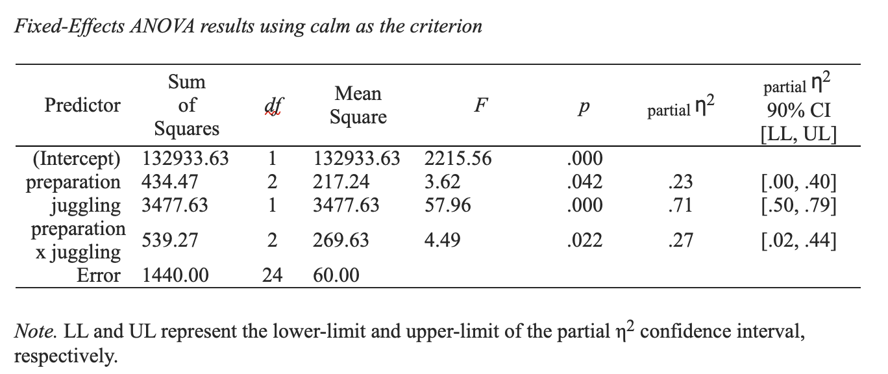

# N-way Cell Comparisons

## Recap and next directions

In the last chapter we focused on the ANOVA itself. In this chapter we focus on comparing the means of cells within the ANOVA. These comparisons could be:

a) planned comparisons based on hypotheses (i.e., confirmatory or a priori comparisons)

or 

b) exploratory comparisons to investigate an interaction.


Previously we conducted an N-way ANOVA, where juggling (yes/no) and preparation (low/medium/high) were used to predict calmness scores before an exam. The analysis we conducted is repeated below:
 

```{r, include=F}
library(tidyverse)
library(apaTables)
```


```{r, warning=F, message=F}
library(tidyverse)
library(apaTables)

nway_data = read_csv("data_crf.csv")

# Turn character columns into factors
nway_data  <- nway_data %>%
  mutate_if(is.character, as.factor)
```

Next we conduct the analysis:

```{r, warning=F, message=F}
# set contrasts to values match SPSS
options(contrasts = c("contr.sum", "contr.poly"))

# Conduct analysis
lm_nway <- lm(calm ~ preparation*juggling, 
              data = nway_data)
```

Then we create the output using:

```{r, eval = F}
apa.aov.table(lm_nway, 
              filename = "my_table.doc")
```

```{r, out.width="80%", echo = FALSE}

```


```{r, echo = F}
x1 = c(79,66,70,75,67)
x2 = c(62,84,66,73,78)
x3 = c(76,94,83,94,93)
x4 = c(61,58,64,56,58)
x5 = c(61,42,59,51,50)
x6 = c(66,59,38,61,53)
xbar1 = mean(x1)
xbar2 = mean(x2)
xbar3 = mean(x3)
xbar4 = mean(x4)
xbar5 = mean(x5)
xbar6 = mean(x6)
var1 = var(x1)
var2 = var(x2)
var3 = var(x3)
var4 = var(x4)
var5 = var(x5)
var6 = var(x6)

var_all = c(var1, var2, var3, var4, var5, var6)
mse = mean(var_all)

mean_a1 = mean(c(x1, x2, x3))
mean_a2 = mean(c(x4, x5, x6))

mean_b1 = mean(c(x1, x4))
mean_b2 = mean(c(x2, x5))
mean_b3 = mean(c(x3, x6))

mean_grand = mean(c(x1, x2, x3,x4, x5, x6))

mean_a1s = sprintf("%1.2f", mean_a1)
mean_a2s = sprintf("%1.2f", mean_a2)
mean_b1s = sprintf("%1.2f", mean_b1)
mean_b2s = sprintf("%1.2f", mean_b2)
mean_b3s = sprintf("%1.2f", mean_b3)
mean_grands = sprintf("%1.2f", mean_grand)


ra1 = xbar1 - mean_a1
ra2 = xbar2 - mean_a1
ra3 = xbar3 - mean_a1
ra4 = xbar4 - mean_a2
ra5 = xbar5 - mean_a2
ra6 = xbar6 - mean_a2

rb1 = ra1 - mean_b1
rb2 = ra2 - mean_b2
rb3 = ra3 - mean_b3
rb4 = ra4 - mean_b1
rb5 = ra5 - mean_b2
rb6 = ra6 - mean_b3

rg1 = rb1 + mean_grand
rg2 = rb2 + mean_grand
rg3 = rb3 + mean_grand
rg4 = rb4 + mean_grand
rg5 = rb5 + mean_grand
rg6 = rb6 + mean_grand

all_res = c(rg1, rg2, rg3, rg4, rg5, rg6)
```


## Confirmatory Comparisons

### $t$-test


If you have a comparison (with 2 means) that was planned prior to collecting data, one option to test the comparison is the $t$-test. This is perhaps the most frequently used approach in some research areas. 

Consider a scenario where you have a directional hypothesis (i.e., you believe on cell mean is higher than an other). This is also known as a one-sided test.

In this particular scenario, your planned directional comparison involves comparing cell 1 (yes juggling/low preparation) with cell 3 (yes juggling / high preparation). You believe the mean for cell 3 will be higher than cell 1. That is, you have a directional hypothesis (i.e., one-tailed or one-sided hypothesis). This belief is based on theory and you registered your hypothesis at [osf.io](osf.io) prior to collecting data. 


#### $t$-test statistic 

You could proceed as follows.


Obtain the data for these two cells:

```{r}
juggling_high_preparation <- nway_data %>%
  filter(juggling == "yes")%>%
  filter(preparation == "high")%>%
  pull(calm)


juggling_low_preparation <- nway_data %>%
  filter(juggling == "yes")%>%
  filter(preparation == "low")%>%
  pull(calm)
```


Conduct a two-sided $t$-test with the formula (equal variances assumed):

$$
 t = \frac{\bar{x_3} - \bar{x_1}}{\sqrt{\frac{s_{people}^2}{n_1}+\frac{s_{people}^2}{n_2}}}
$$
 
Note that when we conduct a $t$-test the estimate of the population variance of calmness scores ($ s_{people}^2$) is based on only the two cells involved in the comparison (see below). Recall though that in the ANOVA this estimate was based on all six cells.
 
 $$
 s_{people}^2 = \frac{s_1^2 + s_2^2}{2}
 $$ 
 

Using the code below we make it a two-sided test to obtain the CI in format typically used in psychology. We convert it to a one-sided $t$-test below.

```{r}
tout<- t.test(juggling_high_preparation, juggling_low_preparation,
       var.equal = TRUE,
       alternative = "two.sided")

print(tout)
```


#### $t$-test p-value

Divide the two-sided $p$-value by 2 to obtain the one-sided or directional $p$-value.

$0.005444/2=0.002722$

Your output text now stands as:

Among jugglers, high preparation students ($M = 88.00$, $SD = 8.15$) were calmer, on average, ($M_{\text{diff}} = 16.6$, 95% $CI[6.45, 26.75]$) than low preparation students,($M = 71.40$, $SD = 5.50$), $t(8)=3.77$, $p = .003$.

Notably, we are missing a standardized effect size, $d$-value with confidence interval, for the above.

#### $t$-test effect size

We can calculate the $d$-value with a CI for this comparison using the formula below.

 $$
 d = \frac{\bar{x_3} - \bar{x_1}}{s_{people}}
 $$

Not that in this formula, $s_{people}$, was based on the two cells only.

To obtain this effect size in R, we use t-test value as the non-centralty parameter in this command:

```{r}
library(MBESS)
ci.smd(ncp = tout$statistic, n.1 = 5, n.2 = 5)

# this is the came as typing:
# ci.smd(ncp = 3.77, n.1 = 5, n.2 = 5)
```


#### $t$-test text

Among jugglers, high preparation students ($M = 88.00$, $SD = 8.15$) were calmer, on average, ($M_{\text{diff}} = 16.6$, 95% $CI[6.45, 26.75]$, $d = 2.39$, 95% $CI[0.66, 4.04$]) than low preparation students,($M = 71.40$, $SD = 5.50$), $t(8)=3.77$, $p = .003$.


| Approach | pooled variance | test  | effect size |
|:--------:|:---------------:|:-----:|:-----------:|
| $t$-test (equal variances assumed) | $s_{people}^2 = \frac{s_1^2 + s_2^2}{2}$ | $t = \frac{\bar{x_3} - \bar{x_1}}{\sqrt{\frac{s_{people}^2}{n_1}+\frac{s_{people}^2}{n_2}}}$ | $d = \frac{\bar{x_3} - \bar{x_1}}{s_{people}}$ |


### contrast (2 means)

As we did with the t-test, consider a scenario where you planned a directional comparison involves comparing cell 1 (yes juggling/low preparation) with cell 3 (yes juggling / high preparation). You believe the mean for cell 3 will be higher than cell 1. That is, you have a directional hypothesis (i.e., one-tailed or one-sided hypothesis). This belief is based on theory and you registered your hypothesis at [osf.io](osf.io) prior to collecting data. 

Although the t-test is a popular approach for comparing two cell means in an ANOVA, a **contrast** is actually more consistent with the underlying ANOVA framework. The big difference between a t-test and a contrast is how they calculate the pooled variance term. In fact, that's the only difference. With a t-test the population variance of people's calmness scores is estimated using only the two cells involved in the comparison. The contrast, the contrast-test, takes a different approach. Even though only two cell means are being compared in a contrast, the population variance of people's calmness scores is estimated using all the cells in the ANOVA.

Let's walk thought the calculation process below. It initially seems more different than it is because it's an F-test. But we'll see how this is a superficial differences as we go through the process.

We begin by obtaining the sample data for these cells

```{r}
juggling_high_preparation <- nway_data %>%
  filter(juggling == "yes")%>%
  filter(preparation == "high")%>%
  pull(calm)


juggling_low_preparation <- nway_data %>%
  filter(juggling == "yes")%>%
  filter(preparation == "low")%>%
  pull(calm)
```

#### contrast statistic

As noted, a contrast differs from a t-test primarily because of how the pooled variance term is calculated.

A t-test only uses the two cells involved in the comparison to estimate $s_{people}^2$. A contrast uses a different approach. It uses all 6 cells from the ANOVA to estimate $s_{people}^2$. 

$$
s_{people}^2 = \frac{s_1^2 + s_2^2 +s_3^2+s_4^2+s_5^2+s_6^2}{6} = MSE = 60
$$ 


Notice how, below, the calculation of this $F$-value below follows the general logic we have used with $F$-values all along. The estimate of the total variance is divided by the estimate of the random sampling variance.

We begin by referring to the means we will use in the contrast as contrast means. That is, instead of using the original lables ($\bar{x_1}$ and $\bar{x_3}$}) we use new labels with the indices 1 and 2 to refer to the first and second means involved in the contrast. The relabelling is described below:

We use $\bar{c_1}$ to refer to the the mean in cell 1 (juggling yes, low preparation).

$$
\bar{c_1} = \bar{x_1} = `r xbar1`
$$


We use $\bar{c_2}$ to refer to the the mean in cell 3 (juggling yes, high preparation).

$$
\bar{c_2} = \bar{x_3} = `r xbar3`
$$


We imagine there are only these two populations ([juggling yes, low preparation],[juggling yes, high preparation]) and there there is a population-level grand mean create by averaging the two population means. We estimate that population-level grand mean using sample-level data:


$$
\begin{aligned}
\bar{\bar{c}} &= \frac{\sum \bar{c_i}}{2} \\
&= \frac{\bar{c_1}+\bar{c_2}}{2}\\
&= \frac{`r xbar1` + `r xbar3`}{2} \\
&= `r mean(c(xbar1, xbar3))`\\
\end{aligned}
$$


We estimate the total variance (as we did with the ANOVA):

$$
\begin{aligned} 
\text{total variance} &=  \frac{\sum (\bar{c_{i}}-\bar{\bar{c}})^2}{2-1} \\
&=  \frac{(\bar{c_{1}} - \bar{\bar{c}})^2 + (\bar{c_{2}} - \bar{\bar{c}})^2}{2-1} \\
&=  \frac{(`r xbar1`- `r  mean(c(xbar1, xbar3))`)^2 + (`r xbar3` - `r  mean(c(xbar1, xbar3))`)^2}{2-1} \\
&= `r var(c(xbar1, xbar3))`
\end{aligned}
$$

We estimate variance due to random sampling:

$$
\frac{s_{people}^2}{n} = \frac{MSE}{n} = \frac{60}{5} = 12  
$$

And then we compare these two estimates with the F-ratio:

$$
F = \frac{\frac{\sum (\bar{x_i} - \bar{\bar{x}})^2}{2-1}}{\frac{s_{people}^2}{n}}
$$


This $F$-value formula looks very different from the $t$-test formula we used previously. But we can rearrange the formula above to make it look like a t-test. 

$$
F = \left[ \frac{\bar{x_3} - \bar{x_1}}{\sqrt{\frac{s_{people}^2}{n_1}+\frac{s_{people}^2}{n_2}}} \right] ^2
$$

When it is rearranged, you can see the $F = t^2$. This rearrangement only works when there are two means. The important point is though that you can see that really the $t$-test and the contrast are the same except for the way the pooled variance term is calculated. The t-test used a pooled variance estimate based on the two cells involved in the comparison whereas the contrast used a pooled variance estimate based on all the cells in the ANOVA.

In R, we can calculate the contrast with the code below.

```{r}
mean_cell1 = mean(juggling_low_preparation, na.rm = TRUE)
mean_cell3 = mean(juggling_high_preparation, na.rm = TRUE)

means_to_compare = c(mean_cell3, mean_cell1)

mse = (summary(lm_nway)$sigma)^2 # or just 60 for MSE
df1 = 2 -1 # two means - 1
df2 = 24 # degrees of freedom for MSE
n = 5 # 5 per cell

Fvalue = var(means_to_compare)/(mse/n)
print(Fvalue)
```


#### contrast p-value

```{r}
pvalue_nondirectional = pf(Fvalue,
                     df1 = df1,
                     df2 = df2,
                     lower.tail = FALSE)

pvalue_directional = pvalue_nondirectional/2

print(pvalue_directional)
```

Your output text now stands as:

Among jugglers, high preparation students ($M = 88.00$, $SD = 8.15$) were calmer ($M_{\text{diff}} = 16.60$) than low preparation students,($M = 71.40$, $SD = 5.50$), $F(1, 24)= 11.482$, $p = .001$.

Notably, we are missing a standardized effect size, with confidence interval, for the above.

#### contrast effect size

We can calculate an effect size with a CI for this comparison using the formula below.

$$
sc = \frac{\bar{c_2} - \bar{c_1}}{s_{people}}
$$

Again, notice the only difference from a d-value is that we calculated  $s_{people}$ based on 6 cells instead of 2. Consequently, some people call this value a $d$-value. So in this calculation, the denominator is determined:

By calculating $s_{people}^2$:

$$
s_{people}^2 = \frac{s_1^2 + s_2^2 +s_3^2+s_4^2+s_5^2+s_6^2}{6} = MSE = 60
$$ 

Turning it into $s_{people}$:
$$
s_{people}=\sqrt{s_{people}^2}=\sqrt{MSE}=\sqrt{60}
$$

Then using the resulting value in the calculation


$$
sc = \frac{`r xbar3` - `r xbar1`}{\sqrt{60}} = 2.14
$$

In R, we use the code below to obtain the effect size:

```{r}
n_per_cell = 5
mse_n = 2*3*n_per_cell

mean_cell1 = mean(juggling_low_preparation, na.rm = TRUE)
mean_cell3 = mean(juggling_high_preparation, na.rm = TRUE)

mean_c1 = mean_cell1
mean_c2 = mean_cell3

means_to_compare = c(mean_c2, mean_c1)
n_for_means = c(n_per_cell, n_per_cell)
comparison_weights = c(1, -1)

# Approach 1 to s.anova
mse = 60 #s2_people
s_people = sqrt(mse)

# Approach 2 to s.anova
# re-use lm_nway from initial ANOVA
s_people = summary(lm_nway)$sigma

# Calculate standardizec contrast with CI
ci.sc(means = means_to_compare,
      c.weights = comparison_weights,
      n = rep(n_per_cell, 2),
      s.anova = s_people,
      N = mse_n)
```

#### contrast text

Among jugglers, high preparation students ($M = 88.00$, $SD = 8.15$) were calmer ($M_{\text{diff}} = 16.60$, $sc = 2.14$, 95% $CI[0.77, 3.49$]) than low preparation students,($M = 71.40$, $SD = 5.50$), $F(1, 24)= 11.482$, $p = .001$.

But, as noted, some people might just write this up calling the effect size a $d$-value:

Among jugglers, high preparation students ($M = 88.00$, $SD = 8.15$) were calmer ($M_{\text{diff}} = 16.60$, $d = 2.14$, 95% $CI[0.77, 3.49$]) than low preparation students,($M = 71.40$, $SD = 5.50$), $F(1, 24)= 11.482$, $p = .001$.

The fact that you could calculate a $d$-value in two different ways (using difference variance calculations) illustrates why it is **extremely** important that you indicate in your paper (even in a footnote) the formula you used to calculate the $d$-value and pooled variance terms.

#### Comparison with $t$-test

| Approach | pooled variance | test  | effect size |
|:--------:|:---------------:|:-----:|:-----------:|
| contrast (equal variances assumed) | $s_{people}^2 = \frac{s_1^2 + s_2^2 +s_3^2+s_4^2+s_5^2+s_6^2}{6}$ | $F = \frac{\frac{\sum (\bar{x_i} - \bar{\bar{x}})^2}{2-1}}{\frac{s_{people}^2}{n}}$ | $sc = \frac{\bar{x_3} - \bar{x_1}}{s_{people}}$ |
| $t$-test (equal variances assumed) | $s_{people}^2 = \frac{s_1^2 + s_2^2}{2}$ | $t = \frac{\bar{x_3} \bar{x_1}}{\sqrt{\frac{s_{people}^2}{n_1}+\frac{s_{people}^2}{n_2}}}$ | $d = \frac{\bar{x_3} - \bar{x_1}}{s_{people}}$ |

You can see from the above table that when you are comparing two means the contrast and $t$-test approaches are very similar. The only difference between the two approaches is how the population variance estimate ($s_{people}^2$) is calculated.

#### $F = t^2$

In case you wanted to understand how and F-value and t-value can be the same with two groups here is the proof:

$$
\begin{align}
F &= \frac{\frac{\sum (\bar{x_i} - \bar{\bar{x}})^2}{2-1}}{\frac{s_{people}^2}{n}}\\
&= \frac{\frac{(\bar{x_1} - \bar{\bar{x}})^2 + (\bar{x_2} - \bar{\bar{x}})^2}{1}}{\frac{s_{people}^2}{n}}\\
&= \frac{(\bar{x_1} - \bar{\bar{x}})^2 + (\bar{x_2} - \bar{\bar{x}})^2}{\frac{s_{people}^2}{n}}; \text{With only two means they are equidistant from the grand mean}\\
&= \frac{\frac{(\bar{x_1} - \bar{x_2})^2}{2}}{\frac{s_{people}^2}{n}}; \text{So we can change the numerator because:} (\bar{x_1} - \bar{\bar{x}})^2 + (\bar{x_2} - \bar{\bar{x}})^2 = \frac{(\bar{x_1} - \bar{x_2})^2}{2}\\
&= \frac{\frac{(\bar{x_1} - \bar{x_2})^2}{2}}{\frac{s_{people}^2}{n}}\times 1\\
&= \frac{\frac{(\bar{x_1} - \bar{x_2})^2}{2}}{\frac{s_{people}^2}{n}}\times \frac{2}{2}\\
&= \frac{(\bar{x_1} - \bar{x_2})^2}{2 \times \frac{s_{people}^2}{n}}\\
&= \frac{(\bar{x_1} - \bar{x_2})^2}{ \frac{s_{people}^2}{n} + \frac{s_{people}^2}{n}}\\
&= t^2
\end{align}
$$


### contrast (multiple means)


Sometimes we might want to combine cells for a comparison. For example, imagine we hypothesized the mean of cells 2 and 3 was higher than the mean of cell 1. Illustrated below:

$$
\frac{\bar{x_2} + \bar{x_3}}{2} \text{ vs }\bar{x_1}
$$

How do we go about conducting this comparison?

```{r, echo = FALSE}
cond.means = c(xbar1, xbar2, xbar3)
cond.sd = c(sqrt(var1), sqrt(var2), sqrt(var3))
MS.w = 60
n.pergroup = c(5,5,5)
mse = 60

my.weights<-c(-2,1,1) # Define contrast weights
psi<-sum(my.weights*cond.means) # Calculate psi 

Fvalue_psi<-(psi^2)/(sum((my.weights^2)/n.pergroup))/MS.w # Use MSw from omnibus ANOVA

xcm1 = xbar1
xcm2 = mean(c(xbar2, xbar3))
xcm = c(xcm1, xcm2)
xvar = var(xcm)


svar1 = mse/5
svar2 = mse/10
svar = mean(c(svar1, svar2))

```

#### contrast (mult) statistic

The two contrast means ($\bar{c_1}$, $\bar{c_2}$}) are calculated as below"

For the first mean, it's just a cell mean, where $n = 5$.

$$
\bar{c_1} = \bar{x_1} = `r xbar1`
$$

For the second mean, it's the average of two means. Note for this combined mean $n = 10$; because it was based on two cell means, each $n=5$.

$$
\bar{c_2} = \frac{\bar{x_2} + \bar{x_3}}{2} = \frac{ `r (xbar1 + xbar2)`}{2} = `r xcm2`
$$


But when we look at these two contrast means, the estimate of the "grand mean" is:

$$
\begin{aligned}
\bar{\bar{c}} &= \frac{\sum \bar{c_i}}{2} \\
&= \frac{\bar{c_1}+\bar{c_2}}{2}\\
&= \frac{`r xcm1` + `r xcm2`}{2} \\
&= `r mean(c(xcm1, xcm2))`\\
\end{aligned}
$$

**We estimate the total variance:**

$$
\begin{aligned} 
\text{total variance} &=  \frac{\sum (\bar{c_{i}}-\bar{\bar{c}})^2}{2-1} \\
&=  \frac{(\bar{c_{1}} - \bar{\bar{c}})^2 + (\bar{c_{2}} - \bar{\bar{c}})^2}{2-1} \\
&=  \frac{(`r xcm1`- `r mean(c(xcm1, xcm2))`)^2 + (`r xcm2` - `r mean(c(xcm1, xcm2))`)^2}{2-1} \\
&= `r var(c(xcm1, xcm2))`
\end{aligned}
$$

**We estimate the variance due to random sampling:**

The calculation is bit more complicated for sampling error because the sample sizes are different for the two means.

For first contrast mean, $c_1$, is $n = 5$. Therefore sampling error is:

$$
\frac{s_{people}^2}{n} = \frac{MSE}{n} = \frac{60}{5} = 12  
$$


For second contrast mean, $c_2$, is $n = 10$. Therefore sampling error is:

$$
\frac{s_{people}^2}{n + n} = \frac{MSE}{n + n} = \frac{60}{5 + 5} = \frac{60}{10} = 6  
$$


We use the average of these two sampling error calculations

$$
\text{random sampling variance} = \frac{\frac{s_{people}^2}{5} + \frac{s_{people}^2}{10}}{2} = 9
$$


The $F$-value is:

$$
\begin{align}
F &= \frac{\text{total variance}}{\text{random sampling variance}}\\
&= \frac{\frac{\sum (\bar{c_{i}}-\bar{\bar{c}})^2}{2-1}}{\left[ \frac{\frac{s_{people}^2}{5} + \frac{s_{people}^2}{10}}{2} \right]}\\
&= \frac{\frac{(`r xcm1`- `r mean(c(xcm1, xcm2))`)^2 + (`r xcm2` - `r mean(c(xcm1, xcm2))`)^2}{2-1}}{\left[ \frac{12 + 6}{2} \right]}\\
&= \frac{`r var(c(xcm1, xcm2))`}{\left[ 9 \right]}\\
&= 4.40
\end{align}
$$

In R, it's easy to get these numbers.

We begin by getting the cell data:

```{r}
juggling_high_preparation <- nway_data %>%
  filter(juggling == "yes")%>%
  filter(preparation == "high")%>%
  pull(calm)

juggling_medium_preparation <- nway_data %>%
  filter(juggling == "yes")%>%
  filter(preparation == "medium")%>%
  pull(calm)

juggling_low_preparation <- nway_data %>%
  filter(juggling == "yes")%>%
  filter(preparation == "low")%>%
  pull(calm)

```

Then calculate the cell means:

```{r}
mean_cell1 <- mean(juggling_low_preparation, na.rm = TRUE)
mean_cell2 <- mean(juggling_medium_preparation, na.rm = TRUE)
mean_cell3 <- mean(juggling_high_preparation, na.rm = TRUE)


# estimate total variance
mean_c1 <- mean_cell1
mean_c2 <- mean( c(mean_cell2, mean_cell3) )
contrast_means = c(mean_c1, mean_c2)

total_var = var(contrast_means)


# estimate variance due to sampling error
n_per_cell = 5
n = n_per_cell

sampling_var_c1 <- mse/n
sampling_var_c2 <- mse/(n + n)
sampling_var = mean( c(sampling_var_c1, sampling_var_c2) )

# compare the estimates with a ratio
Fvalue = total_var / sampling_var

print(Fvalue)
```


#### contrast (mult) p-value

```{r}
df1 = 1   # two means being compared so: 2 - 1 df
df2 = 24 #recall 24 df for MSE:  ab(n-1)

pvalue_nondirectional = pf(Fvalue,
                     df1 = df1,
                     df2 = df2,
                     lower.tail = FALSE)

pvalue_directional = pvalue_nondirectional/2

print(pvalue_directional)
```

Among jugglers, the combined mean of calmness for high and medium preparation students ($M = 80.30$) was higher than the mean ($M_{\text{diff}} = 8.90$) for low preparation students,($M = 71.40$), $F(1,24) = 4.40, p = .023$.

But we would still like to put an effect size in this sentence.

#### contrast (mult) effect size

Now the effect size. To calculate the effect size we need to use a rather odd notation. But this odd notation is commonly used with contrasts. We assign weights to the contrasts using a few rules.

* All of the cell means involved in one contrast mean (e.g., $\bar{c_1}$) receive a negative number for the weight.

* All of the cell means involved in the other contrast mean (e.g., $\bar{c_2}$) receive a positive number for the weight. 

* All of the negative weights must add up to negative one (i.e., -1.0)

* All of the positive weights must add up to positive one (i.e., 1.0)

So if we think of the cell means in order:

$$
\bar{x_1}, \bar{x_2}, \bar{x_3}
$$

If we want $x_1$ compared to the average of cells two ($x_2$ and $x_3$) then we would use the weights

$$
-1, 0.5, 0.5
$$

This results in the following comparison:

$$
\frac{\bar{x_2} + \bar{x_3}}{2} - \bar{x_1}
$$


```{r}
n_per_cell = 5
mse_n = 2*3*n_per_cell

means_to_compare = c(mean_cell1, mean_cell2, mean_cell3)
n_for_means = c(n_per_cell, n_per_cell, n_per_cell)
comparison_weights = c(-1, .5, .5)

# re-use lm_nway from initial ANOVA
s_people = summary(lm_nway)$sigma

# Calculate standardizec contrast with CI
ci.sc(means = means_to_compare,
      c.weights = comparison_weights,
      n = n_for_means,
      s.anova = s_people,
      N = mse_n)
```

#### contrast (mult) text

Among jugglers, the combined mean of calmness for high and medium preparation students ($M = 80.30$) was higher than the mean ($M_{\text{diff}} = 8.90$, $sc = 1.15$, 95% $CI[.02, 2.26]$) for low preparation students,($M = 71.40$), $F(1,24) = 4.40, p = .023$.

#### contrasts in practice

The calculations presented here are designed to present the conceptual basis for contrasts. In particular, I aimed to emphasize how the logic used is the same as that used in ANOVA. I strongly encourage you to check out the excellent computational treatment of this topic provided in the book below:

[Maxwell, S. E., Delaney, H. D., & Kelley, K. (2017). Designing experiments and analyzing data: A model comparison perspective. Routledge. Chicago](https://www.amazon.ca/Designing-Experiments-Analyzing-Data-Perspective/dp/1138892289/ref=sr_1_1?crid=1QJPZWX9P6APB&keywords=designing+experiments+Maxwell+delany&qid=1661367007&sprefix=designing+experiments+maxwell+delany%2Caps%2C85&sr=8-1)

