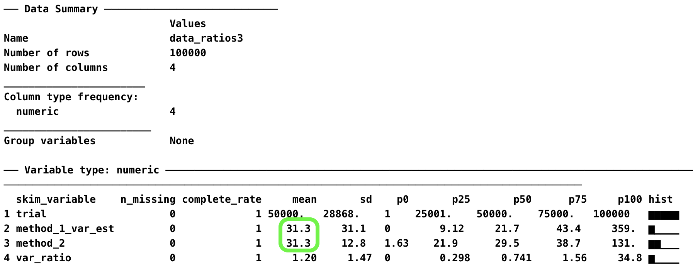
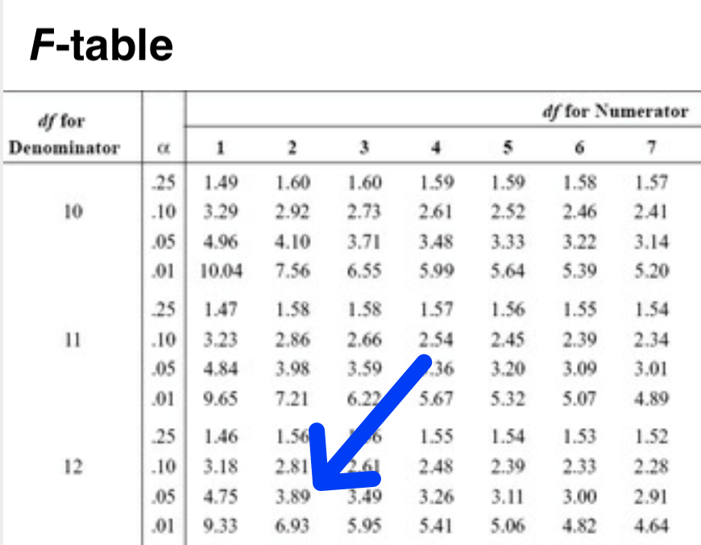

---
output:
  pdf_document: default
  html_document: default
---

# Deep Dive: Sampling Distributions [DRAFT]

## A tale of two methods

In this chapter, we focus on describing the distribution of sample means. Our goal is to understand the logic behind two different methods for estimating the variance of distribution of sample means. A thorough understanding of both of these two estimation methods lays the foundation for understanding Analysis of Variance (ANOVA).

## A student population

Consider a scenario where there is a large university with 100,000 students and we have the heights of all 100,000 students. The mean height of all 100,000 students is 172.50 cm and the variance is 156.3236 cm$^2$. The heights of all the university students are illustrated in Figure \@ref(fig:chdeepfigure1)A. This figure is shaded with stick figures wearing trousers that remind us this distribution represents people. For these 100,000 people the mean is $\mu_{people}=172.50$ and the variance is $\sigma_{people}^2=156.3236$. 

The mean of a population of 100,000 individuals is calculated using Equation \@ref(eq:popmeanchdeep) below.

\begin{equation} 
\mu_{people} = \frac{\sum_{i=1}^{N=100000}{X_i}}{N}
      (\#eq:popmeanchdeep)
\end{equation}

The variance of a population of 100,000 individuals is calculated using Equation \@ref(eq:popvardeep) below.

\begin{equation} 
\sigma_{people}^2 = \frac{\sum_{i=1}^{N=100000}{(X_i - \mu_{people})^2}}{N}
      (\#eq:popvardeep)
\end{equation}


## Random sampling process

Now imagine that we are interested in studying the random sampling process. Specifically we are interested in examining the variability in sample means that occurs when taking random samples of students from the population of people (see Figure \@ref(fig:chdeepfigure1)). Indeed, imagine that we obtained a sample of $n$ = 5 students and calculated a sample mean ($\bar{x}$). Then we repeated this sampling process an infinite number of times such that we have an infinite number of sample means. This set of an **infinite number of sample means** is conceptually illustrated in Figure \@ref(fig:chdeepfigure1)B and we refer to it as the *sampling distribution of the mean*. Moreover, **because we sampled from a single population** the variability in sample means is due only to the **random sampling error** that occurs when the sample size is 5 ($n = 5$) and the population variance is 156.3236 (i.e., $\sigma_{people}^2 =156.3236$).

\

```{r chdeepfigure1, echo=FALSE, out.width="60%", fig.cap="The distributions of people and the sample means can both be considered populations."}
knitr::include_graphics("ch_deep_sampling/images/figure1.png")
```

## Population: What's in a name

Typically, in psychology, when we use the word "population" we are referring to a population of people - such as those illustrated in Figure \@ref(fig:chdeepfigure1)A. However, in statistics, a population is simply set of elements (often people) about which we wish to draw conclusions. In this chapter, we shift our focus from thinking of the distribution of people in Figure \@ref(fig:chdeepfigure1)A as a population to **also** thinking of the distribution of sample means in Figure \@ref(fig:chdeepfigure1)B as a population. Doing so may seem counter intuitive but it the logical foundation for Analysis of Variance (ANOVA).

### Sample means in context

Thinking of the distribution of sample means as a population can be a bit tricky - since there are two populations that we could be referring to when we use the word "population". Notation helps to keep things straight. In this book, when we are talking about a distribution of people (see Figure \@ref(fig:chdeepfigure1)A), we use $N$ to indicate the number people in the population and $n$ to refer to the number of people in a subset of the population (what we typically refer to as a sample). Likewise, when we are talking about a distribution of sample means (see Figure \@ref(fig:chdeepfigure1)B), we use $A$ to indicate the number sample means in the population and $a$ to refer to the number of sample means in a subset of the population.

Consider a concrete example. When we obtain a sample of people ($n$ = 5) we can think those people as being subset of the population of people ($N$=100,000), see Figure \@ref(fig:chdeepfigure1)A. If we calculate a sample mean ($\bar{x}$) based on those 5 people we can think of that single sample mean ($a$ = 1) a being subset of a population of sample means ($A = \infty$), see Figure \@ref(fig:chdeepfigure1)B. Alternatively, imagine we obtained three samples from the population of people, Figure \@ref(fig:chdeepfigure1)A, each composed of 5 people ($n$ = 5 for each sample). Then we calculated the sample mean ($\bar{x}$) for each of the three samples. We could think of those three sample means ($a$ = 3) as being a subset of a population of sample means ($A = \infty$), see Figure \@ref(fig:chdeepfigure1)B.

### Distribution of sample means as a population

Because we are thinking of the distribution of sample means as a population we can calculate the mean and variance for the distribution of sample means. The mean of the population of sample means is calculated as below in Equation  \@ref(eq:popmeanxbardeep). Notice that we used the symbol, $\mu_{\bar{x}}$, to represented this value. Further notice, the little $\bar{x}$ beside the $\mu$ in $\mu_{\bar{x}}$ which indicates it is sample means that are being averaged. As noted previously, we use $A$ instead of $N$ to represent the number of sample means (where $A$ = infinity, because there are an infinite number of sample means in the distribution)[^deep_sampling-1]. Notice the similarity between the formula for the mean of a distribution of people, Equation \@ref(eq:popmeanchdeep) above, and the formula for the mean of a distribution of sample means, Equation \@ref(eq:popmeanxbardeep).


[^deep_sampling-1]: I know it doesn't make sense the divide by infinity; however, in formal mathematics we would write this up in a different way describing the resulted value as an *expected value*. I use dividing by infinity simply as a way to show consistency with other formulas with the aim of increasing conceptual clarity at the expense of correct notation.

\begin{equation} 
\mu_{\bar{x}} = \frac{\sum_{i=1}^{A=\infty}{\bar{x}_i}}{A}
      (\#eq:popmeanxbardeep)
\end{equation} 


Using Equation \@ref(eq:popmeanxbardeep) we find that the mean of the sample means is 172.50 cm (i.e., $\mu_{\bar{x}} = 172.50$). 

A key point to remember is that the mean of the sample means, $\mu_{\bar{x}}$, will always be the same as that of the people's heights, $\mu_{people}$. Consequently, any conclusions we make about *population means* based on Figure \@ref(fig:chdeepfigure1)B (i.e., $\mu_{\bar{x}}$) will also apply to Figure \@ref(fig:chdeepfigure1)A (i.e., $\mu_{people}$). This is a crucial point to keep in mind as we proceed through this chapter. Although we are ultimately interested in making conclusion about the mean of the people (i.e., $\mu_{people}$) - all our work in this chapter (and in ANOVA) is based on the mean of distribution of sample means in Figure \@ref(fig:chdeepfigure1)B (i.e., $\mu_{\bar{x}}$).


##  Sample mean distribution variance

When there is *one* **population of people** (see Figure \@ref(fig:chdeepfigure1)A) there is a single distribution of sample means that corresponds to that population (see Figure \@ref(fig:chdeepfigure1)B). There are two methods for calculating the variance of this distribution of sample means.

### Method 1: Calculate the variance of infinite sample means

In this first method, we use an infinite number of sample means and simply calculate the variance, see Equation \@ref(eq:popvarxbardeep) below. 

\begin{equation} 
\sigma_{\bar{x}}^2 = \frac{\sum_{i=1}^{A=\infty}{(\bar{x}_i - \mu_{\bar{x}})^2}}{A}
      (\#eq:popvarxbardeep)
\end{equation} 

Notice how Equation \@ref(eq:popvarxbardeep) for the variance of sample means in Figure \@ref(fig:chdeepfigure1)B, is similar to the formula we use the variance of people, Equation \@ref(eq:popvardeep), in Figure \@ref(fig:chdeepfigure1)A. The formula for the variance of sample means, Equation \@ref(eq:popvarxbardeep), differs because we are using on sample means ($\bar{x}$) instead of attributes of people ($X$). As well, we use $A$ to indicate the number of elements used (i.e., an infinite number of sample means) in the calculation rather than $N$. 


Obviously, using Equation \@ref(eq:popvarxbardeep) to calculate the variance of an infinite set of sample means is an impractical solution because we could never obtain the infinite number of samples and then calculate the variance for this set. Conceptually, however, it's good to keep this calculation method in mind - since it reminds us of principles we've already learned about the variance of populations [^deep_sampling-2]

[^deep_sampling-2]: As noted previously, the notation is incorrect and I should really have expressed this as an expected value to be correct. But for conceptual clarity I divide by infinity to make the linkages to other equations clear.

But imagine if we could obtain the full infinite set of sample means - then we could use the formula as below: 

$$
\begin{aligned} 
\sigma_{\bar{x}}^2 &= \frac{\sum_{i=1}^{A=\infty}{(\bar{x}_i - \mu_{\bar{x}})^2}}{A}\\
&= 31.26472\\
\end{aligned} 
$$

Thus, the "population" variance of the distribution of sample means ($\sigma_{\bar{x}}^2$, see Figure \@ref(fig:chdeepfigure1)B) is **calculated**, based an infinite number of sample means ($A = \infty$) using Method 1, to be $\sigma_{\bar{x}}^2 = 31.26472$. 

**When there is only one population of people** this formula will reflect variability in sample means due to random sampling. When there is more than one population of people - it becomes more complicated. We'll discuss that situation in a future chapter.

### Method 2: CLT shortcut: *Calculation* of variance of infinite sample means

Fortunately we don't need to obtain an infinite number of sample means to determine the variance of the distribution of an infinite number of sample means, Figure \@ref(fig:chdeepfigure1)B. There is a "shortcut formula" we can used based on the Central Limit Theorem (CLT), see Equation \@ref(eq:popvarCLTxbardeep) below.


\begin{equation} 
\sigma_{\bar{x}}^2 = \frac{\sigma_{people}^2}{n}\\
      (\#eq:popvarCLTxbardeep)
\end{equation} 


An inspection of Equation \@ref(eq:popvarCLTxbardeep) reveals the variance of the distribution of sample means (see Figure \@ref(fig:chdeepfigure1)B) depends on both the number of people in each sample ($n$) and the variability in the people's heights in the population (see Figure \@ref(fig:chdeepfigure1)B, $\sigma_{people}^2$). 
 
The reason this formula works should not be obvious - at all. If you are looking at this formula trying to figure out why it works - I suggest you stop and just accept that it does work. If you want to understand why it works, I suggest you [consult](https://archive.org/details/statisticsfifthe00will) [@hays1994statistics] who provides a statistical proof for the Central Limit Theorem.

It's helpful, moving forward to, think of this formula ($\frac{\sigma_{people}^2}{n}$) as representing the *variability in means due to random sampling*. No matter the situation - this formula will always reflects the variability in sample means due ONLY to random sampling.

Previously, we learned that the variance of the distribution of people in Figure \@ref(fig:chdeepfigure1)A is $\sigma_{people}^2=156.3236$. Consequently, we can use Equation \@ref(eq:popvarCLTxbardeep) to calculate the variance of the distribution of sample means in Figure \@ref(fig:chdeepfigure1)B:

$$
\begin{aligned} 
\sigma_{\bar{x}}^2 &= \frac{\sigma_{people}^2}{n}\\
&= \frac{156.3236}{5}\\
&= 31.26472\\
\end{aligned} 
$$

Thus, the "population" variance of the distribution of sample means ($\sigma_{\bar{x}}^2$, see Figure \@ref(fig:chdeepfigure1)B) is **calculated**, using Method 2 the CLT shortcut, to be $\sigma_{\bar{x}}^2 = 31.26472$. 

### Ratio comparison of two methods

Thus, far we have calculated the variance of the distribution of sample means using two different methods.

-   Method 1: Variance of sample means calculated using sample means

-   Method 2: Variance of sample means calculated using CLT shortcut formula

Although we can just look at the numbers resulting from these two methods and compare them, that's not how statisticians typically handle such comparisons. The approach used by statisticians to compare two numbers is to create a ratio. That is, take one number and divide it by the other number. If the two numbers are the same the ratio will be 1.00. If the ratio is larger than 1.00 it means the number on the top was bigger than the number on the bottom.

\

$$
\begin{aligned} 
\text{ratio comparing methods} &= \frac{\text{variance of sample means calculated using sample means}}{\text{variance of sample means calculated using CLT shortcut formula}}\\
&=\frac{\frac{\sum_{i=1}^{A=\infty}{(\bar{x}_i - \mu_{\bar{x}})^2}}{A}}{\frac{\sigma_{people}^2}{n}}\\
&=\frac{31.26472}{31.26472}\\
&= 1.00\\
\end{aligned} 
$$

You can see the ratio comparing these two methods below is 1.00 - so we conclude two methods produced the same result. If the number on the top of the ratio was the *larger* of the two, then the value of the ratio would be greater than 1.00.  In contrast, if the number on the top of the ratio was the *smaller* of the two, then the value of the ratio would be less than 1.00. Be sure you understand how to interpet the value of a ratio using these rules before continuing.

In this section, we focused on actually **calculating** the variance of the distribution of sample means using two methods. But to actually calculate this variance we needed an infinite number of sample means (Method 1) or knowledge of the population variance (Method 2). Both are unrealistic methods to determining this value.

In the next section, below, we recognize that we can likely never know or calculate the variance of the distribution of sample means. Instead, we focus on **estimating** the variance of the distribution of sample means. An estimated value is an approximation of the actual value that will differ due to the effects of random sampling.

```{r, include=FALSE}
# Set up sample information for rest of chapter
set.seed(20210901)
pop_sd = sqrt(156.3236)
pop_mean = 172.50

n_sample <- 5 #don't use n it's a reserved variable name for this package

sample_data <- round(rnorm(n_sample)*pop_sd+pop_mean)
sample_mean <- round(mean(sample_data),1)
sample_var <- var(sample_data)*(n_sample-1)/(n_sample)
est_pop_var <- round(var(sample_data),1)
df <-  n_sample-1
barx <- sample_mean
x1 <- sample_data[1]
x2 <- sample_data[2]
x3 <- sample_data[3]
x4 <- sample_data[4]
x5 <- sample_data[5]
sumx2 <- sum((sample_data-mean(sample_mean))^2)


sample_data2 <- round(rnorm(n_sample)*pop_sd+pop_mean)
sample_mean2 <- round(mean(sample_data2),1)
sample_var2 <- var(sample_data2)*(n_sample-1)/(n_sample)
est_pop_var2 <- round(var(sample_data2),1)
df2 <-  n_sample-1
barxb <- sample_mean2
x1b <- sample_data2[1]
x2b <- sample_data2[2]
x3b <- sample_data2[3]
x4b <- sample_data2[4]
x5b <- sample_data2[5]
sumx2b <- sum((sample_data2-mean(sample_mean2))^2)


sample_data3 <- round(rnorm(n_sample)*pop_sd+pop_mean)
sample_mean3 <- round(mean(sample_data3),1)
sample_var3 <- var(sample_data3)*(n_sample-1)/(n_sample)
est_pop_var3 <- round(var(sample_data3),1)
df3 <-  n_sample-1
barxc <- sample_mean3
x1c <- sample_data3[1]
x2c <- sample_data3[2]
x3c <- sample_data3[3]
x4c <- sample_data3[4]
x5c <- sample_data3[5]
sumx2c <- sum((sample_data3-mean(sample_mean3))^2)

dfpooled <- df+df2 + df3
est_pop_var_pooled <- (est_pop_var+est_pop_var2+est_pop_var3)/3

a <- 3
xbarbar <- round((barx+barxb+barxc), 3)
xbar_vector <- c(barx, barxb, barxc)
method1_var <- round(var(xbar_vector),3)


est_mean_var_clt <- est_pop_var_pooled/n_sample

```

## Estimating sample mean distribution variance

In this section we focus on estimating the variance of the distribution of sample means using sample data. Imagine that we obtained three samples (each $n$ = 5) from the population of people illustrated in Figure \@ref(fig:chdeepfigure1)A. The statistics for those three sample are presented below.

| Sample Number | Sample size ($n$) | Mean ($\bar{x} = \frac{\Sigma x_i}{n}$) | Variance ($s_{people}^2=\frac{\Sigma (x_i - \bar{x})^2}{n-1}$) |
|:-------------:|:-----:|:-----------------------------:|:------------------------------------------------:|
| 1             |  5 | `r sample_mean`      | `r est_pop_var`                         |
| 2             |  5 | `r sample_mean2`     | `r est_pop_var2`                        |
| 3             |  5 | `r sample_mean3`     | `r est_pop_var3`                        |


### Method 1: Estimate the variance of infinite sample means using 3 sample means

We can use the sample means presented in the table above to estimate the variance of the distribution of sample means as illustrated in the formula below. Recall, we use the lower case "$a$" to represent the number of sample means (in the case because we have 3 sample means $a = 3$).

\begin{equation} 
s_{\bar{x}}^2 = \frac{\sum_{i=1}^{a=3}{(\bar{x}_i - \bar{\bar{x}})^2}}{a-1}
      (\#eq:estpopvarxbardeep)
\end{equation} 

In this example (see table above), we have 3 sample means (each based on n = 5) so $a = 3$. Let's estimate the variance of the distribution of sample means (Figure \@ref(fig:chdeepfigure1)B) using these three sample means.

First, we calculate the mean of the three sample means ($\mu_{\bar{x}}$) because we will need that in the variance formula.

$$
\begin{aligned} 
\bar{\bar{x}} &= \frac{\sum_{i=1}^{a=3}{\bar{x}_i}}{a}\\
&= \frac{\bar{x}_1+\bar{x}_2+\bar{x}_3}{a}\\
&= \frac{`r barx` + `r barxb`  + `r barxc` }{`r a`}\\
&= `r xbarbar`
\end{aligned} 
$$


Second, we estimate the variance of the population of sample means ($s_{\bar{x}}^2$, see Figure \@ref(fig:chdeepfigure1)B) using the set of sample means. Notice the use of "-1" in the denominator - [which we discussed previously in the sample accuracy chapter](https://dstanley4.github.io/psyc6060bookdown/sampling-accuracy.html#estimating-sigma2). The use of the "-1" in the denominator means we are not calculating the variance of these three sample means. Rather, when we use "-1" in the denominator we are **estimating** the variance of the population of sample means from which they were obtained (i.e., the distribution of sample means depicted in Figure \@ref(fig:chdeepfigure1)B).


$$
\begin{aligned} 
s_{\bar{x}}^2 &= \frac{\sum_{i=1}^{a=3}{(\bar{x}_i - \bar{\bar{x}})^2}}{a-1}\\
&= \frac{(\bar{x_1}- \bar{\bar{x}})^2+(\bar{x_2}- \bar{\bar{x}})^2+(\bar{x_3}- \bar{\bar{x}})^2}{a-1}\\
&= \frac{(`r (barx)` - `r (xbarbar)`)^2+(`r (barxb)`  - `r (xbarbar)`)^2+(`r (barxc)` - `r (xbarbar)`)^2}{3-1}\\
&= `r method1_var`
\end{aligned} 
$$

Thus, the "population" variance of the distribution of sample means ($\sigma_{\bar{x}}^2$, see Figure \@ref(fig:chdeepfigure1)B) is **estimated**, based on three sample means ($a = 3$) using Method 1, to be  $s_{\bar{x}}^2 = `r method1_var`$. Remember though `r method1_var` is just an *estimate* of the population value ($\sigma_{\bar{x}}^2$) based on three sample means.


**IMPORTANT:** The denominator of this variance calculation is $2$ (i.e., $3-1$). Therefore, we say there are 2 degrees of freedom associated with this estimate of the variance of the infinite number of sample means.


### Method 2: CLT shortcut: *Estimation* of variance of infinite sample means

We can use the information presented in the table above in another way to estimate the variance of the distribution of sample means. Indeed, recall than another approach to calculating the variance of the distribution of sample means is to use the shortcut formula based on the Central Limit Theorem (CLT), Equation \@ref(eq:popvarCLTxbardeep) above, repeated below for clarity.
.

$$
\begin{aligned}
\sigma_{\bar{x}}^2 &= \frac{\sigma_{people}^2}{n}\\
\end{aligned}
$$

#### Estimating $\sigma_{people}^2$ with $s_{people}^2$

The problem with the formula above is that you need to know the variance of the all the people in the population ($\sigma_{people}^2$) - and we don't know the variance of all the people in the population. But, we do have three samples from that population of people. Because the three samples are from the same population of people - we know each sample provides an estimate of the same (single) variance of people in the population. Therefore, we can combine those variance estimates into a better (or average) estimate of the variance of the people ($s_{people}^2$) in the population using the formula below.

$$
\begin{aligned}
s_{people}^2 &= MSE_{people}\\
&= \frac{\sum_{i=1}^{a=3}(n_i-1)s_i^2}{\sum_{i=1}^{a}(n_i-1)} \\
&= \frac{(n_1-1)s_1^2 + (n_2-1)s_2^2 + (n_3-1)s_3^2}{(n_1-1)+(n_2-1)+(n_3-1)} \\
&= \frac{(5-1)s_1^2 + (5-1)s_2^2 + (5-1)s_3^2}{(5-1)+(5-1)+(5-1)} \\
&= \frac{(5-1)`r est_pop_var` + (5-1)`r est_pop_var2` +(5-1)`r est_pop_var3`}{(5-1) + (5-1) + (5-1)} \\
&= \frac{`r 4*est_pop_var` + `r 4*est_pop_var2` + `r 4*est_pop_var3`}{15 -3} \\
&= \frac{`r as.character((4*est_pop_var + 4*est_pop_var2 +  4*est_pop_var3))`}{12} \\
&= `r est_pop_var_pooled` \\
\end{aligned}
$$

**IMPORTANT:** The denominator of this variance calculation is $12$ (i.e., $a(n-1)=3(5-1)=3(4)=12$). Therefore, we say there are 12 degrees of freedom associated with this estimate of the variance of the people in the population.


When the three sample sizes are the same the above formula just boils down to an average:

$$
\begin{aligned}
s_{people}^2 &= MSE_{people}\\
&= \frac{s_1^2 + s_2^2 + s_3^2}{3} \\
&= \frac{`r est_pop_var` + `r est_pop_var2` + `r est_pop_var3` }{3} \\
&= \frac{660.7}{3} \\
&= `r est_pop_var_pooled` \\
\end{aligned}
$$


The number we just calculated,  $s_{people}^2 =`r est_pop_var_pooled`$, is an estimate of the variance of the population of people illustrated in Figure \@ref(fig:chdeepfigure1)A. You could think of this number as an average variance estimate.

We created the average variance estimate,$s_{people}^2 =`r est_pop_var_pooled`$, by combining three sample estimates of the variance of the population of people. Each sample estimate was based on 5 people (i.e., 4 degrees of freedom). But the average variance estimate we just calculated ( $s_{people}^2 =`r est_pop_var_pooled`$) is based on 15 people - people from all three samples (i.e., 12 degrees of freedom). Because we combined people from all three samples the average variance estimate is a better estimate of the variance of the population of people than any single sample estimate. In technical terms, we say the variance estimate we just calculated is a better estimate because of the higher degrees of freedom (12) to compared to a individual sample estimate (with only 4 degrees of freedom).

We use different names to refer to the resulting average variance estimate - we could just call it a better estimate of the population variance ($s_{people}^2$). But statisticians also use the term pooled variance ($s_{pooled}^2$) to refer it. Other times statisticians use the term Mean Square Error ($MSE$) to refer to it. You should realize that these are all just synonyms for variance of the population of people illustrated in Figure \@ref(fig:chdeepfigure1)A: $s_{people}^2 = s_{pooled}^2 = MSE_{people} = MSE$.


#### Estimating $\sigma_{\bar{x}}^2$ with CLT

Armed with the estimate of the variance of the people in the population ($s_{people}^2$) we can use the CLT shortcut formula to obtain an estimate of the variance of the distribution of sample means using Equation \@ref(eq:estpopvarmeansclt) below.

\begin{equation} 
s_{\bar{x}}^2 = \frac{s_{people}^2}{n}
      (\#eq:estpopvarmeansclt)
\end{equation} 


Putting in values:

$$
\begin{aligned} 
s_{\bar{x}}^2 &= \frac{s_{people}^2}{n}\\
&= \frac{`r est_pop_var_pooled` }{5}\\
&= `r est_mean_var_clt`
\end{aligned} 
$$

Thus, using Method 2: CLT shortcut, our estimate of the variance of the distribution of sample means is $s_{\bar{x}}^2 =  `r est_mean_var_clt`$. 


**IMPORTANT:** This esimate of the variance of sample means was based on using an estimate of the variance of the people in the population (i.e., $s_{people}^2 =`r est_pop_var_pooled`$). There were 12 degrees of freedom associated with $s_{people}^2$ which $s_{\bar{X}}^2$ depends upon. So we say there are 12 degrees of freedom associated with $s_{\bar{X}}^2$.


### Ratio comparison of two methods

The table below summarizes our work so far.

| Attribute | Unknown  Parameter |  Estimate of Parameter |  $s_{\bar{x}}^2$ degrees of freedom |
|:-------------------:|:----------------------:|:----------------------:|:--------------:|
|  Method 1: Variance| $\sigma_{\bar{x}}^2 =31.26472$ |  $s_{\bar{x}}^2 = \frac{\sum_{i=1}^{a}{(\bar{x}_i - \bar{\bar{x}})^2}}{a-1}= `r method1_var`$ | 2|
|  Method 2 CLT: Variance| $\sigma_{\bar{x}}^2 =31.26472$ |  $s_{\bar{x}}^2 = \frac{s_{people}^2}{n}=`r est_mean_var_clt`$ | 12|

You can see in the table above, that the estimates for the variance of the distribution of sample means differ from each other and from "the truth" (31.26472) due to sampling error. Consquently, when we construct a ratio based on those variance estimate ($s_{\bar{x}}^2 = \frac{\sum_{i=1}^{a}{(\bar{x}_i - \bar{\bar{x}})^2}}{a-1}= `r method1_var`$ and $s_{\bar{x}}^2 = \frac{s_{people}^2}{n}=`r est_mean_var_clt`$) the ratio will differ from "the truth" (1.00) due to sampling error.

\

$$
\begin{aligned} 
\text{ratio comparing methods} &= \frac{\text{variance of sample means ESTIMATED using sample means}}{\text{variance of sample means ESTIMATED using CLT shortcut formula}}\\
&=\frac{\frac{\sum_{i=1}^{a=3}{(\bar{x}_i - \bar{\bar{x}})^2}}{a-1}}{\frac{s_{people}^2}{n}}\\
&=\frac{`r method1_var`}{`r est_mean_var_clt`}\\
&= `r method1_var/est_mean_var_clt`\\
\end{aligned} 
$$


## Simulation 1 population

We can use the R code below to determine the extent to which this ratio will differ from 1.00 for the current context (3 means each based on $n =5$).

```{r, eval = FALSE}
library(learnSampling)
pop1 <- make_population(mean = 172.50, variance = 156.3236)

data_ratios <- get_mean_samples_ratio(pop1,
                                      a = 3, 
                                      number.of.trials = 100000)
```

```{r, eval = FALSE, echo = FALSE}
save(data_ratios, file = "ch_deep_sampling/data_ratio_1pop.RData")
```

```{r, eval = TRUE, echo = FALSE}
load(file = "ch_deep_sampling/data_ratio_1pop.RData")
```

```{r, eval = FALSE}
library(skimr)
skim(data_ratios)
```

```{r, echo = FALSE, out.width="90%"}
knitr::include_graphics("ch_deep_sampling/images/skim_screenshot.png")
```

An inspection of the output in Figure XX above illustrates that, on average (over many trials),  both Method 1 and Method 2 produce the save result as our calculations above.

You may be suprised to see that the ratio - is 1.20 on average and not 1.00. This occurs because the ratio is constructed base on each trial of the simulation (rather than the overal shown in the output). If you were to make a histograph of method_1_var_est values and histogram of the method_2_clt_est values you would see they have different shapes. As a result, the mean ratio is 1.20 rather than 1.00. But that's ok, we just need to remember that the ratio is **roughly** 1.00 when the two methods are used on the same popualtion. 

What's more interesting is thinking about how large this ratio of variances can get.
Let's look a graph of the values in the var_ratio column. We can graph the variance ratios with the code below:

```{r, out.width="100%"}
library(ggplot2)

ggplot(data = data_ratios, mapping = aes(x = var_ratio)) +
  geom_histogram(breaks = seq(0, 10, by = .5)) +
  scale_x_continuous(breaks = seq(0,10, by = .5)) +
  coord_cartesian(xlim = c(0,10), ylim = c(0, 40000)) +
  xlab("Variance Ratio: (method_1_var / method_2_clt)") +
  ylab("Frequency") +
  theme_classic()
```

Describe the graph here. Range etc.


## Simulation 3 identical populations

```{r, eval = FALSE}
library(learnSampling)
pop1 <- make_population(mean = 172.50, variance = 156.3236)
pop2 <- pop1
pop3 <- pop1

data_ratios3 <- get_mean_samples_ratio(pop1, pop2, pop3,
                                      number.of.trials = 100000)
```

```{r, eval = FALSE, echo = FALSE}
save(data_ratios3, file = "ch_deep_sampling/data_ratio_3pop.RData")
```

```{r, eval = TRUE, echo = FALSE}
load(file = "ch_deep_sampling/data_ratio_3pop.RData")
```

```{r, eval = FALSE}
library(skimr)
skim(data_ratios3)
```

```{r, echo = FALSE, out.width="90%"}
#
```


What's more interesting is thinking about how large this ratio of variances can get.
Let's look a graph of the values in the var_ratio column. We can graph the variance ratios with the code below:

```{r, out.width="100%"}
library(ggplot2)

ggplot(data = data_ratios3, mapping = aes(x = var_ratio)) +
  geom_histogram(breaks = seq(0, 10, by = .5)) +
  geom_vline(xintercept = 3.88, color = "blue", size = 1) +
  scale_x_continuous(breaks = seq(0,10, by = .5)) +
  coord_cartesian(xlim = c(0,10), ylim = c(0, 40000)) +
  xlab("Variance Ratio: (method_1_var / method_2_clt)") +
  ylab("Frequency") +
  theme_classic()
```

Describe the graph here. Range etc.


```{r}
var_ratio3_sorted <- sort(data_ratios3$var_ratio)
extreme_cut_off3 <- var_ratio3_sorted[100000*.95]
extreme_cut_off3 <- round(extreme_cut_off3, 2)
print(extreme_cut_off3)
```

Thus, $F_{critical}$(2, 12) = 3.88.


Compare to an $F$-table.

```{r, echo = FALSE, out.width="90%"}

```


## Summary table

| Distribution | Attribute |  Parameter Calculation |  Estimate of Parameter |  
|:----------:|:-------------------:|:----------------------:|:----------------------:|
| People     |  Mean               | $\mu_{people} = \frac{\sum_{i=1}^{N}{X_i}}{N}$                           | $\bar{x}_{people} = M = \frac{\sum_{i=1}^{n}{x_i}}{n}$              |
| People     |  Variance           | $\sigma_{people}^2 = \frac{\sum_{i=1}^{N}{(X_i - \mu_{people})^2}}{N}$        | $s_{people}^2 = VAR = \frac{\sum_{i=1}^{n}{(x_i - \bar{x}_{people})^2}}{n-1}$  |
| People     |  Standard Deviation | $\sigma_{people} = \sqrt{\frac{\sum_{i=1}^{N}{(X_i - \mu_{people})^2}}{N}}$   | $s_{people} = SD = \sqrt{\frac{\sum_{i=1}^{n}{(x_i - \bar{x}_{people})^2}}{n-1}}$  |
| Sample Means |  Mean             | $\mu_{\bar{x}} = \frac{\sum_{i=1}^{A=\infty}{\bar{x}_i}}{A}$             |  $\bar{\bar{x}} = \frac{\sum_{i=1}^{a}{\bar{x}_i}}{a}$                             | 
| Sample Means |  Method 1: Variance| $\sigma_{\bar{x}}^2 = \frac{\sum_{i=1}^{A=\infty}{(\bar{x}_i - \mu_{\bar{x}})^2}}{A}$ |  $s_{\bar{x}}^2 = \frac{\sum_{i=1}^{a}{(\bar{x}_i - \bar{\bar{x}})^2}}{a-1}$ |
| Sample Means |  Method 2 CLT: Variance| $\sigma_{\bar{x}}^2 = \frac{\sigma_{people}^2}{n}$ |  $s_{\bar{x}}^2 = \frac{s_{people}^2}{n}$ |
| Sample Means |  Method 2 CLT: Standard Error| $\sigma_{\bar{x}} = \sqrt{\frac{\sigma_{people}^2}{n}}=\frac{\sigma_{people}}{\sqrt{n}}$ |  $s_{\bar{x}} = SE=\sqrt{\frac{s_{people}^2}{n}}=\frac{s_{people}}{\sqrt{n}}$ |


## Walk away points

-   Sometimes we need to shift our thinking and conceptualize the distribution of sample means as the population to which we are trying to generalize
-   think of var/n as representing the variability in sample means due to random sampling
-   the findings we illustrate here only hold when there is only one population the sample means come from that one population.


We are interested in the variance of the distribute of sample means (Figure \@ref(fig:chdeepfigure1)B). If we were all knowing we would know that the variance of the distribution is 31.26472. But we are not all knowing, and need to rely on sample data to estimate the variance of this distribution. 

We used two different approaches to estimating the variance of the distribution of sample means. With our "all knowing cap" on we can see, in the table above, that both methods produce values that differ from the actual variance of the distribution. That's because the best we can do with sample data is obtain an estimate of the variance of the distribution of mean - we can never know the actual variance of the distribution of sample means.

Each variance estimate (Method 1 or Method 2) will likely produce values that differ from the actual variance of sample means. The first estimate, Method 1, differs from 31.26472 due to sampling error. That is, we used 3 sample means ($a=3$) to estimate the variance of an infinite set of sample means ($A = \infty$). Because we used such a small subset of sample means (3 of $\infty$) our estimate will differ from 31.26472 due to sampling error. 

Likewise, the second estimate, Method 2 CLT, used a formula that relies on knowledge of variance of the population of people ($\sigma_{people}^2$) to determine the variance of the distribution of sample means. We had to estimate $\sigma_{people}^2$ using $s_{people}^2$. Because we used such a small subset of people ($n = 15$, 5 from each sample) from the distribution of people ($N = 100000$) for our estimate, $s_{people}^2$, it will differ from $\sigma_{people}^2$ due to sampling error. Consequently, our estimate of the variance of sample means, which relies on this values, differs fron 31.26472 due to sampling error.
